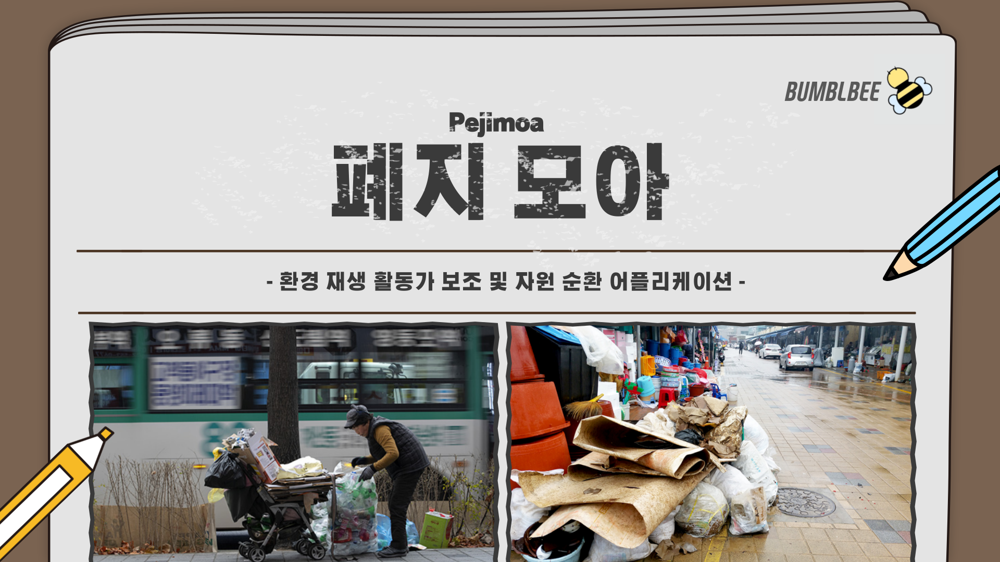

## Profile

<!--author-->

Minsu Choo

 
## Personal Data

---
> 1999.05.02 대한민국  
> contact : devsoftychoo@gmail.com  

## Education
---
> Mar.2018 ~ Feb.2024 조선대학교
>
> 정보통신공학 (Information and Communication ENGINEERING)

## Awards
---

2022 빛가람에너지밸리 소프트웨어 소프트웨어 작품 경진대회[PM] 2019 </a></strong></u>

- 주최, 주관: 한전KDN(주)
- an encouragement award

<!--## Research Interest
---
* Computer Vision
+ image Object Detection
+ Vot
+ Semantic/Instance Segmentation
+ Super Resolution
* Machine Learning / Deep Learning
+ GAN
+ Few-Shot Learning
+ Meta Learning-->

## Project
---
{: width="49.9%" height="auto" align="left"}

{: width="49.9%" height="auto" align="right"} 

[폐지모아](https://softychoo.github.io/projects/2022-11-30-pejimoa/) 자원 재생 활동가의 활동환경을 개선하고, 환경 보호 측면에서 무분별하게 버려지는 재활용 쓰레기들의 처리를 용이하게 하여 상가상인, 자원재생활동가 모두에게 도움을 주기위해 기획된 어플리케이션

[BOX KEEPER](https://softychoo.github.io/projects/2022-11-30-pejimoa/) 택배 도착여부를 실시간으로 확인할 수 있게하여비대면 택배수령 증가로 발생하는
"도난사고를 예방"하고 고객의 "편의를 보장"해주는 시스템

---
<!-- -2020. 07 – 2020. 11-->
<!--Work place name and what i did -->

## Skills and Certification
---
-Languages : Kotlin, Java, Android Studio, C++, C  -Development Tools: Android Studio, VS Code, Visual Studio -Collaboration Platforms: GitHub -Documentation Tools: Typora -Backend Services: Firebase -Frameworks: Flutter -Certification : 정보처리기사

