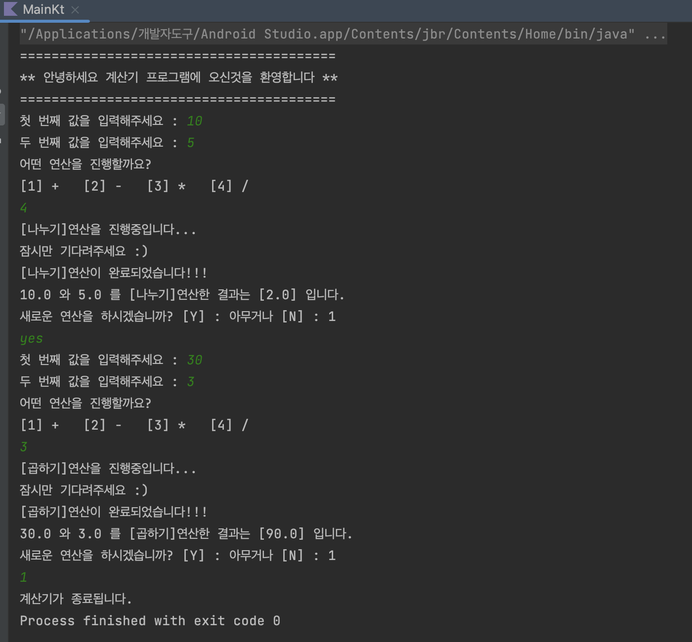

# [Android/Kotlin] [TIL] Calculator

코틀린 문법을 복습하던 중 만들어본 계산기


* toc
{:toc}


## Main.kt

```kotlin
package com.example.calculator

import kotlinx.coroutines.delay

fun main() {
    val add = AddOperation()
    val sub = SubstractOperation()
    val mul = MultiplyOperation()
    val div = DivideOperation()
    var result : Double
    var calString : String = ""

    println("========================================")
    println("** 안녕하세요 계산기 프로그램에 오신것을 환영합니다 **")
    println("========================================")
    while(true)
    {
        print("첫 번째 값을 입력해주세요 : ")
        var a = readLine()!!.toDouble()

        print("두 번째 값을 입력해주세요 : ")
        var b = readLine()!!.toDouble()

        print("어떤 연산을 진행할까요?\n[1] +\t[2] -\t[3] *\t[4] /\n")
        var calculation = readLine()!!.toInt()

        if(!(calculation == 1 || calculation == 2 || calculation == 3 || calculation == 4))
        {
            print("올바르지 않은 값을 입력했습니다.\n계산기 프로그램이 종료됩니다.")
            return
        }
        when(calculation)
        {
            1 -> calString = "더하기"
            2 -> calString = "빼기"
            3 -> calString = "곱하기"
            4 -> calString = "나누기"
        }
        println("[${calString}]연산을 진행중입니다...\n잠시만 기다려주세요 :)")
        Thread.sleep(2000)
        println("[${calString}]연산이 완료되었습니다!!!")

        var calc = Calculator(add)
        when(calculation)
        {
            1 -> result = calc.operate(a,b)
            2 -> calc = Calculator(sub)
            3 -> calc = Calculator(mul)
            4 -> calc = Calculator(div)
        }
        result = calc.operate(a,b)
        println("$a 와 $b 를 [${calString}]연산한 결과는 ["+result+"] 입니다.")

        println("새로운 연산을 하시겠습니까? [Y] : 아무거나 [N] : 1")
        var new = readLine()!!.toString()
        if(new == "1")
        {
          	print("계산기가 종료됩니다.")
            return
        }
    }
}
```

## Class `Calculator`

```kotlin
class Calculator(private val operation: AbstractOperation) {
    fun operate(a : Double,b:Double) : Double{
        return operation.operate(a,b)
    }
}
```

## Class `AbstractOperation`

```kotlin
abstract class AbstractOperation {
    abstract fun operate(a : Double,b:Double):Double
}
```

## Class `AddOperation`

```kotlin
class AddOperation : AbstractOperation(){
    override fun operate(a: Double, b: Double): Double{
        return a+b
    }
}
```

## Class `SubstractOperation`

```kotlin
class SubstractOperation : AbstractOperation(){
    override fun operate(a: Double, b: Double): Double{
        return a-b
    }
}
```

## Class `MultiplyOperation`

```kotlin
class MultiplyOperation : AbstractOperation(){
    override fun operate(a: Double, b: Double): Double{
        return a*b
    }
}
```

## Class `DivideOperation`

```kotlin
class DivideOperation : AbstractOperation(){
    override fun operate(a: Double, b: Double): Double{
        return a/b
    }
}
```


## Result



