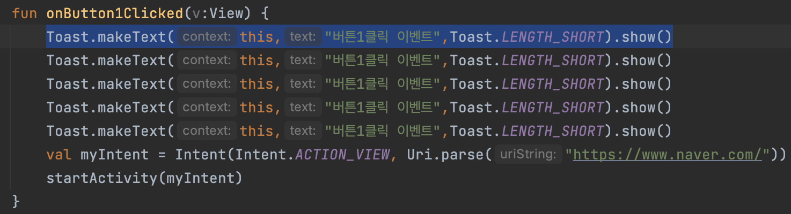

# [Android] 유용한 단축키

AndroidStudio에서 유용한 단축키! 가볍게 알아보자

* toc
{:toc}
## 북마크 : `F3`

- 개발을 진행할 때 코드가 복잡해진다면 `F3`을 눌러서 북마크를 지정해 줄 수 있다.
- 지정한 북마크는 좌측의 BookMarks탭을 눌러 확인가능하다:)

## 코드 복제 `Cmd` + `D` or `ctrl` + `D`

- 복제를 원하는 코드를 클릭하고 `Cmd` + `D`를 누르게 되면 코드 한줄이 복사되게 된다.
- 만약 여러줄을 한번에 복제하고 싶다면 원하는 부분을 드래그 한 후 `Cmd` + `D`를 누르면 된다!

## 작업하던 코드라인 보기 `Cmd` + `{` or `}`

- `Cmd` +`{` 를 누르면 이 전에 작업하던 코드라인을 바로 확인할 수 있고
- `Cmd` +`}` 를 누르면 다시 앞에서 작업하던 코드라인으로 돌아갈 수 있다!
