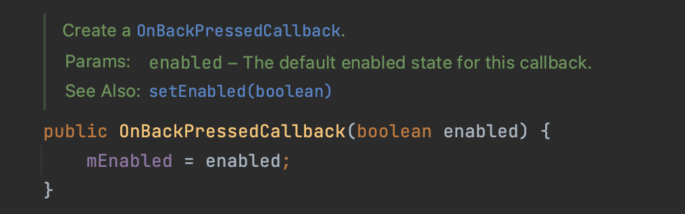

# [Android/Kotlin] OnBackPressedCallback


* toc
{:toc}


## 📌 OnBackPressedCallback? 

- 기존의 OnBackPressed가 **targetSdkVersion 33** 이후 부턴 **deprecated**돼고 이를 대체할 **OnBackPressedCallBack()**이 나왔다.
-  OnBackPressedCallback을 사용하여 뒤로 가기 버튼 동작을 정의할 수 있다.




> 다음은 Android Jetpack의 `OnBackPressedCallback` 클래스의 생성자이다.
>
> 이 생성자는 뒤로 가기 버튼의 동작을 커스텀하기 위해 사용되는 콜백을 생성하는 역할을 한다.
>
> `OnBackPressedCallback`은 뒤로 가기 버튼을 누를 때 호출되는 동작을 커스텀하려고 할 때 사용된다.
>
> 생성자에 전달되는 `enabled` 값은 이 콜백이 활성화되어 있는지를 결정한다. 만약 `enabled`가 `true`로 설정되면 콜백은 활성화되어 뒤로 가기 버튼을 눌렀을 때 호출되고 만약 `false`로 설정하면, 나중에 `isEnabled` 속성을 사용하여 콜백을 활성화시킬 수 있다.


## 👨🏻‍💻 적용 예제

- **`OnBackPressedCallback()`**의 인스턴스를 생성하고 초기화한다. 
- 생성자에 `true` 값을 전달하여 즉시 활성화 시킨다. 
-  `OnBackPressedCallback()` 클래스를 상속하고, `handleOnBackPressed` 메서드를 오버라이드하여 뒤로 가기 버튼 이벤트가 발생했을 때 실행할 동작을 작성한다.

```kotlin
private val onBackPressedCallback = object : OnBackPressedCallback(true) {
    override fun handleOnBackPressed() {
        // 뒤로가기 시 실행할 코드 작성
    }
}
```


- 뒤로 가기 버튼 동작을 커스텀하기 위한 콜백 객체를 생성하고 등록한다.
- dispatcher를 사용해 뒤로가기 버튼 이벤트를 처리한다.

```kotlin
onBackPressedDispatcher.addCallback(this, onBackPressedCallback)
```

