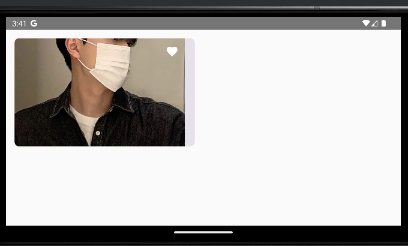

# [Android Jetpack Compose] Remember란? - 상태 저장하기

{:toc}


**💡 remember는 initial composition 시점에 메모리에 저장되고, recomposition 할 때 값을 받아 사용한다.**

**💡remember 는 회전 등 configuration change가 발생하면 값이 유지 되지 않기 때문에 rememberSaveable 를 사용해야 한다.**


<br/>


**이름에서 유추 가능하듯 Compose 에서 상태 저장이 가능한 `remember`에 대해서 알아보자**


<br/>


먼저 Developer의 설명을 봐보자

**[[ Developer ]](https://developer.android.com/jetpack/compose/state?hl=ko)**

> **Composable** 함수는 `remember` API를 사용하여 메모리에 객체를 저장할 수 있습니다. `remember`에 의해 계산된 값은 초기 컴포지션 중에 컴포지션에 저장되고 저장된 값은 리컴포지션 중에 반환됩니다. `remember`는 변경 가능한 객체뿐만 아니라 변경할 수 없는 객체를 저장하는 데 사용할 수 있습니다.


<br/>


- **정리하자면 `remember`란**
  - 메모리에 객체를 저장하는 API이며, 계산된 값은 초기 **`initial composition`** 시점에 메모리에 저장되어 **`recomposition`**  도중에 반환된다.
  - 변경 가능한 객체뿐만 아니라 변경할 수 없는 객체를 저장하는 데 사용할 수 있다.
  - **`remember`**를 사용하지 않는다면 **`recompose`**될 때 초기화가 일어나 제 역할을 하지 못한다.


<br/>


**`remember`를 사용하는 방법**

- **`mutableStateOf()`**를 호출하면 false라는 boolean 값을 갖는 **`MutableState`** 객체가 만들어지고, 이를 감싸고 있는 **`remember`**에 의해 컴포지션 도중에 값이 저장되고 리컴포지션 도중에 값을 반환한다.

```kotlin
val isFavorite = remember { mutableStateOf(false) }
var isFavoriteValue by remember { mutableStateOf(false) }

val (value, setValue) = remember{ mutableStateOf(default) }
```


<br/>


### rememberSaveable

- 화면 전환 등 configuration change 발생 시 `remember`와는 다르게 데이터를 저장한다.





- 만약 **`Serialize`**하지 않는 객체를 전달하고 싶을 경우 **`@Parcelize`** 어노테이션을 설정한다.

```kotlin
@Parcelize
data class Memo(val title: String, val description: String) : Parcelable

@Composable
fun MemoScreen() {
    var selectedMemo = rememberSaveable {
        mutableStateOf(Memo("drinks", "Marker's Mark, Balvenie, Hennessy"))
    }
}
```

재사용을 위해 setContent에 변수 위치시키고 파라미터로 넘겨받기

- 받는값이 변수가 아닌 상수임으로 콜백으로 돌려주기 `onTabFavorite`

```kotlin
setContent {
    var isFavorite by rememberSaveable {
        mutableStateOf(false)
    }
    ImageCard(isFavorite = isFavorite) { favorite ->
        isFavorite = favorite
    }
}
@Composable
fun ImageCard(
    isFavorite: Boolean,
    onTabFavorite: (Boolean) -> Unit,
) {
	...
	IconButton(
    onClick = {
        onTabFavorite(!isFavorite)
    },
  )
	...
}
```

- 재사용을 위한 modifier 외부에 설정

```kotlin
ImageCard(
    modifier = Modifier
        .fillMaxWidth(0.5f)
        .padding(16.dp),
    isFavorite = isFavorite
){ favorite ->
	isFavorite = favorite
}

@Composable
fun ImageCard(
    modifier: Modifier = Modifier,
    isFavorite: Boolean,
    onTabFavorite: (Boolean) -> Unit,
) {
...
}
```