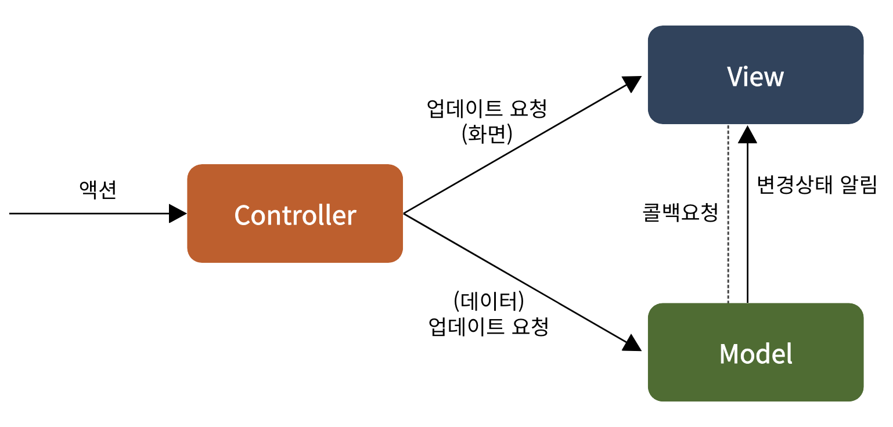
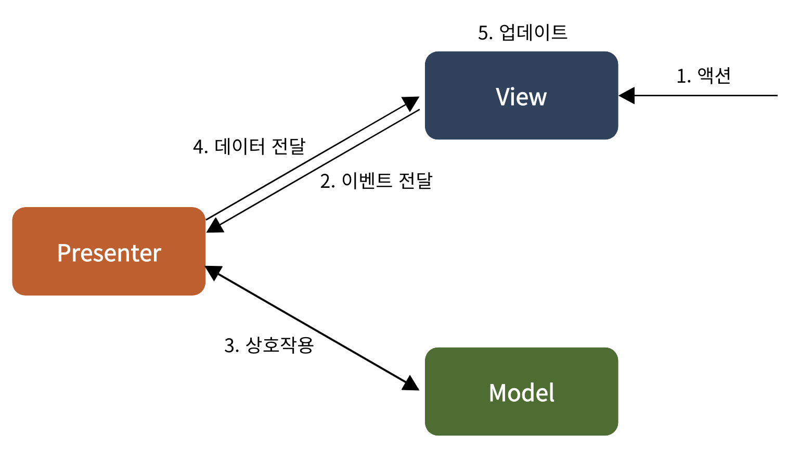
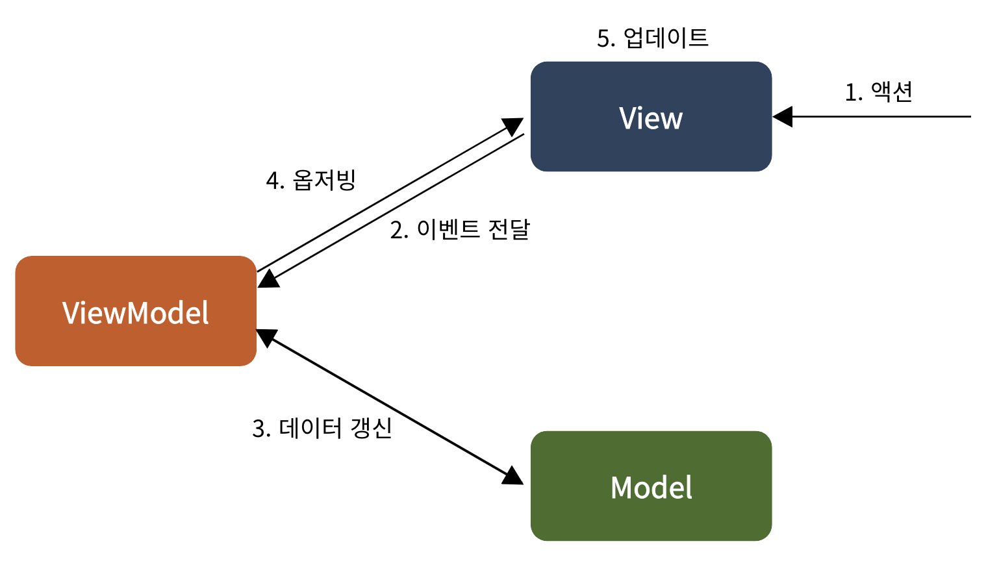
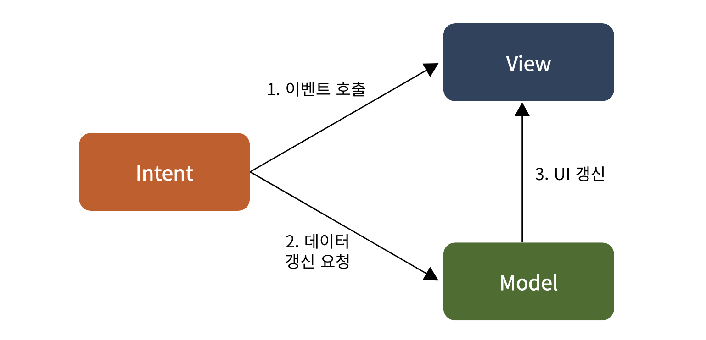

# [Android] 디자인패턴이란? (MVC, MVP, MVVM, MVI)

{:toc}

오늘은 안드로이드 앱을 개발할 때 사용할 수 있는 여러가지 **`디자인 패턴`**에 대해 알아보도록 하겠다 🙂

**디자인 패턴은 대표적으로 `MVC`, `MVP`, `MVVM`, `MVI`가 있는데 순서대로 살펴보자.**

 

## MVC

먼저 MVC 패턴이다. `Model`, `View`, `Controller`로 이루어져 있으며, 안드로이드에선 **Activity**가 `View`와 `Controller`의 모든 기능을 한다.

- **Model** : 어플에서 사용되는 실제 데이터를 관리하는 부분
- **View** : 사용자에게 보여지는 부분(UI)
- **Controller** : 사용자로부터 액션을 받고 처리함

> **장점**
>
> - 구현이 쉽다.
>
> **단점**
>
> - Controller/View가 결합되어있어 테스트가 힘들다.
> - 기능이 많아질수록, Activity가 무거워져 관리가 어렵다.
> - Model과 View의 의존성이 높다.

 

## MVP

다음으로 MVP 패턴이다. `Model`, `View`, `presenter`로 이루어져 있으며, **MVC**의 단점을 어느정도 해결했다고 볼 수 있다.

- **Model** : 어플에서 사용되는 실제 데이터를 관리하는 부분
- **View** : 사용자에게 보여지는 부분(UI) → presenter로 이벤트 전달
- **presenter** : 모델과 상호작용하여 받은 정보를 View에 전달

> **장점**
>
> - Model과 View의 의존성이 존재하지 않는다
> - Model은 Presenter의 요청만을 수행한다
>
> **단점**
>
> - MVC에 비해 필요한 클래스 수가 증가한다
> - View와 Presenter의 1:1 관계로 인해 의존성 증가한다.
> - 기능이 많아질수록, Presenter가 무거워져 분리하기 힘들다.

 

## MVVM

다음은 MVVM 패턴이다. `Model`, `View`, `ViewModel`로 이루어져 있으며, **presenter**에 의존하지않고, `Observer Pattern`을 사용해 객체의 변경이 일어날때마다 UI를 갱신한다. 따라서 View의 종속성이 졌기 때문에 **MVP**의 단점을 해결했다고 볼 수 있다.

- **Model** : 어플에서 사용되는 실제 데이터를 관리하는 부분
- **View** : 사용자에게 보여지는 부분(UI) → ViewModel의 데이터를 옵저빙 하고 있다가, 변화가 일어나면 UI를 갱신한다.
- **ViewModel** : 모델과 상호작용하며, View에 종속되지 않고 **1:N** 구조를 갖는다.

> **장점**
>
> - View와 Model이 독립되어 있다.
> - ViewModel에서 View 코드가 없기때문에 UnitTest를 쉽게 할수 있다.
>
> **단점**
>
> - 장점이 많은 만큼 러닝커브가 높다.
> - View에 대한 처리가 복잡할수록, 비즈니스 로직을 전부 가지고 있는 ViewModel이 거대해진다

 

## MVI

마지막으로 MVI 패턴을 알아보자. `Model`, `View`, `Intent`로 이루어져 있다.

- Model : intent로 전달받은 객체에 맞추어, 새로운 불변객체를 Model로 생성한다.
- View : Model의 결과물인 상태를 구독하고 있다가, 변경시 UI 업데이트를 진행한다.
- Intent로 : 앱의 상태를 바꾸려는 의도를 의미한다. Model에게 앱의 상태를 전달한다.

> **장점**
>
> - 하나의 State객체만을 바라보기 떄문에 상태충돌이 일어나기 어렵다.
> - 데이터의 흐름을 파악하기 쉽다.
>
> **단점**
>
> - Model Update를 위해 새로운 인스턴트를 끼워넣기 때문에, 리소스가 낭비될수 있다.
> - 작은 변경에도 intent를 거쳐야 한다.

 

사실 아직 MVI 패턴은 사용해본 적이 없기 때문에 제대로 이해되진 않는다. 따라서 현재 공부하고 있는 MVVM 패턴을 학습완료한 후에 제대로 다시한 번 공부해봐야겠다.