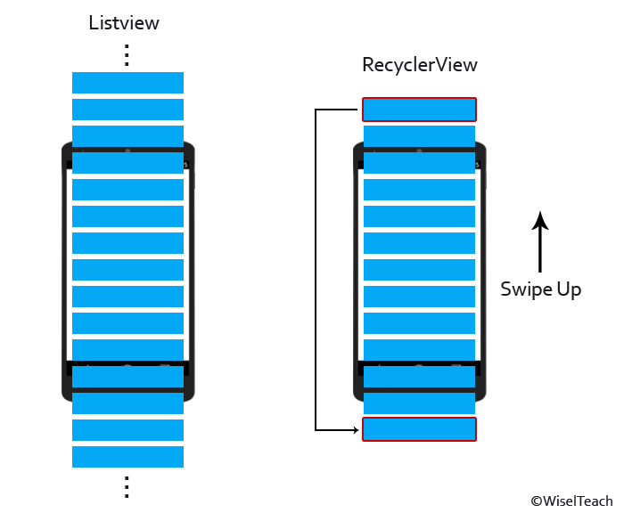

# [Android] RecyclerView의 원리 + Adapter 필수 메서드


* toc
{:toc}


##### 오늘은 Recyclerview의 원리 와 필수 메서드에 대해서 알아보려고 한다.

##### 기존에 RecyclerView에 대해서 정리했었는데 원리보단 구현방법에 집중해서 글을 올렸어서 오늘은 원리와 필수 메서드에 대해서 추가적으로 적어보려고 한다. 구현 방법이 궁금하다면 다음의 링크를 참고해 보자. ㅎㅎㅎ

##### [[ Recyclerview란? ]](https://softychoo.github.io/devlog/android/2023-08-24-RecyclerView/)


<br/>


## Recyclerview와 Listview의 차이

- 가장 먼저 **`Listview`**와의 차이점을 알아보도록 하겠다.



### Listview

- 스크롤을 할 때 상단의 아이템은 삭제되고 하단의 아이템은 새로 생성되는것을 반복한다.
- 아이템이 많아질수록 빈번하게 삭제, 생성이 반복되므로 성능적인 측면에서 문제가 생긴다.

### Recyclerview

- **`recyclerView`**는 그림과 같이 화면에 보이는 10개정도의 아이템을 생성해놓고 스크롤이 발생할 때 상단의 아이템을 하단으로 이동시켜 재사용하게 된다.
- 데이터가 아무리 많아져도 데이터의 갱신은 되지만, 뷰 객체를 재사용하기 때문에 성능적인 측면에서 큰 이점을 가져갈 수 있다.


## Recyclerview의 사용절차

먼저 **`Recyclerview`**를 사용하기 위해 **`Adapter`**와 **`LayoutManager`**가 필요하다. 

#### 1) Adapter

- 데이터가 담긴 리스트를 **`Recyclerview`**에 바인딩 시켜주기 위한 객체이다. 
- 즉 데이터와 **`Recyclerview`** 사이의 통신을 위한 연결체라고 볼 수 있다.

#### 2) layoutmanager

- 데이터나 아이템이 **`Recyclerview`** 내부에서 배치되는 형태를 관리하는 역할을 한다.
- 추가적으로 궁금하다면 기존에 작성했던 글을 가볍게 읽고 오자 ➡︎ [[ RecyclerView LayoutManager 사용 ]](https://softychoo.github.io/devlog/android/2023-08-24-LayoutManager/)

#### 3) ViewHolder

- **`Recyclerview`**를 사용할 때 기존에 생성된 view객체를 재사용하기 위해선, 이 view객체를 기억하고 있어야하는데 viewHolder가 그 역할을 한다.


<br/>


## Recyclerview Adapter의 필수 메서드 3가지

#### 1) getItemCount()

- 가장 먼저 실행되는 함수이며 사용할 데이터의 전체 길이를 리턴한다.

```kotlin
override fun getItemCount(): Int {
    return mItems.size
}
```


#### 2) onCreateViewHolder()

- **`getItemCount()`** 다음으로 호출되며 **`ViewHolder`**를 생성한다.
- 여기서 **`ViewHolder`**의 생성자에 view객체를 넘겨준다. 그렇게 되면 **`ViewHolder`**는 받은 레이아웃을 기억하고 있게 된다.

```kotlin
override fun onCreateViewHolder(parent: ViewGroup, viewType: Int): Holder {
    val binding = ItemRecyclerviewBinding.inflate(LayoutInflater.from(parent.context), parent, false)
    return ViewHolder(binding)
}
```

- 마지막으로 재사용되는 **`viewHolder`**들에 데이터를 바인딩 해주기만 하면 된다.


#### 3) onBindViewHolder()

- 이름 그대로 **`viewHolder`**에 데이터를 바인딩 해주는 함수이다.
- 각각 바인딩을 해줘야 하지만 **`position`**으로 index를 한번에 바인딩이 가능하다 ㅎㅎㅎ

```kotlin
override fun onBindViewHolder(holder: Holder, position: Int) {
    holder.itemView.setOnClickListener {  //클릭이벤트추가부분
        itemClick?.onClick(it, position)
    }
    holder.iconImageView.setImageResource(mItems[position].icon)
    holder.name.text = mItems[position].name
    holder.age.text = mItems[position].age
}
```


<br/>


최종적으로 로그를 찍어보게 되면 화면에 필요한 개수 + 여분의 정해진 수 까지만 **`onCreateViewHolder`**가 호출되고 그 이후엔 **`onBindViewHolder`**만  호출되게 된다. 이는 필요한 개수만큼만 **`ViewHolder`**를 생성하고 그 이후엔 재사용을 하기 때문에 데이터만 새롭게 바인딩을 해준다고 볼 수 있다.


