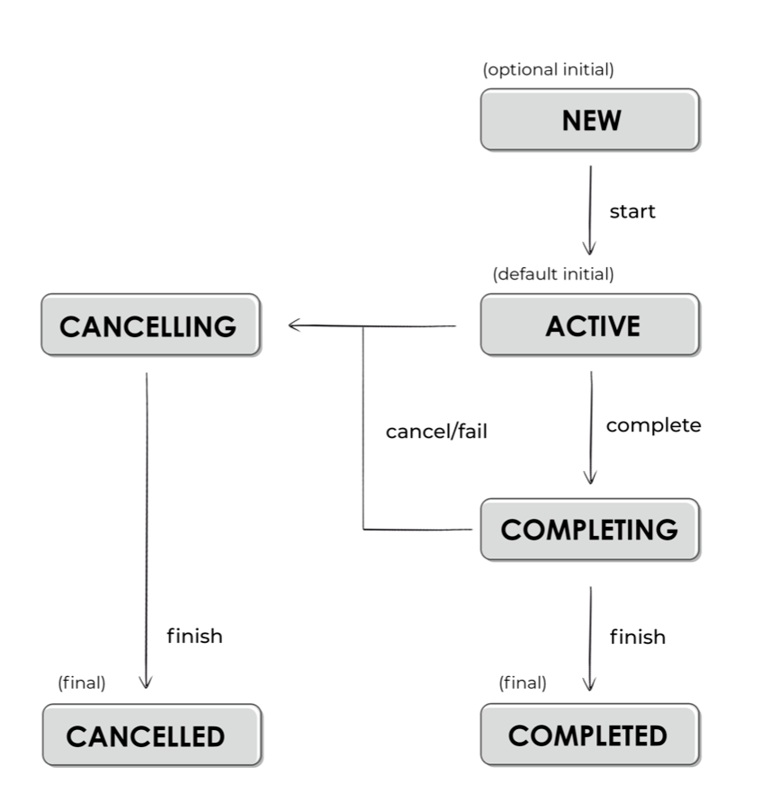

# [Coroutine]  Job이란?

* toc
{:toc}
**먼저 Coroutine의 launch를 눌러서 코드를 살펴보자**

- 다음과 같이 우리가 코루틴 빌더를 통해 코루틴을 생성하면 launch는 Job객체를 반환해주는 것을 볼 수 있다.

```kotlin
public fun CoroutineScope.launch(
    context: CoroutineContext = EmptyCoroutineContext,
    start: CoroutineStart = CoroutineStart.DEFAULT,
    block: suspend CoroutineScope.() -> Unit
): Job {
    val newContext = newCoroutineContext(context)
    val coroutine = if (start.isLazy)
        LazyStandaloneCoroutine(newContext, block) else
        StandaloneCoroutine(newContext, active = true)
    coroutine.start(start, coroutine, block)
    return coroutine
}
```


<br/>


## Job이란?

**다음으로 Kotlin 공홈에서 말하는 Job에 대해 알아보자.**

[[ Kotlin : Job \]](https://kotlinlang.org/api/kotlinx.coroutines/kotlinx-coroutines-core/kotlinx.coroutines/-job/)

> Job이란 백그라운드 작업을 나타내는 인터페이스이다. 개념적으로 Job은 취소 가능한 것으로 생명주기가 완료될때 종료된다. Job은 부모-자식 계층구조로 구성될 수 있으며, 부모가 취소되면 모든 자식이 재귀적으로 즉시 취소된다. 자식이 CancellationException 이외의 예외로 실패된다면 해당 자식의 부모가 즉시 취소되고, 따라서 그 부모에 엮여있는 모든 자식또한 즉시 취소된다.
>
> Job 인터페이스의 가장 기본적인 인스턴스는 다음과 같이 생성된다.
>
> - launch 코루틴 빌더로 생성된 코루틴 작업입니다. 지정된 코드 블록을 실행하고 이 블록이 완료될 때 완료된다.
> - Job() 팩토리 함수로 생성된 CompletableJob입니다. CompletableJob은 CompletableJob.complete를 호출하여 완료된다.


<br/>


**추가적으로 Job의 Lifecycle에 대해 알아보기 위해 Kotlin Coroutine 책을 보고 정리한 블로그를 참고했다.**

[[ 티스토리 블로그 \]](https://devroach.tistory.com/137)



> Job 의 LifeCycle 은 위와 같다.
>
> - 대부분의 Coroutine 들은**"Active"** 상태로 시작하지만, Job 은 특이하게도 **"NEW"\**라는 상태로 시작한다. 그래서\**Lazily 하게 실행**될 수 있다.
> - Job 이 실행되게 되면 상태는 Active 로 바뀌게 된다. 여기서 **Job 이 성공적으로 완료됐다면 Completing 상태**로 돌아가고, Children 이 끝나는 걸 대기한다. **모든 Children이 종료되면, Job 은 Completed 상태**가 된다.
> - **만약Active 상태 이후로 실패되거나 취소 되면, Cancelling 상태로 변경**된다.
> - 보통 Network I/O 로직에 Coroutine을 사용하는데 Cacelling 상태일 경우 Session을 끊거나, Resource를 반환하거나 하는 일들을 수행하면 좋다고 한다. 이것마저 끝나면 "Cancelled" 상태가 된다.
>
> **Lazily Start**
>
> - 아까 위에서 설명했듯이New 라는 State 가 존재하기에 Job 은 Lazily 하게 실행할 수 있다.
>
> ```kotlin
> // launch started lazily is in New state
> val lazyJob = launch(start = CoroutineStart.LAZY) { delay(1000) }
> println(lazyJob) // LazyStandaloneCoroutine{New}@ADD
> // we need to start it, to make it active
> lazyJob.start()
> println(lazyJob) // LazyStandaloneCoroutine{Active}@ADD
> lazyJob.join() // (1 sec)
> println(lazyJob) //LazyStandaloneCoroutine{Completed}@ADD
> 출처: <https://devroach.tistory.com/137> [Rlog:티스토리]
> ```


<br/>


### 사용예시

- Job을 기본 노트앱의 ViewModel에서 현재 저장된 메모들을 받아오는 getNotes 함수에 적용시켜 보았다.
- getNotes 함수를 호출할 때 마다 이전 코루틴을 취소하는 코드를 넣어주었다.
- 결과적으로 코루틴 중복 실행을 방지해 메모리 누수를 함께 방지되는 이점이 생겼다고 볼 수 있다.

**기존코드**

```kotlin
private fun getNotes(noteOrder: NoteOrder){
    noteUseCases.getNoteUseCase(noteOrder)
        .map { notes ->
            NoteState(
                notes = notes,
                noteOrder = noteOrder
            )
        }.onEach { newNoteState ->
            _state.value = newNoteState
        }.launchIn(viewModelScope)
}
```

**변경코드**

```kotlin
private var getNotesJob : Job? = null
```

```kotlin
private fun getNotes(noteOrder: NoteOrder){
    getNotesJob?.cancel()
    getNotesJob = noteUseCases.getNoteUseCase(noteOrder)
        .map { notes ->
            NoteState(
                notes = notes,
                noteOrder = noteOrder
            )
        }.onEach { newNoteState ->
            _state.value = newNoteState
        }.launchIn(viewModelScope)
}
```