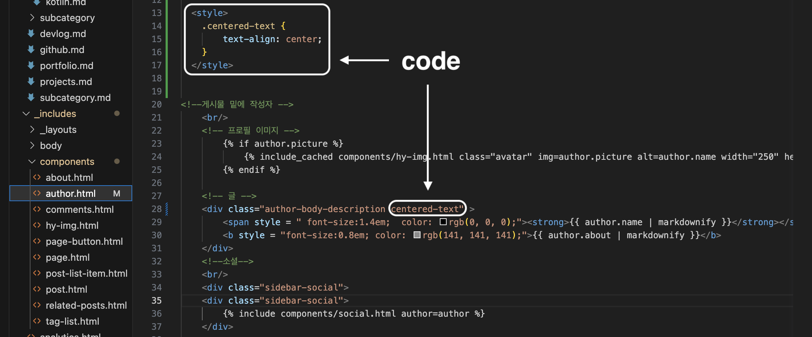

# [Git Blog] About 텍스트 정렬

아래서 설명할 About은 모든 Post의 하단에 있는 가벼운 설명글이다. <br/>처음 소개글을 입력했을 때 글씨가 잘리는 문제가 발생해 수정하던 중 Text를 중앙정렬하면 깔끔할 것 같아서<br/>중앙정렬을 하는 법을 알아보려고 한다.


* toc
{:toc}


---

## 1. 잘리는 Text

About을 수정하던 중 다음 사진과 같이 이미지와 겹쳐져 텍스트가 안보이는 상황이 발생하였다.


- 이 문제를 해결하기 위해 name, about 글의 앞쪽에 space로 공백을 넣어주려고 시도하였다.


- 하지만 아무리 띄어쓰기를 넣어도 블로그안에서는 공백이 적용이 안되는 것을 발견하였다 그래서 해결책을 알아보던 중 공간문자인 (U+2002)에 대해 알게되었다.


## 2. Unicode Character “ ” (U+2002)

U+2002는 En Space라고 불리는 공간 문자이다. 이 문자는 일반 스페이스바(U+0020)와는 다른 너비를 가지며, 텍스트 레이아웃에서 등분한 간격을 나타내는 데 사용된다.

- 다음은 (U+2002)를 yml상에 붙여놓은 코드이다.


- 다음과 같이 투명하지만 vs code에서는 노란색 테두리로 표시되는 것을 알 수 있다.

{: width="90%" height="auto" align="center"}

- 위의 (U+2002)를 적용한 결과 다음처럼 성공적으로 공백이 적용된 것을 볼 수 있다.
- (U+2002)는 <https://www.compart.com/en/unicode/U+2002> 여기서 복사할 수 있다.


## 3. Text 중앙정렬

위의 (U+2002)로 공백을 성공적으로 적용하였지만 글을 쓸 때 마다 공백을 적용해주기에는 너무 귀찮고 결과를 보면서 수정해야한다는 불편함이 있어 Text 중앙정렬을 알아보려고 한다.

- 먼저 깃블로그의 **_includes> componets> author.html** 경로로 들어간다.

- **스타일**을 center로 정해주기 위해 아래의 코드를 추가해준다.

```html
<style>
.centered-text {
    text-align: center;
}
</style>
```

- 다음으로
- 그리고 **글** 아래에있는 **클래스**이름의 뒷부분에 다음 코드를 추가해준다.

```html
centered-text
```

- 이해가 잘 안되는 사람들을 위해 아래 사진을 첨부하였다.



- 다음 사진을 참고해서 변경을 해주게 되면


- 이렇게! (U+2002)를 사용하지 않고도 깔끔한 중앙정렬이 완성되었다 :)

  
