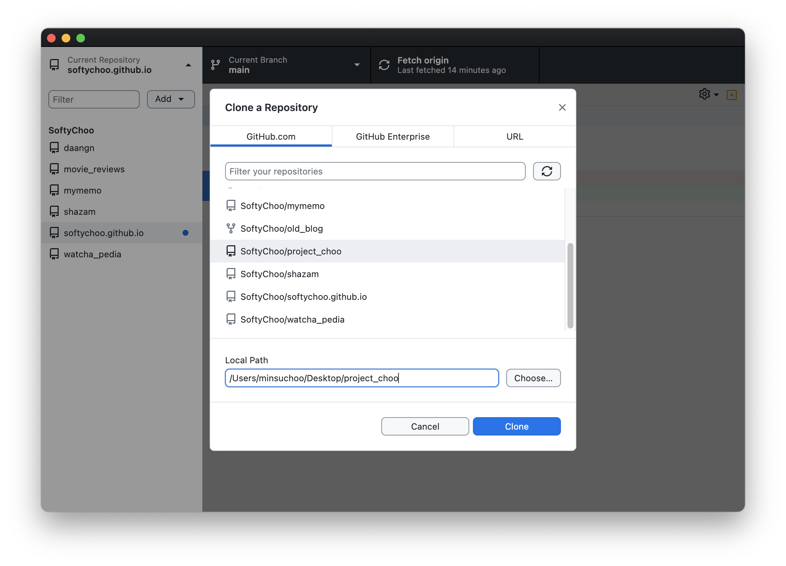
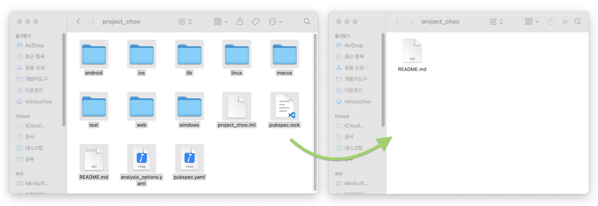

# [Github] 깃허브 레포지토리 쉽게 연결하는 방법

**Git Clone**을 쉽게하는 방법을 찾던 중 누구나 바로 따라할 수 있는 방법이 생각나서 글을 적어본다.

이제부터 컴퓨터상의 폴더를 깃허브에 쉽게 연결하는 방법에 대해 알아보자! 

* toc
{:toc}

## 1. 레포지토리 만들기 

먼저 기존의 폴더 이름과 동일한 이름의 레포지토리를 만들어준다.

## 2. Git Clone

**GitHub Desktop**을 열고 "Add" ➡ "Clone Repository"버튼을 클릭한다.

Desktop의 경로에 Clone을 해주면 바탕화면에 폴더가 생긴다.

## 3. 내용 이동

위에서 clone한 바탕화면의 폴더로 기존의 폴더안의 파일을 옮겨준다.

GitHub Desktop에 들어가보면 폴더 안에 파일이 정상적으로 추가된 것을 볼 수 있다.

Commit 후 Push해준다.

## 4. 마무리

이제 기존의 폴더를 삭제하고 그 위치에 clone이 완료돼있는 폴더를 옮겨주면 정상적으로 깃허브와 폴더가 연결되었다!
