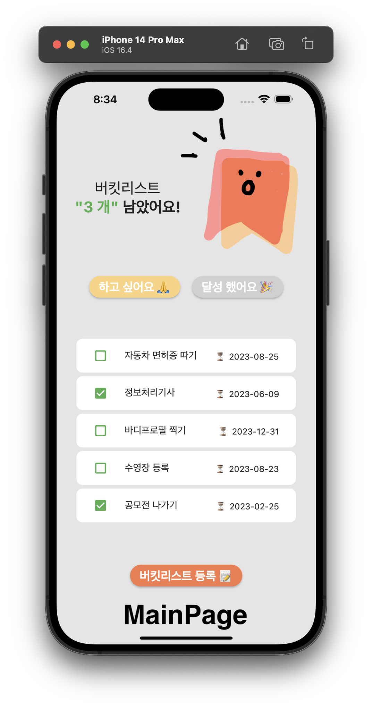

# [Flutter] 플러터 Text에 이모지 추가하기

플러터 앱 개발중 텍스트 버튼에 이모지를 추가해 가시성을 올리고 싶어서 알아보았다.

{:toc}

## 1. 이모지 유니코드 사이트

- 먼저 아래의 사이트로 가서 사용하고싶은 이모지의 유니코드를 복사해 오자!

- [Emoji Unicode Tables](https://apps.timwhitlock.info/emoji/tables/unicode) ⬅ 클릭!!

## 2. 텍스트에 이모지 추가 

- 플러터의 Text, TextField, Textbutton등에 유니코드를 추가한다.
- 추가 형식 예시 →  Text(”달성했어요 \u{1F389}”)

## 3. 결과물

**다음과 같이 성공적으로 이모지가 추가되었다!**

