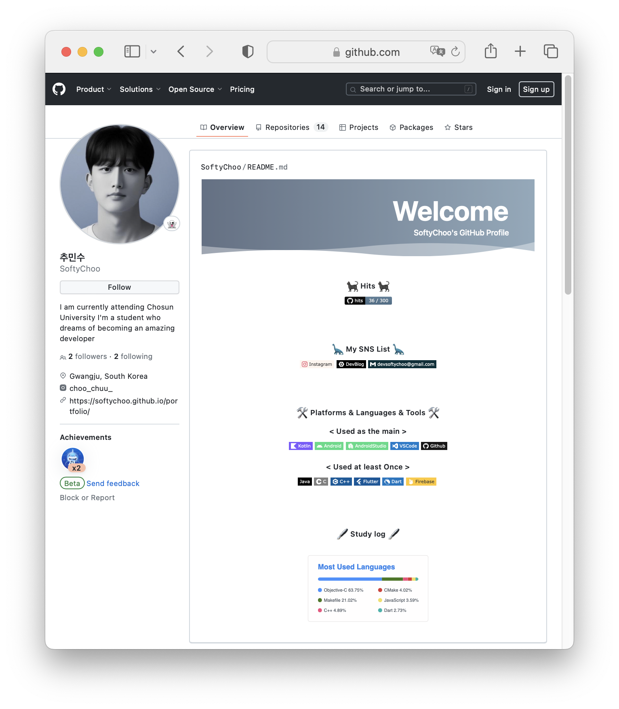
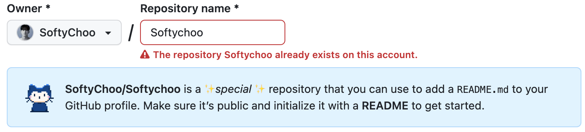
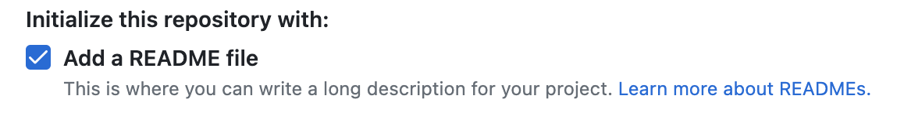
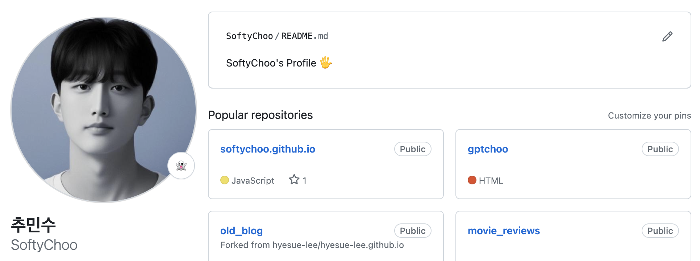
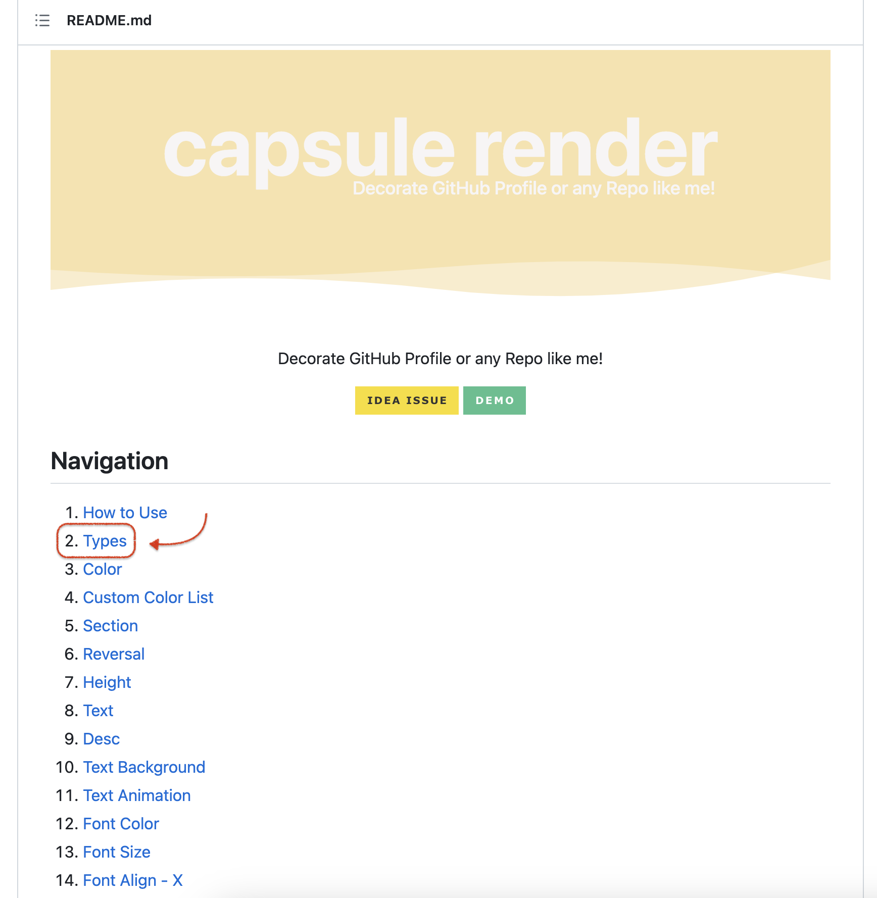
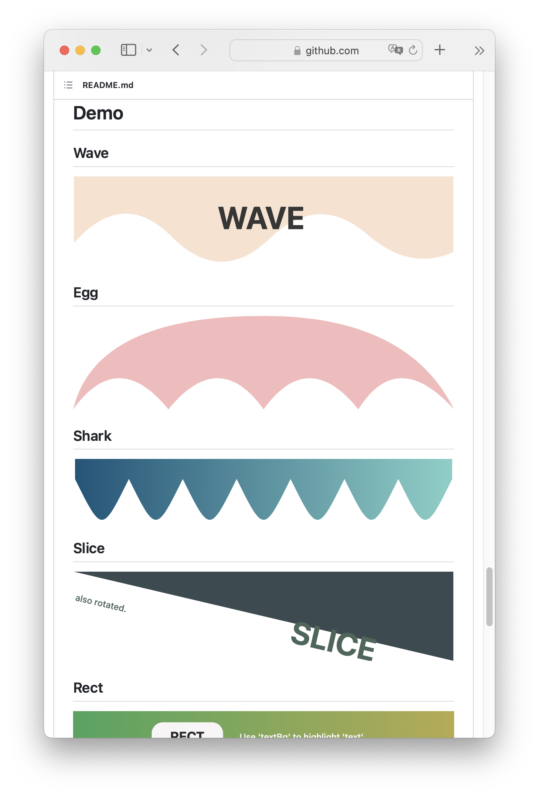
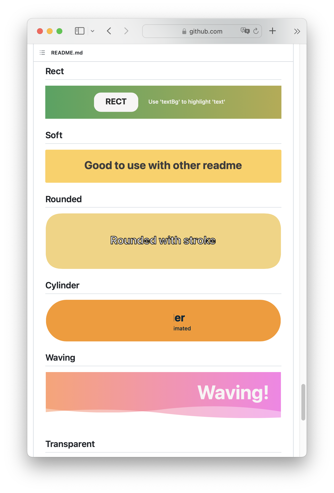
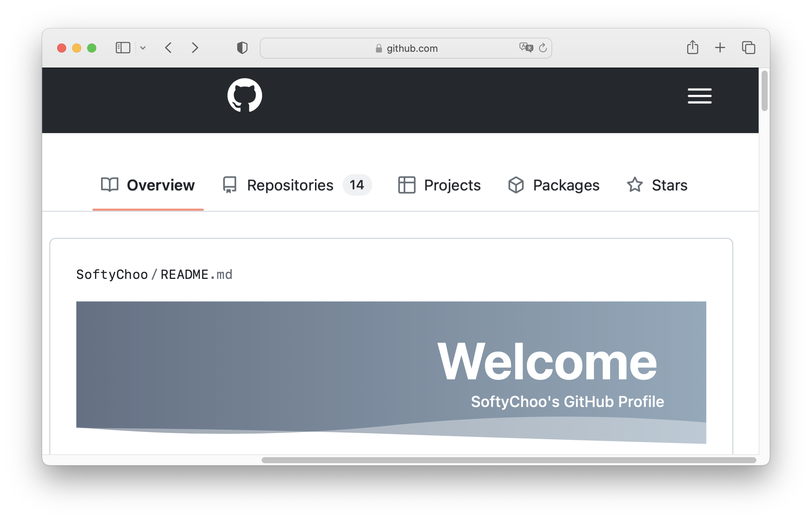
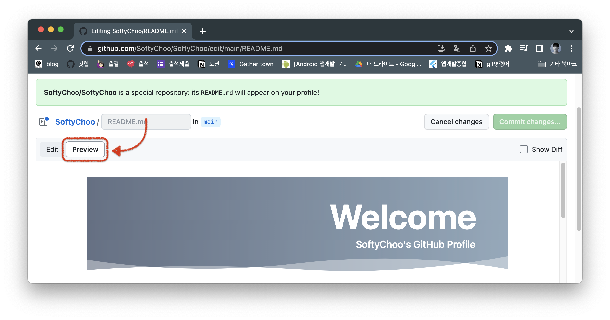

# [Github] GitHub Profile꾸미기!

README.md를 활용해 깃허브 프로필 꾸미기 :)


{:toc}


## My GitHub

- 먼저 꾸민 최종 결과물이다 :)   **[[Github Link]](https://github.com/SoftyChoo)**



## Step 1 : 프로필 생성하기

- 자신의 Github ➡  `Repository`  ➡  `New`를 클릭하여 신규 repository를 생성해준다.(이 때 이름을 자신의username과 동일하게 입력한다.)



- 나는 이미 레포지토리를 만들어 놓아서 다음과 같이 뜨지만 처음 생성한다면 **"You found a secret!"** 메시지와 함께 `README.md`로 깃허브 프로필을 작성할 수 있게 되었다는 메시지가 나온다!



- README file은 어차피 추가해주어야 하니 `Repository`를 생성할 때 추가 해주자!



- 그럼 다음과 같이 상단에 정상적으로 README.md 파일이 추가된 것을 확인할 수 있다.


## Step 2 : Header 만들기

- 이제 상단에 뜨는 Welcome을 만들어 보자.
- 먼저 다음의 링크에 들어간다 ➡ **[[Header 만들기 Link!]](https://github.com/kyechan99/capsule-render)**



- `Types` 를 눌러서 이동해주면
- 다음과 같이 헤더의 종류를 나타내는 목록이 나오고 어떤 형식으로 입력하는지가 나오고

- 아래로 쭉 내보면 Demo도 나온다!



- 나는 다음과 같이 Wave를 골라서 커스텀 했는데 다음은 내 헤더 코드이다!

```markdown

```

- **type = [데모스타일]** ➡ 나는 Waving을 골랐는데 Cylinder, Soft 등 자기가 원하는 스타일을 정해주면 된다.

- **color** **= 색상코드** ➡ 단색으로 하고싶다면 색상코드 하나를 집어넣어주면 되고 random으로 그라데이션을 해주고 싶다면 gradient를 입력해주면 된다. 나는 원하는 색으로 그라데이션을 넣고 싶어서 **왼쪽[0:색상코드] 오른쪽[100:색상코드]** 이런식으로 값을 지정해 주었다.!

- **height = 높이** ➡ 헤더의 높이 지정

- [**text = 타이틀** ➡ 먼저 나타낼 제목], [**fontColor** **= 색상코드** ➡ 제목의 색상 지정],[**fontsize = 크기** ➡ 글씨크기]

- [**desc = 부제목** ➡ 하단 부제목]

- **animation = 효과** ➡ 글씨 반짝임, 페이드인 등 효과 지정 위의 사이트의 animation 목록 참고!

- **fontAlignY = 위치** ➡ 글씨의 세로 위치 지정

- **fontAlign = 위치** ➡ 글씨의 가로 위치 지정 0~100 까지의 범위 내에서 입력

- **descAlign = 위치** ➡  부제목 가로위치

  

### 잠깐!! 

- README.md 파일에서 프로필을 편집할 때 상단의 `Preview`를 클릭하면 현재 진행사항을 확인할 수 있다!



## Step 3 : Body 만들기

- 먼저 아이콘은 다음 사이트에서 색상코드, 아이콘 등을 받아올 수 있다.
- [[아이콘 사이트!!]](https://simpleicons.org/)


- 다음은 내가 사용한 아이콘 중 일부인데 Kotlin을 예로 작성해보면

```markdown

```

- 다음과 같이 입력하면  이렇게 아이콘을 완성할 수 있다!

```markdown

```

- 다음과 같은 형식으로 작성하면 된다 :)

```markdown
<div align="center">
작성하고싶은 글씨
</div>
```

- 글씨는 가운데 정렬을 해주었다.


## Step 4 : GitHub Stats

[](https://github.com/SoftyChoo/github-readme-stats)

- 마지막으로 다음과 같이 내가 어떤 언어를 많이 사용했는지 수치를 통해 보여주는 Github Stats를 추가해보겠다.

```markdown
[](본인깃허브주소/github-readme-stats)
```

- 다음과 같은 형식으로 작성해주면 완성된다!! :)

