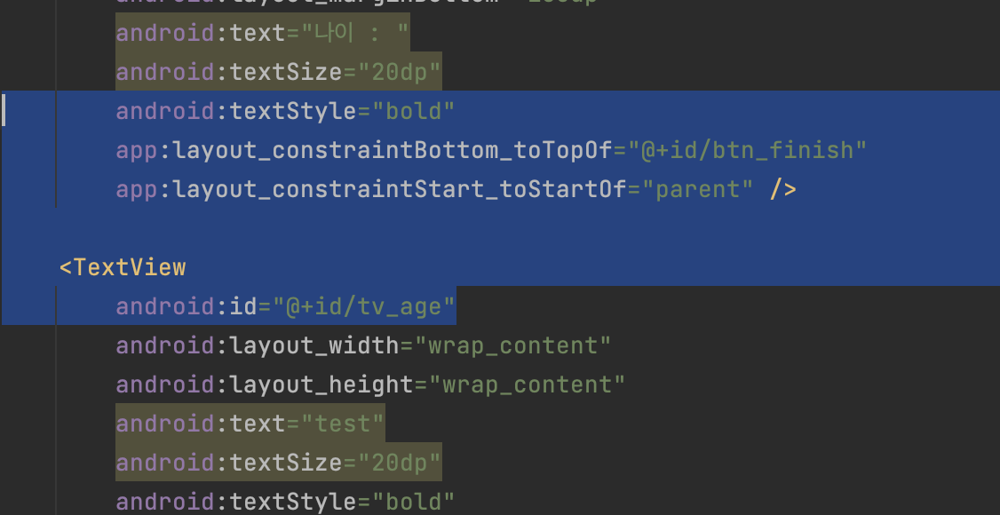
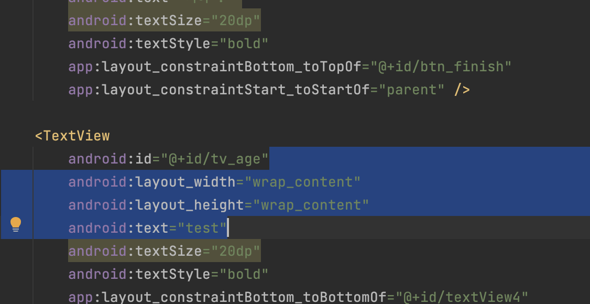

# [Android/Kotlin] [Trouble Shooting] (MAC) Android Studio 클릭 먹통 해결

{:toc}

## 문제 상황

- 안드로이드 스튜디오를 사용하던 중 가끔씩 클릭이 먹통이 되고 코드를 클릭하면 마치 `Shift`를 계속 누르고 있는 듯이 드래그 되는 상태가 발생했다.

- 다음과 같이 마치 age의 뒤쪽에 마우스가 고정된 상태로 클릭한 부분까지 드래그 되는 현상이 생겼다..!

- 이 상태에서 코드 부분을 제외한 모든부분이 먹통이 되는 문제가 있었다.

## 시도 

- 내가 찾은 해결방법이 있는데 첫번째는 안드로이드 스튜디오 **재부팅**이다..! 
- 당연하게도 안드로이드 스튜디오를 `Cmd`+`s`를 눌러 저장 후 재부팅해주면 문제가 해결되게 된다. 

## 다른 해결방법

- 만약 다른 방법이 궁금하다면 두번째 방법은 한/영 전환을 해주는 것이다.
- 이유는 모르겠지만 `esc`를 아무리 눌러도 먹통이던 안드로이드 스튜디오가
  `caps lock` or `Cmd` + `space`를 눌러 한영 전환을 해주니 정상적으로 동작하였다.

## 알게된 점

- 정말 상상하지도 못한 부분에서 오류가 발생하는 문제가 생기는데 당황하지 않고 여유를 가지고 웹서핑이나 문제가 무엇인지 한번 더 생각해보는게 도움이 많이 된다!
  - ++어떻게 해결된지는 이해가 안되지만 개발에 지장이 전혀 없을정도의 도구 문제는 가볍게 인지만 하고 넘어가자:) 