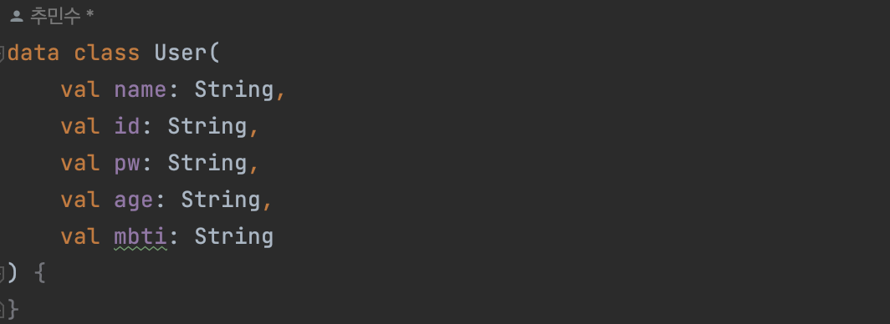
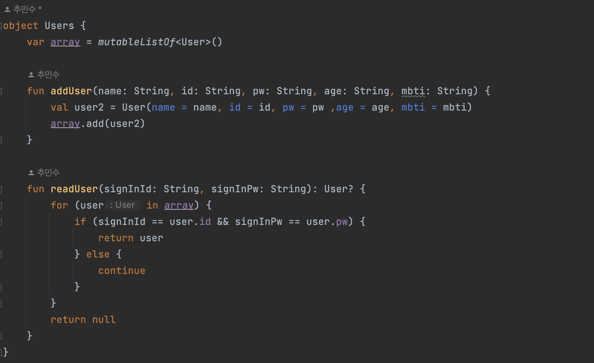

# [Android/Kotlin] [Trouble Shooting] Object 사용하기

{:toc}

## 문제 상황

- SignIn 과제를 하던 중 `Class`에 정보를 저장해 관리했었는데 호출을 한곳에서 한 이후 액티비티를 옮겨다니다 보니 매우 번거롭고 휘발성이고 값이 null값으로 날아가는 문제를 직면했다.

## 시도 

- 좀 더 효율적으로 데이터를 불러오기 위해 **Java**에서 `Static`을 사용했던 기억이 있어서 찾아보니
  Kotlin에 Object를 알게돼서 적용해보았다.
- 데이터를 저장하는 방식은 `data class`로 객체를 만들어 사용하였다 :)

## 해결

- 먼저 필요한 값을 저장하기 위해 `data class`를 생성해주고 생성자로 내가 필요한 데이터 변수들을  입력해주었다.

- 다음으로 **Object** `Users`를 만들어 준 뒤 `mutableList`를 선언해 타입을 위에서 만든 `User`로 지정해주었다.

- 그 이후 회원가입 이벤트가 있을 때 마다 **`add User`**을 통해 값을 추가해주고 **`readUser`**로 값을 불러오는 코드를 작성해주었다.

## 알게된 점

- 뭐든 많이 아는게 중요한 것 같다는걸 항상 느낀다. 모를 때는 한참 고민해도 되게 어려운 로직과 오류들의 늪에 빠졌는데 어느정도 지식이 생긴 다음에 구현을 하니 되게 쉽게 척척 진행됐던 것 같다.
- 아직 엄청 부족한것 같다 앞으로도 끊임없이 공부를 진행하고 내것으로 만들어야겠다 :)