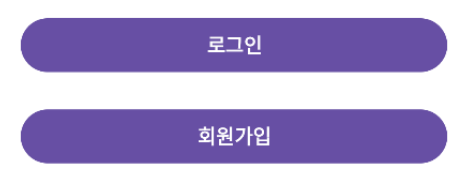
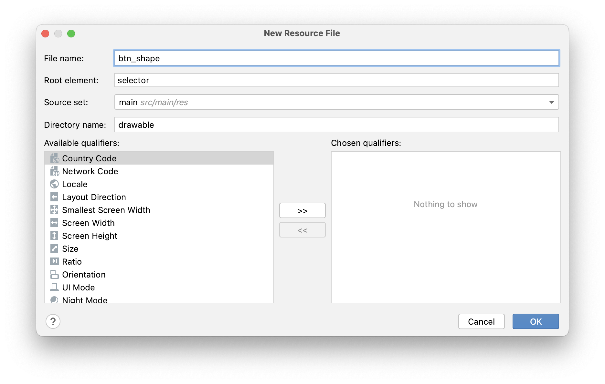
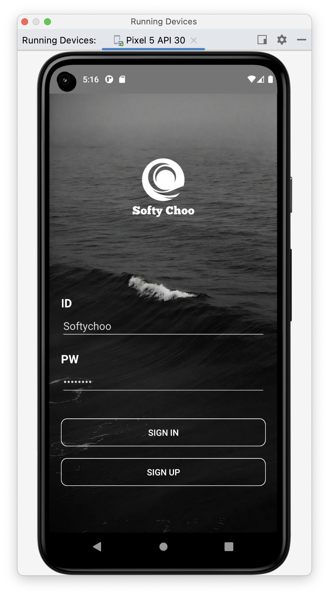
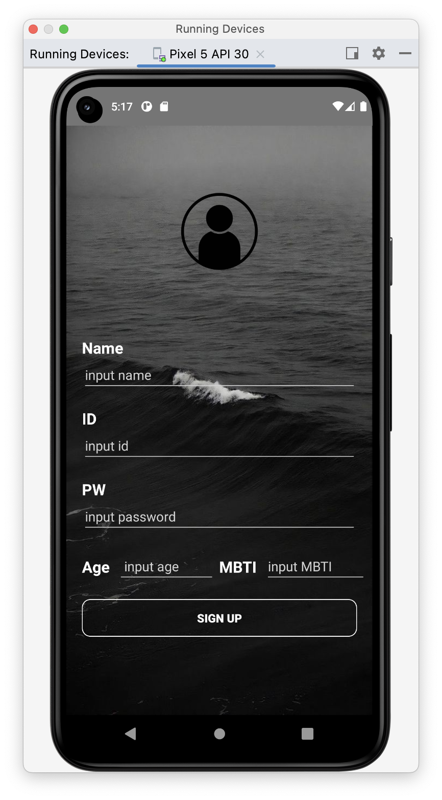

# [Android] (kotlin) 나만의 버튼 커스텀하기 :)

{:toc}

- AndroidStudio UI를 수정하던 중 버튼이 너무 구린것 같아 수정해보려고 한다 :)


## [초기] Button (적용 전)

- 구상하고자하는 UI에 어울리지 않은 버튼색과 모양이라서 내가 원하는 버튼모양을 만들려고 한다.




## [Step 1] 리소스파일 추가

- **res /drawable** 경로에 원하는 이름의 새로운 Resource File을 만들어준다.

  

## [step 2] 코드작성

- 그 안의 코드를 다음과 같은 형식으로 수정해준다.

```xml
<?xml version="1.0" encoding="utf-8"?>
    <shape xmlns:android="http://schemas.android.com/apk/res/android" >
        <solid android:color="#00ff0000" /><!--투명색-->
        <stroke
            android:width="1dp"
            android:color="#ffffff" /> <!--테두리 두께와 색-->
        <corners
            android:topLeftRadius="10dp"
            android:topRightRadius="10dp"
            android:bottomLeftRadius="10dp"
            android:bottomRightRadius="10dp"  />

    </shape>
```

- 나는 배경을 투명색으로 해주기 위해 투명색 색상코드인 `#00ff0000` 로 설정해주었다.
- `stroke`는 테두리로 width로 두께를 color는 흰색으로 하기위해 색상코드 `#ffffff` 로 설정하였다.
- `corners`는 모서리의 둥근정도를 설정 가능하다.


## [step 3] activity.xml 파일 변경

- 진행하던 xml파일로 돌아가 button에 다음 코드(`android:background="@drawable/btn_shape"`)를 추가해준다.

```xml
<Button
        android:layout_width="match_parent"
        android:layout_height="wrap_content"
        android:background="@drawable/btn_shape"     배경을 만든 스타일대로 지정해준다.
        android:text="sign in"/>
```


## [결과] 커스텀 button 적용 후

- 다음과 같이 내가 만든 커스텀 button이 완성되었다 :)


- button을 커스텀한 각각의 UI에 적용한 모습



