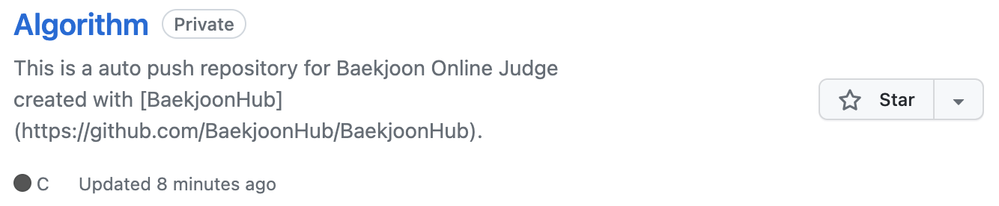
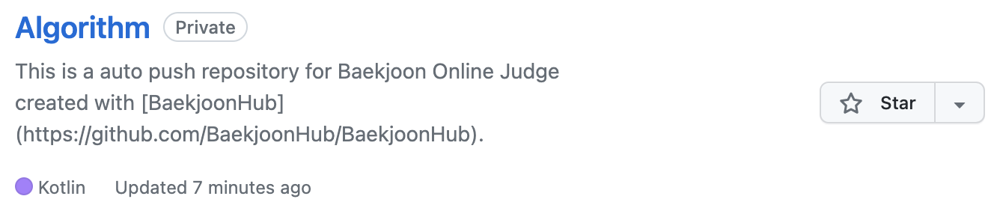

# [Trouble Shooting] Github 리포지토리 언어 변경 + (백준허브)

{:toc}

- 백준허브를 통해 알고리즘 풀이를 github 상으로 바로 입력되도록 하던 와중에 언어를 **C  ➡ Kotlin** 으로 변경하게 되어 표시되는 리포지토리의 언어를 바꿔보려고 한다!
- 

## 변경 전( C )



- 다음과 같이 Kotlin과 C언어 풀이가 둘 다 있음에도 C로 표기되는 것을 볼 수 있다.
- 물론 나중에 Kotlin 파일의 크기가 많아지게 된다면 바뀌겠지만 사용하지 않는 언어를 무시해줄 수 있다는 점에서 다른 리포지토리에도 충분히 사용 가능하다.


## [Step 1] 리포지토리에 파일생성


- 먼저 다음과 같이 리포지토리에 이름이 **.gitattributes** 인 파일을 생성해준다.


## [Step 2] 무시할 언어 설정

```
*.c linguist-detectable=false
```

- 나는 Algorithm 리포지토리에선 C를 무시할 것이기 때문에 C를 무시해준다.

### 	변경 후 




## [Step 3] 응용

```
* linguist-vendored
*.kt linguist-vendored=false
```

- 만약 무시해줄 언어가 너무 많다면 전체를 무시해준 다음 내가 표시할 언어만 인식하도록 설정해주면 된다.


##### Github Repository에 코드를 올리게 되면 자동으로 파일을 분석하여 작성한 언어별 비율을 알려주는데 이 때 언어비율에 미치는 것은 파일의 갯수가 아닌 언어별 파일의 크기이기 때문에 크기가 크다면 내 주 언어가 아닌 다른 언어의 비율이 내 언어의 비율을 밀어낼 수 있기 때문에 유용하게 쓰일 것 같다 :)