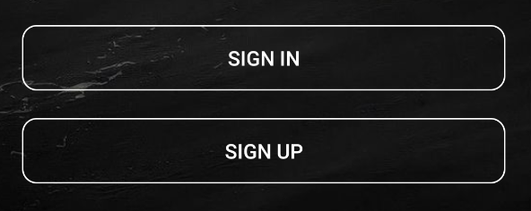
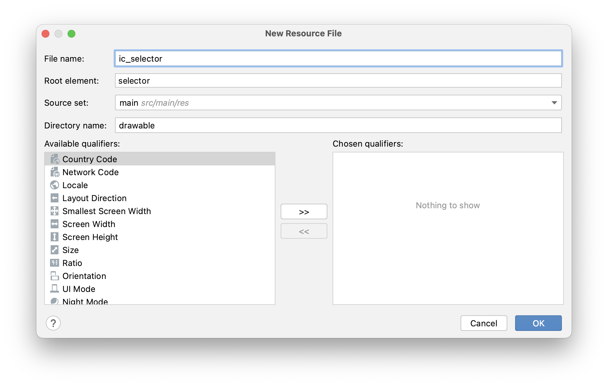
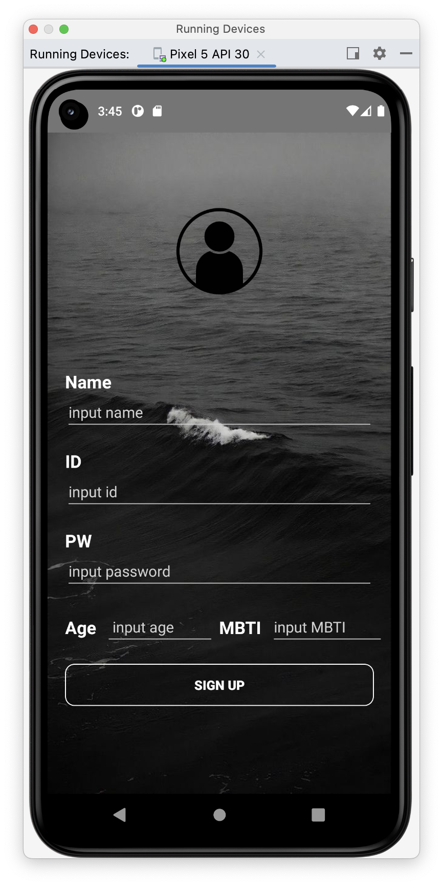
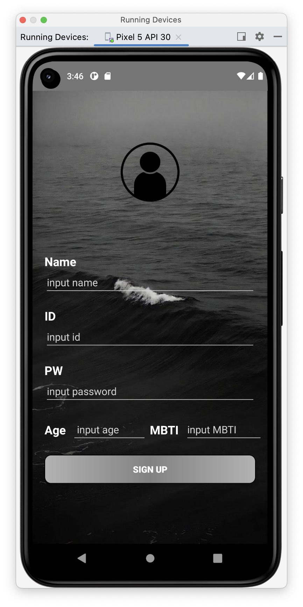
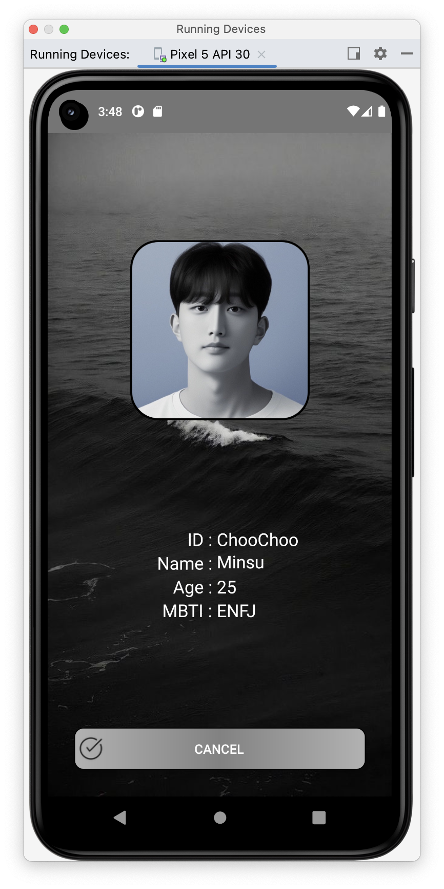

# [Android/Kotlin] Selector을 사용한 커스텀 버튼 만들기(최종!!)

{:toc}

##### 전 내용이 궁금한 분들은 링크를 클릭해주세요 :) 

- [전 내용 바로가기 링크 !!!!](https://softychoo.github.io/devlog/fix-it/2023-08-04-%EB%B2%84%ED%8A%BC%EC%BB%A4%EC%8A%A4%ED%85%80/)


## 이전의 커스텀 button



- 저번시간에 만들어본 나만의 버튼 커스텀에 이어서 **Selector을 사용해 버튼클릭 시 버튼의 색이 변경**되도록 하는 코드를 작성해보겠다


## [Step 1] 리소스파일 추가

- **res /drawable** 경로에 원하는 이름의 새로운 Resource File을 만들어준다.

  1. **버튼 스타일을 나타낼 xml**

     

  2. **버튼에 아이콘을 나타낼 xml**

     

  

## [step 2] 코드작성

- 그 안의 코드를 다음과 같은 형식으로 수정해준다.

### 1. 버튼 배경 등 Style을 지정해줄 `btn_selector.xml`

```xml
<?xml version="1.0" encoding="utf-8"?>
<selector xmlns:android="http://schemas.android.com/apk/res/android">
    <item android:state_pressed="true">
        <shape>
            <corners android:radius="10dp"/>
            <stroke
                android:width="1dp"
                android:color="#000000" />
            <gradient
                android:angle="0"
                android:startColor="#b2b2b2"
                android:centerColor="#828282"
                android:endColor="#b2b2b2"
                android:type="linear" />
        </shape>
    </item>
    <item android:state_pressed="false">
        <shape>
            <solid android:color="#00ff0000"/>
            <corners android:radius="10dp"/>
            <stroke
                android:width="1dp"
                android:color="#ffffff" />
        </shape>
    </item>
</selector>
```

- `state_pressed` 는 버튼의 눌림 상태를 나타낸다. `true`라면 버튼이 눌린 상태를 나타낸다.
- `false` 일 때는 전의 포스트에서 다룰 때 만들어줬던 버튼을 그대로 적용해주었다.
- `true` 상태에서는 테두리를 검정색으로 변경해주고 입체감을 주기 위하여 **`color`** 대신 **`gradient`** 를 지정해주었다.

### 2. 버튼에 아이콘을 표시해줄 `ic_selector.xml`

#### 	[step 1] 사용할 아이콘 추가

- res/drawable 경로 안에 사용할 img 파일을 추가해준다.
- 원래의 구현 목적은 이미지 2개를 추가해준 뒤 클릭 전 후를 설정해서 이미지가 변경되도록 해주는 것이다.
- 나는 아이콘이 변하는 것을 원치않았기 때문에 하나만 추가해줘서 연출해주었다. (내가 추가한 파일은 `Ic_check.png`)

#### 	[step 2]

- `state_pressed` 는 버튼의 눌림 상태를 나타낸다. `true`라면 버튼이 눌린 상태를 나타낸다.

```xml
<?xml version="1.0" encoding="utf-8"?>
<selector xmlns:android="http://schemas.android.com/apk/res/android">
    <item android:drawable="@drawable/ic_check" ----- [1]
        android:state_pressed="true" />
    <item android:drawable="@drawable/ic_check" /> -----[2]
</selector>
```

- 나는 위에서 말했듯이 동일한 파일을 설정해주었지만 이미지가 변하게 하려면
- [1]의 위치엔 눌렀을 때 표시될 Icon
- [2]의 위치엔 누르기 전 Icon을 입력해주면 된다.


## [step 3] activity.xml 파일 변경

- 진행하던 xml파일로 돌아가 button에 다음 코드들을 추가해준다.

```xml
<Button
        android:layout_width="match_parent"
        android:layout_height="wrap_content"
        android:background="@drawable/btn_selector" - 버튼 클릭 시 배경지정
				android:drawableLeft="@drawable/ic_selector" - 버튼 클릭 시 아이콘 변경
        android:text="sign in"/>
```

- 나는 마지막에 CANCEL 버튼에만 `btn_selector`와 `ic_selector`을 모두 적용해주었고
  나머지 버튼들에는`btn_selector`만 적용해주었다.

## [결과] 커스텀 button 적용 후



### 시연영상

