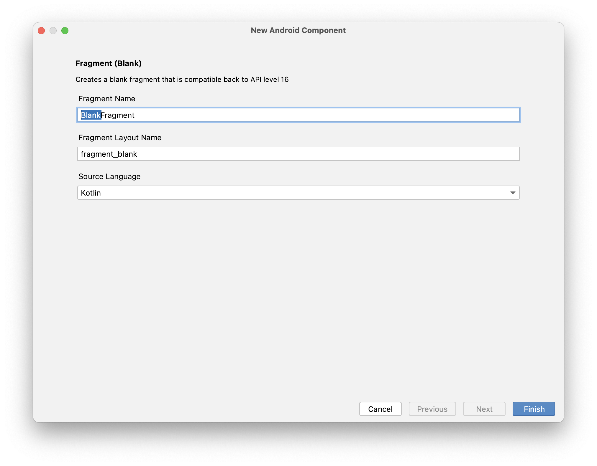

# [Android/Kotlin] ViewPager에서 ViewPager2로 이전

{:toc}

## ViewPager2란?

[`ViewPager2`](https://developer.android.com/jetpack/androidx/releases/viewpager2?hl=ko)는 `ViewPager` 라이브러리의 개선된 버전으로, 향상된 기능을 제공하며 `ViewPager` 사용 시 발생하는 일반적인 문제를 해결한다.

## ViewPager2의 장점

### 세로 방향 지원

`ViewPager2`는 기존 가로 페이징은 물론 세로 페이징도 지원한다. `android:orientation` 속성을 설정하여 `ViewPager2` 요소의 세로 페이징을 사용 설정할 수 있다.

```xml
<androidx.viewpager2.widget.ViewPager2
        xmlns:android="http://schemas.android.com/apk/res/android"
        android:id="@+id/pager"
        android:orientation="vertical" />
    
```

### 오른쪽에서 왼쪽 지원

`ViewPager2`는 오른쪽에서 왼쪽(RTL) 페이징을 지원한다. RTL 페이징은 언어에 따라 해당하는 경우 자동으로 사용 설정되지만 `android:layoutDirection` 속성을 설정하여 `ViewPager2` 요소의 RTL 페이징을 수동으로 사용 설정할 수도 있다.

```xml
<androidx.viewpager2.widget.ViewPager2
        xmlns:android="http://schemas.android.com/apk/res/android"
        android:id="@+id/pager"
        android:layoutDirection="rtl" />
    
```

#### ViewPager2 에서 개선된 것들

- Modifidable Fragment Collections을 정상 지원한다.
  - 기존 ViewPager에서 웰논 이슈였던 notifyDataSetChanged()에 대한 비정상 동작이 해결됐다.

- DiffUtil를 사용할 수 있다.
  - ViewPager2는 RecyclerView 기반으로 동작하기 때문에 DiffUtil도 사용할 수 있다.

#### 꼭 사용해야 할 이유!

- 이제 Google이 Viewpager에 대한 유지보수를 하지 않고 Viewpager2만 유지보수할 예정이라고 밝혔기 때문에 ViewPager2를 사용해야한다.


## [Step 1] XML 레이아웃 파일 업데이트

- `TabLayout`을 추가해준다.

- `<!-- A ViewPager2 element -->`의 형식에 맞춰 ViewPager2를 추가시켜준다.

- ViewPager를 사용중이였다면 XML 레이아웃 파일의 `ViewPager` 요소를 `ViewPager2` 요소로 바꿔준다.

```xml
<!-- TabLayout -->
<com.google.android.material.tabs.TabLayout
        android:id="@+id/tab"
        android:layout_width="match_parent"
        android:layout_height="40dp"
        app:layout_constraintEnd_toEndOf="parent"
        app:layout_constraintStart_toStartOf="parent"
        app:layout_constraintTop_toBottomOf="@+id/toolbar" />
<!-- A ViewPager element -->
    <android.support.v4.view.ViewPager
        xmlns:android="http://schemas.android.com/apk/res/android"
        android:id="@+id/pager"
        android:layout_width="match_parent"
        android:layout_height="match_parent" />

<!-- A ViewPager2 element -->
    <androidx.viewpager2.widget.ViewPager2
        xmlns:android="http://schemas.android.com/apk/res/android"
        android:id="@+id/pager"
        android:layout_width="match_parent"
        android:layout_height="match_parent" />
```


## [Step 2] Fragment 추가 

- 다음으로 화면을 구성할 **Fragment**를 추가해준다.
- Fragment는 화면을 구성할 페이지 개수만큼 추가해주면 된다. (나는 두개가 필요하기 때문에 2개의 Fragment를 만들어주었다.)



- 이름은 위의 사진에서 드래그된 부분만 변경해 **``TodoFragment``**와 **``BookmartFragment``**로 지정해주었다.

## [Step 3] `FragmentPageAdapter` 

- `FragmentPageAdapter` 클래스를 추가해준다.

```kotlin
// FragmentPageAdapter.kt
package com.example.camp

import androidx.fragment.app.Fragment
import androidx.fragment.app.FragmentManager
import androidx.lifecycle.Lifecycle
import androidx.viewpager2.adapter.FragmentStateAdapter

class FragmentPageAdapter(
    fragmentManager: FragmentManager,
    lifecycle: Lifecycle
) : FragmentStateAdapter(fragmentManager, lifecycle) {
    override fun getItemCount(): Int {
        return 2 // 프래그먼트 개수
    }

    override fun createFragment(position: Int): Fragment {
        return if (position == 0)
            TodoFragment() // 첫 번째 위치에는 TodoFragment 생성
        else
            BookmarkFragment() // 두 번째 위치에는 BookmarkFragment 생성
    }
}
```


## [Step 4] `MainActivity` 수정

- `TabActivity`와 `ViewPager` 를 연결해주기 위해 `MainActivity` 의 onCreate안에 다음의 형식에 맞춰 코드를 작성한다. 

```kotlin
				// Xml 아이디 받아오기
        tabLayout = findViewById(R.id.tab)
        viewPager2 = findViewById(R.id.viewPager)

        // FragmentPageAdapter 인스턴스 생성
        adapter = FragmentPageAdapter(supportFragmentManager, lifecycle)

        // TabLayout에 탭 추가
        tabLayout.addTab(tabLayout.newTab().setText("Todo"))
        tabLayout.addTab(tabLayout.newTab().setText("Bookmark"))

        // 어댑터를 ViewPager2에 설정
        viewPager2.adapter = adapter

        // 탭 선택 변경 리스너 추가
        tabLayout.addOnTabSelectedListener(object : TabLayout.OnTabSelectedListener{
            override fun onTabSelected(tab: TabLayout.Tab?) {
                if (tab != null) {
                    // 탭 선택 시, ViewPager2의 현재 페이지 변경
                    viewPager2.currentItem = tab.position
                }
            }
            override fun onTabUnselected(tab: TabLayout.Tab?) {
            }
            override fun onTabReselected(tab: TabLayout.Tab?) {
            }
        })

        // ViewPager2 페이지 변경 콜백 리스너 추가
        viewPager2.registerOnPageChangeCallback(object : ViewPager2.OnPageChangeCallback(){
            override fun onPageSelected(position: Int) {
                super.onPageSelected(position)
                // 페이지 선택 시, TabLayout에서 해당 탭 선택
                tabLayout.selectTab(tabLayout.getTabAt(position))
            }
        })
```


##### [개념에 대해서 참조한 블로그](https://heechokim.tistory.com/21)


