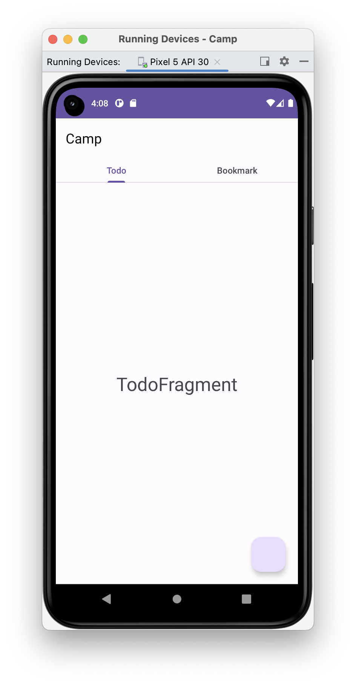
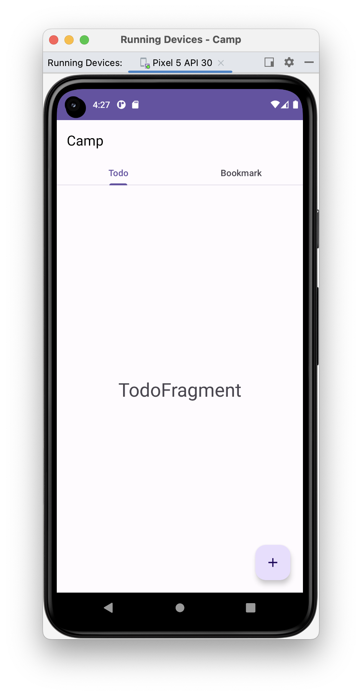
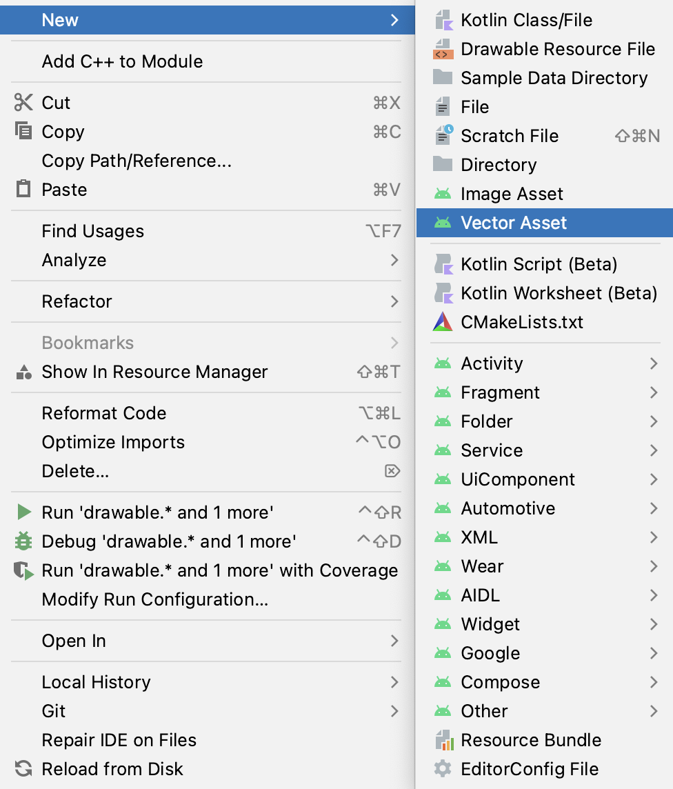
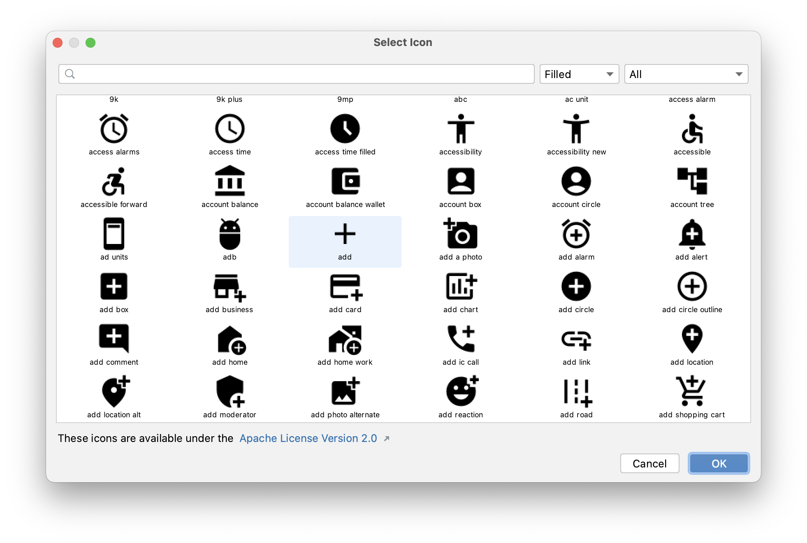

# [Android] 기본 제공 ICON  사용법 (vector graphics)

{:toc}

## 적용 예시(Floating Action Button)

- `Floating Action Button`에 기본 ICON 적용 사례이다.



## [Step 1]

- res/**drawable** 우클릭 후 **VectorAsset**클릭!



## [Step 2] 아이콘 선택

- **Clip art** 버튼을 눌러 원하는 아이콘을 선택해주자


- 나는 추가버튼을 만들어 줄 계획이라  `add` 아이콘을 선택해주었다.



## [Step 3] 적용

- 생성된 아이콘을 적용해주자!

- 나는 버튼에 넣어주기 위해서 버튼에 다음의 코드를 추가해주었다 :)

```xml
<com.google.android.material.floatingactionbutton.FloatingActionButton
        ...
        android:src="@drawable/baseline_add_24"
        ...                                                               
        />
```

