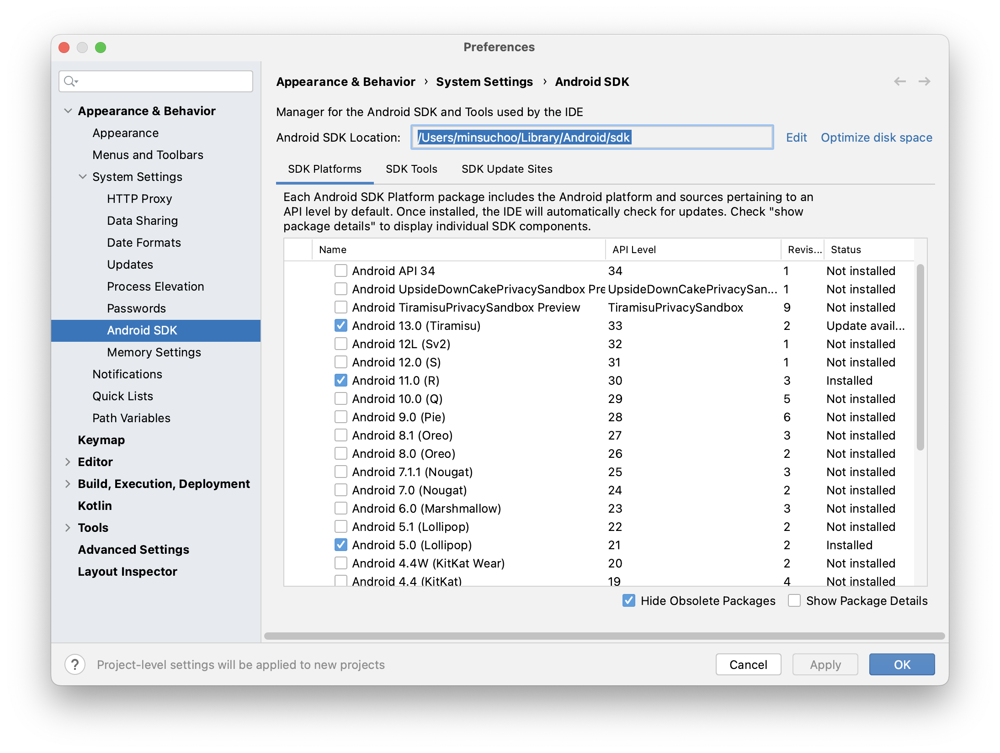

# [Android Error] SDK location not found 에러해결 

{:toc}

## 상황

Android Studio를 사용하여 협업을 진행하던 중 자주 발생한 오류가 있는데

바로바로  **SDK location not found** 에러이다.


## Error 전문

**SDK location not found. Define a valid SDK location with an ANDROID_HOME environment variable or by setting the sdk.dir path in your project's local properties file at** '/Users/minsuchoo/AndroidStudioProjects/kotlin_projects/nbCamp_week4_assignment/local.properties'.


## 해결

영어 해석과 같이 (**SDK location not found**) SDK 경로를 찾을 수 없어서 발생하는 에러이다.


주로 협업을 진행하면서 Mac/Window등 개발자들간 OS가 달라서 발생하는 에러이다.


### [Step 1] SDK Manager 실행

- Android Studio 상단의 버튼을 눌러 SDK Manager을 실행해준다.


### [Step 2] SDK Location 복사

- SDK Manager의 SDK주소를 복사해준다.



### [Step 3] Local.properties 수정

- AndroidStudio 내의 Local.properties 파일로 들어가준다.

```properties
sdk.dir=C\:\\Users\\user\\AppData\\Local\\Android\\Sdk  ->기존 코드

sdk.dir = /Users/minsuchoo/Library/Android/sdk -> 수정한 코드
```

- SDK 주소를 복사한 주소로 변경해준다.


### [참고] OS별 주소 형식

**Window** :  c:\Users\'사용자 이름'\AppData\Local\android\adk

**MAC** : /Users/'사용자 이름'/Library/Android/sdk


