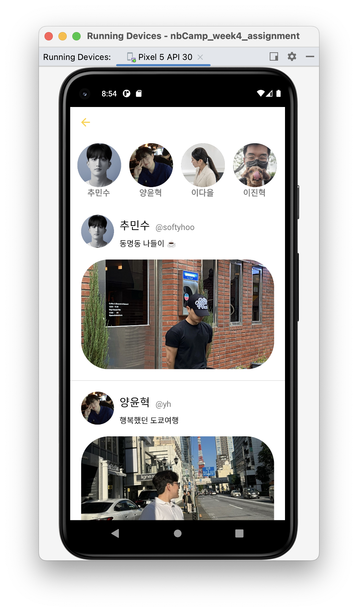

# [Android/Kotlin] recyclerView 가로 스크롤 하는법

{:toc}


RecylerView는 기본적으로 세로 스크롤을 지원한다. 하지만 짧은 코드로 RecyclerView를 가로 스크롤 되도록 구현할 수 있다.


## Code!!

바로 RecyclerView의 속성을 가로로 해주면 된다 :)

```kotlin
val postRecyclerView = findViewById<RecyclerView>(R.id.rv_profile_main)
//RecyclerView 가로로 변환해주는 코드
postRecyclerView.layoutManager =LinearLayoutManager(this).also { it.orientation = LinearLayoutManager.HORIZONTAL }
```


## 구현완료!!

