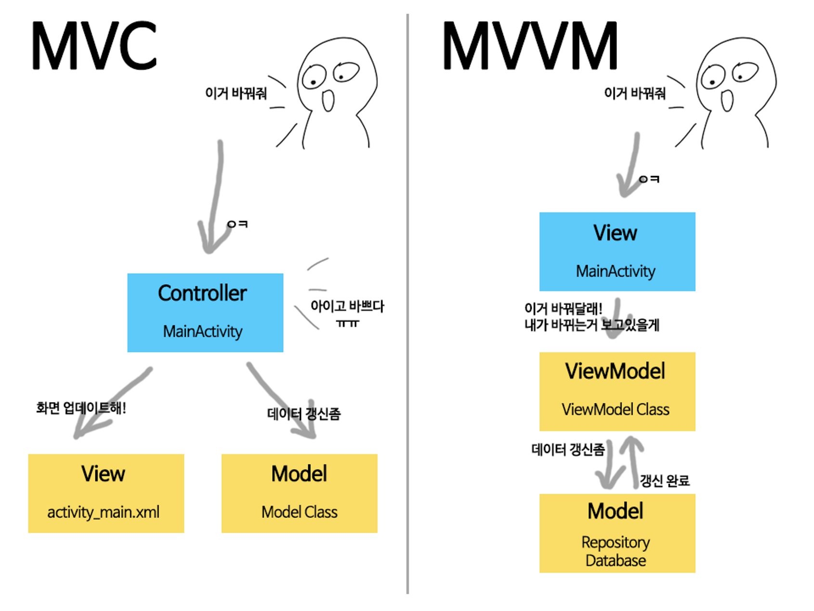

# [Android/Kotlin] TodoList MVC ➡︎ MVVM refactoring

{:toc}

## 🤔 기존 코드

**비즈니스로직과 뷰가 분리되지 않아 코드가 복잡하고 유지보수가 어려움**

그래서!!

**MVVM 패턴으로 리팩토링 해보겠습니다 ~** 

[MVVM패턴이란?](https://softychoo.github.io/devlog/kotlin/2023-09-13-viewmodel/)

