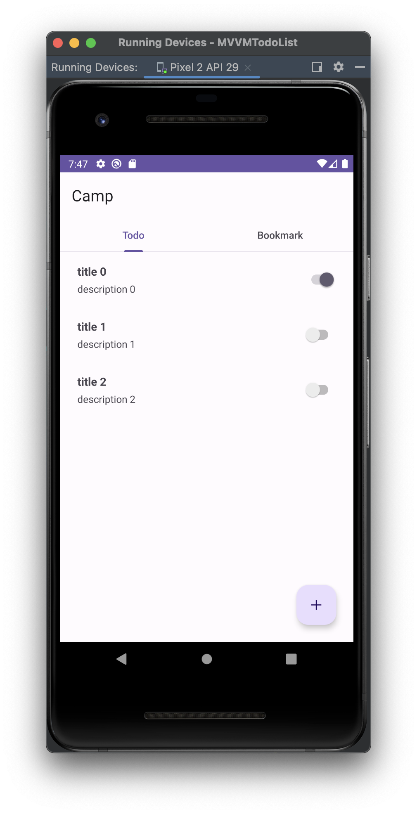

# [Android/Kotlin],[TroubleShooting] Fragment간 데이터 전달 중 앱 죽음

{:toc}

## 상황

MVVM을 공부하기 위해 TodoList를 만들어 개발을 진행 하던 중 앱 실행 후 바로 TodoFragment RecyclerView item의 switch를 클릭하면 앱이 종료됨

+

But! : BookMarkTab을 누르고 클릭 시 정상적으로 추가되었음



## 이유

Bookmark Fragment를 생성하기 전 데이터 전달이 이루어 진 것이였음


## 결론

기존의 데이터를 옮기는 방식은 MainActivity 상에 함수를 선언 해두고

```kotlin
fun addBookmarkItem(item: TodoModel) {
    val fragment = viewPagerAdapter.getFragment(1) as? BookmarkFragment 
    fragment?.addItem(item.toBookmarkModel()) // TodoModel을 BookmarkModel로 변환하여 추가
}
```

TodoFragment에서 캐스팅을 통해 직접 참조해주는 식의 코드를 짰는데

```kotlin
private fun addItemToBookmarkTab(item: TodoModel) {
        (activity as MainActivity).addBookmarkItem(item) 
    }
```

다음과 같은 코드는 메모리 누수, 생명주기의 문제 등이 발생 할 수 있는 코드란 것을 알게되었다.


## 해결 및 알게된 점

해결하기 위해 MainActivity에 MainView모델을 하나를 두고 바로 ViewModel에 접근해 데이터를 추가, 삭제하는 등 작업을 해볼 생각이다.

