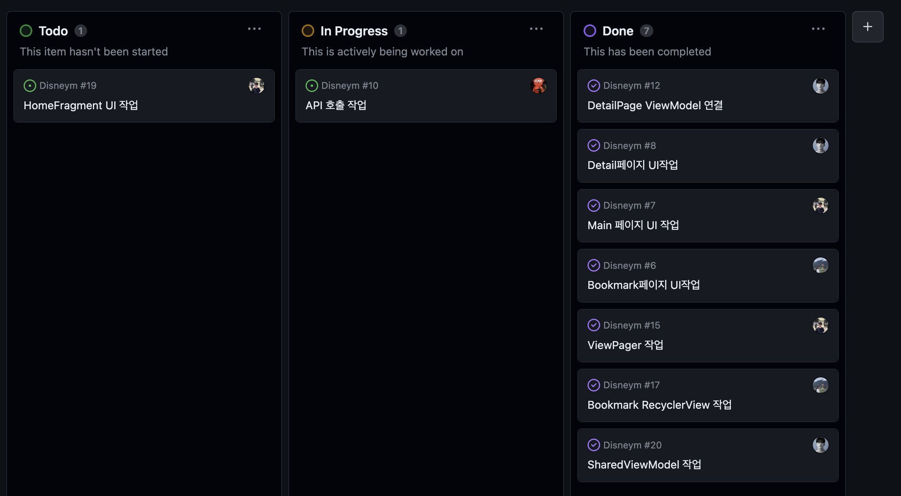
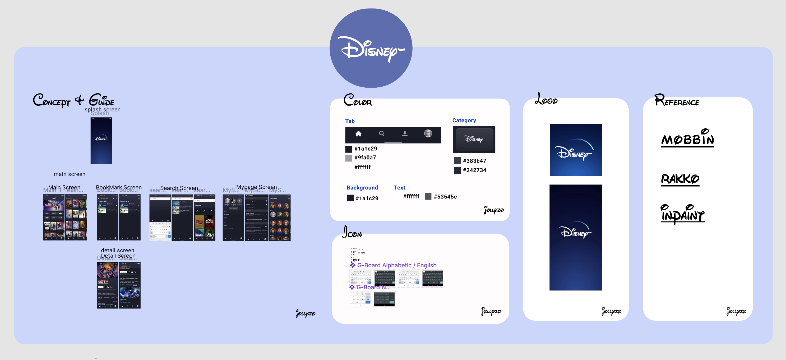

# [TIL] (2023/09/26) Team 졸리조 Disney- 초기 구성

{:toc}

## Start!

오늘은 최종 프로젝트 들어가기 바로 전 주차인 심화과정 팀 프로젝트에 대해서 적어보도록 하겠다. 

앱의 주제는 유튜브 API를 받아와 화면에 보여주고 검색, 저장 등을 지원하는 어플리케이션인데 우리 조는 고민하다가 **Disney+**를 모티브로 앱을 제작하기로 하였다!

컨셉을 정한 이후 이름을 한참 고민하다가 무의식적으로 **Diseny -**로 하실까요? 라고 말했는데 정신을 차리고 보니 앱 로고부터 시작하면까지 일사천리로 만들어지고 있었다 ㅋㅋㅋㅋ 이대로 출시한다면 디즈니에서 고소를 하겠지만 출시하지 않고 공부를 위한 앱이니까 웃기게 봐줬으면 좋겠다 :)

## 팀 Project 구성

이번 프로젝트를 진행할 때 지금까지 중에 가장 세세히 규칙등을 정하고 시작한것 같은데

팀적인 공동 규칙으로는 **컨벤션**, **회의** 등 규칙들을 세세히 정하고 시작하였고

- **컨벤션(커밋 룰, 브랜치 전략, 네이밍 등)**
- **회의록(회의 시간, 회의 기록, 역할분담, 진행사항), Label** 

깃허브 협업 측면으로는 처음 사용해보는

- **Organization의 Project를 통한 칸반보드 사용 **
- **Project, Issue 연동 ➔, Branch 생성 및 관리**

를 통해 진행하였는데 지금까지는 Branch관리만을 위해 github를 사용했다면 이제는 내가 옆에있는 사람들과 개발을 진행하지 않아도 **Organization**의 **프로젝트** 하나만 보고 사람들의 **진행사항, 변경점등 여러 정보들을 한 눈에 파악**할 수 있게 된 것 같아서 좀 깃허브를 사용해서 제대로 된 협업을 해봤구나 라고 생각을 하게 되었던 것 같고,
기존에 공동의 "룰"을 잘 정하고 시작해야 나중에 **유지보수나 일의 효율성 측면에서 큰 이점**을 가져갈 수 있다는 것을 또 한번 짚고 넘어가는 계기가 되었다:)

## WIREFRAME

WireFrame은 다함께 **Figma**를 사용하여 디자인 하였는데 사실 디자인이라기 보단 앱의 동작등을 논의하고 Color, Icon, Logo, Font등을 정하여 개발 들어가기 전 스타일을 먼저 구상하고 개발을 시작하는 것을 목적을 두고 진행하였다!

**[[Figma Link!!]](https://www.figma.com/file/70DzFfexT9Nt4T8leI0gSZ/%EC%A1%B8%EB%A6%AC%EC%A1%B0?type=design&node-id=0%3A1&mode=design&t=Zt8f6UdjHzQ58CvT-1)** ⬅︎ Click!!

## 느낀점

이번 팀 프로젝트를 시작하며 느낀점은 개발을 진행하면서 확실히 소통이 잘되고 나랑 결이 맞는 사람이 좋다는 것이다.

이는 말이 많거나 친한 사람이 좋다는 뜻이 아닌데, 나는 개발을 하며 더 나은 방향성을 함께 고려할 수 있고 서로 부족한 점을 채워가면서 나아갈 수 있는 사람들을 선호하는 것 같다. 또한 말을 나눴을 때 왠지 모를 편안함이 느껴지는 사람 앞에선 더 적극적으로 의견을 낼 수 있고 자기 앞에 놓인 문제에 대해 집중할 수 있기 때문에 더 큰 시너지를 발휘하는 것 같다 :) 

## End!

그동안 TIL이라기 보단 내가 구현한 기능, 설명에 대해서만 너무 집중하며 글을 쓰다보니 빈도도 떨어지고 뒤로 갈수록 더 신중해져 이해한 개념들도 완벽하지 않으면 정리하지 않았는데 앞으로는 하루에 한번 TIL을 적으며 가볍게 느낀점 등이라도 써봐야겠다!👨🏻‍💻