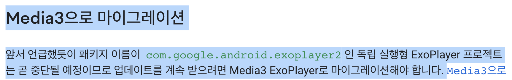

# [TIL] (2023/09/27) Youtube Player

{:toc}

## Start!

요즘들어 Clean Architecture과 MVVM에 대해 조금씩 개념이 잡혀가고 있는것 같다. 아직 완벽한 구현, 설명은 불가능하지만 최종 프로젝트 전까지 최대한 내껄로 만드는게 목표이다 :) 그리구 공부 방법을 좀 바꿔보려고 하는데 기존엔 이해하고 적용해보는데 그쳤다면 이젠 백지에서 끝까지 내가 구현할 수 있는 레벨로 되는것을 목표로 잡고 여러 번 반복해보려고 한다! 사실 팀원분들 중 이렇게 하시는 분이 있는데 항상 이야기를 하거나 설명을 해주실 때 확신(?)을 가지고 말씀하시는 모습을 보고 나도 저정도 레벨까진 돼야 내가 완벽하게 익혔다고 말할 수 있겠구나 싶어 그 길을 따라가보려고 한다 ㅋㅋ키ㅣ키

## Youtube Video Player

이번 팀 프로젝트를 진행하며 Youtube 동영상 API를 사용하여 화면에 띄워주는 기능이 있었는데 이에 그치지 않고 바로 에뮬레이터 상에서 실행까지 시키고 싶어 관련 라이브러리를 찾아봤다.

어느 때와 같이 구글링을 통해 찾아보던 중 Exoplayer을 사용하여 구현한 글을 보고 코드를 참고하여 진행하였는데 이는 deprecated된 코드였고 내가 실행한 코드는 구구구구 버전의 코드라서 이미 사용이 안되는 코드인 것을 발견하였다.. ㅎㅎ..

그 이후 다른 라이브러리를 찾아보던 중 [([android-youtube-player] ⬅︎ 클릭 시 이동!!)](https://github.com/PierfrancescoSoffritti/android-youtube-player#android-youtube-player) 을 알게되었고 가이드를 따라 구현한 결과 손쉽게 구현하였다.

##### [gg](https://softychoo.github.io/projects/2023-09-22-Kakao%EC%8B%A0%EC%9E%85%EC%B1%84%EC%9A%A9%EA%B3%BC%EC%A0%9C/)  ⬅︎ 기능에 대한 설명은 여기 링크에 작성해놓았다 !!

## Jetpack Media3

Youtube Video Player 구현을 완료한 이후 튜터님께 질문도 하고 더 나은 방향성에 대해 찾아보다가 developers에서 2023년 3월 23일에 공식 발표한 **Jetpack Media3**를 알게됐다. [➡︎ 링크참조](https://android-developers.googleblog.com/2023/03/media3-is-ready-to-play.html) 

 

다음과 같이 내가 기존에 진행하였던 독립 실행형 exoplayer가 안된 이유까지 나와있어 흥미를 끌기엔 충분했던 것 같다.. ㅎㅎㅎ

그래서! 이번 명절때는 잠깐잠깐이라도 시간을 내서 다음 기능으로 변경해보자 한다 :)

## 느낀점

기존에는 기능의 구현에만 집중했다면 이젠 좀 더 나은 **방향성**이나 **코드의 구조**에 좀 집착하게 되는 것 같다.

코딩은 해도해도 내가 지금 짠 것 보다 더 좋은 코드가 분명 있기 때문에 그걸 하나하나 알아가고 넘어가는 재미가 있는 것 같다 :)

## End!

이젠 어렴풋이보단 확실하게! 알고 코딩을 하는 습관을 들여야겠다 ;) 끝 ~