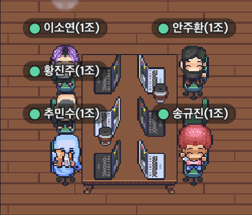
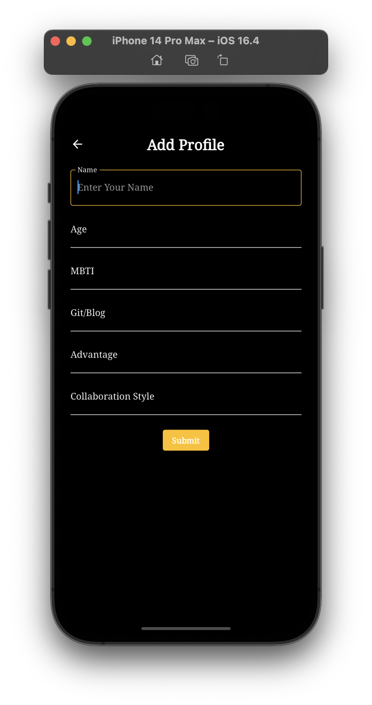
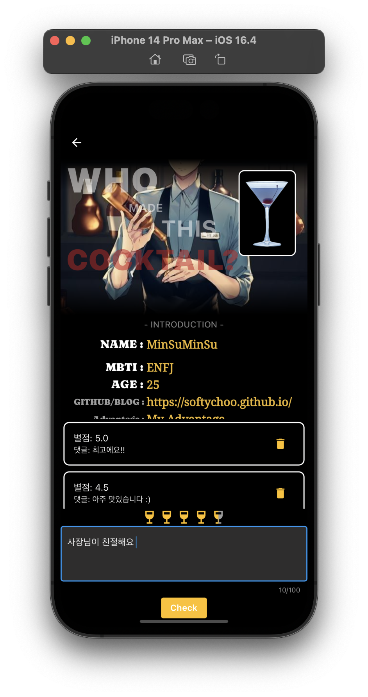

#  [Flutter] 1조 'A' BAR KTP 회고

* toc
{:toc}

---

 

### 1. 한 주의 흐름 :book:

1. 한 일

- 프로젝트 : 팀 이름인 **‘A BAR’**에 맞춰 5명의 바텐더를 소개하는 애플리케이션 (팀원 소개)
- 필수 작업:  flutter를 이용하여 자기 프로필 소개 및 CRUD 구현
- 추가 작업:  댓글 기능 구현 및 공백 경고 문구

1. 느낀점

- 민수 - 각자 팀원들의 장점을 살려 프로젝트를 하며 많은 것을 배웠고 협업이란 게 쉽지 않다는 것을 느끼고 있었지만 이번에 다같이 커뮤니케이션을 많이 하며 진행을 한 결과 많은 것을 이룰 수 있었던 것 같다. 제대로 된 첫 팀이라 좋았던 것도 많았고 아쉽게 덜 마무리 된 부분도 있었지만 재밌는 경험이었던 것 같습니다. 다음에 또 만나면 그 땐 더 완성도 있는 작품 만들어봐요!
- 주환 -  좋은 분들이랑 협업을 경험해봐서 너무 좋았고, 미니 프로젝트 발표회를 보면서 미처 아이디어가 떠오르지 않아 하지 못해봤던 게 떠올라 아쉬웠다. 앞으로 많은 노력이 필요할 것 같다. 다들 너무 감사하고 고생하셨습니다.
- 소연 - 프로젝트를 하면서 적응하는데 오래 걸려 수동적으로 소통해서 죄송했고, 팀원들이 잘 이끌어줘서 할 수 있었던 것 같다. 또 팀이 바뀌면 어떻게 적응해야 할지 약간 걱정이 앞선다.
- 진주 - [재밋] 12시간이 무지하게 안 갈 줄 알았는데 재밌었다. 제가 좀 더 실력이 좋았다면 팀에 도움이 되었을 텐데 그러지 못하여 아쉬웠다.
- 규진 - 미니 프로젝트를 진행하면서 내가 구현할 수 있었던 부분의 패키지를 뒤늦게 깨달은 것이 안타깝습니다. 그래도 구현 하나하나 완성 해 나가며 결과물을 보며 뿌듯하기도 하고 발표는 제가 하지도 않았는데 제가 다 떨렸습니다.
  - 그리고 좋은 결과물이 나온 것 같아서 모두에게 감사합니다. RE)저두요

### 2. Keep :floppy_disk:

- 즐겁게 공부하기
- 원활한 커뮤니케이션 및 상호작용이 굉장히 뛰어났다. 다른 조에 가더라도 우리 조의 형식의 적극적인 커뮤니케이션을 유지하였으면 좋겠다.
- 프로젝트 스케줄 관리가 굉장히 잘된 것 같다. 시간이 부족하여 구현될 수 없는 부분은 과감하게 후 순위로 미루고, 우리가 목표했던 기능들의 큰 구현을 완료한 뒤 작은 목표들을 해결해나가는 형식이 훌륭했다고 생각한다.

### 3. Problem:heavy_exclamation_mark:

1. 문제

- 게더 환경이 사실 버벅거리고 좋지 않은 것 같아서 다음번엔 다른 걸 이용해서 해보는 것도 괜찮을 것 같다 ex)discord 등
- 와이어 프레임이 구체적이지 못했던 것 같다. 우리도 플로우 차트를 만들어 구체화했으면 좀 다각도로 접근할 수 있었을 것 같다.
- 기초적인 지식이 부족하여 작업 시간이 오래 걸렸다.
- 처음 사용해본 협업 툴(git,github)과 처음 듣는 익숙치 않은 용어들이 많아서 이해하기 어려웠다.

1. 원인

- 처음 기초적인 틀을 잡을때, CRUD 개념을 집어넣는지에 대한 정보를 몰라서 프로젝트를 간단하게 생각해서 간단하게 와이어 프레임을 잡았던게 원인이었던 것 같다.
- git 숙련도 부족
- 사실상 첫 협업이기 때문에 실수할까봐 서로 조심조심 했던 것 같다.

### 4. Try :feet:

1. 피그마 이용해보기
2. git 환경 익숙해질 때까지 계속 써보기
3. 다른 기능들도 공부해보기
4. 목표를 정해서 실천하기
5. 구글링 조금더 생각하고 진행하기

### 5. 결과물:confetti_ball:

