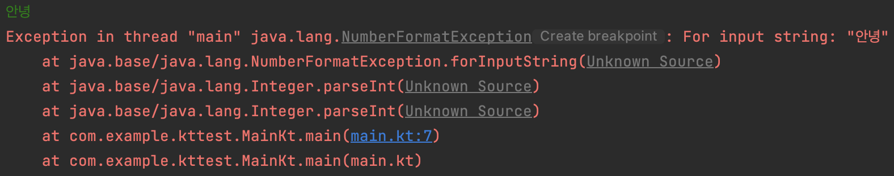
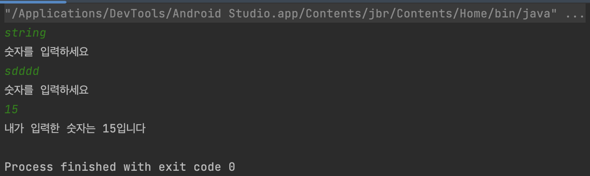
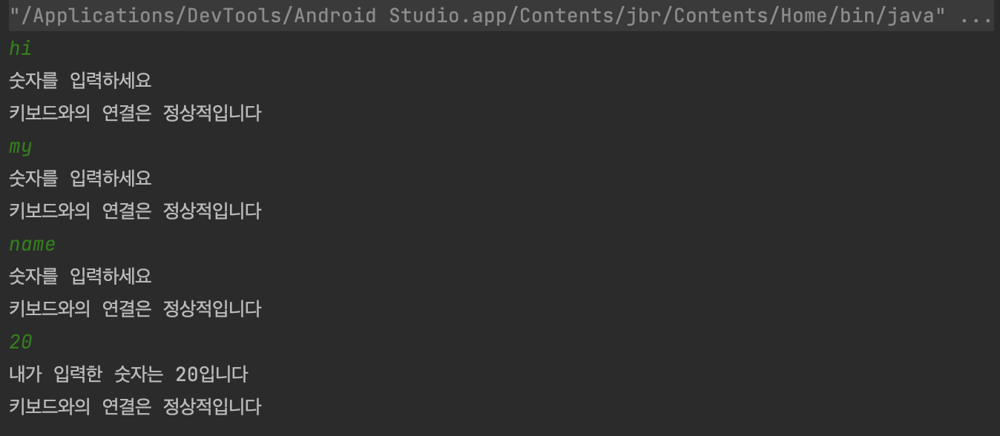

# [Android/Kotlin] [TIL] 예외처리

프로그램 실행 중에 발생하는 예외를 처리해보자

* toc
{:toc}


## 예외처리

- 프로그램을 실행하기전에 알 수 있는 컴파일 에러를 **오류**라고 한다.
- 프로그램을 실행하는 도중에 발생하는 런타임 에러인 예외가 발생할 수 있다.
- 실행도중에 예외가 발생하면 프로그램이 비정상적으로 종료된다.

#### 예외처리를 사용하는 경우

- 고품질의 프로그램이란 사용성을 해치지 않아야한다.
- 여러 측면의 사용성이 있지만 그 중 프로그램이 도중에 종료되는건 심각한 문제이다.
- 미리 예외를 생각하고 소스코드를 작성해야 안정성을 높인 프로그램이라고 할 수 있다.

#### Kotlin의 예외처리 방법

##### 1. `try-Catch` 의 구조

```kotlin
fun method1() {
		try {
			예외가 발생할 가능성이 존재하는 코드
		} catch(예외종류) {
			예외가 발생했을때 처리할 코드
		}
}
```

##### 2. `throw` 의 구조

```kotlin
fun method1(num1:Int) {
		if(num1 > 10) {
			throw 예외종류
		}
}
```


## 예시 코드

- 숫자를 입력해야하는데 만약 문자를 입력하게 되면 다음과 같은 오류가 뜨게 된다.



- 숫자를 입력할 때까지 반복문을 무한으로 실행하는 예외처리 코드(**try-catch**, **try-catch-finally**)

##### 1. try-catch

```kotlin
		while(true) {
        try {
            var num1 = readLine()!!.toInt()
            println("내가 입력한 숫자는 ${num1}입니다")
            break
        } catch(e:java.lang.NumberFormatException) {
            println("숫자를 입력하세요")
        }
    }
```



##### 2. try-catch-finally

```kotlin
		while(true) {
        try {
            var num1 = readLine()!!.toInt()
            println("내가 입력한 숫자는 ${num1}입니다")
            break
        } catch(e:java.lang.NumberFormatException) {
            println("숫자를 입력하세요")
        } finally {
            println("키보드와의 연결은 정상적입니다")
        }
    }
```

