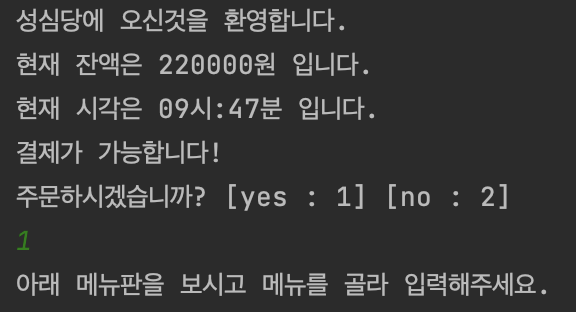
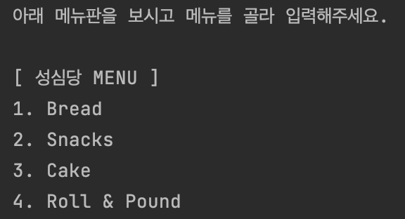
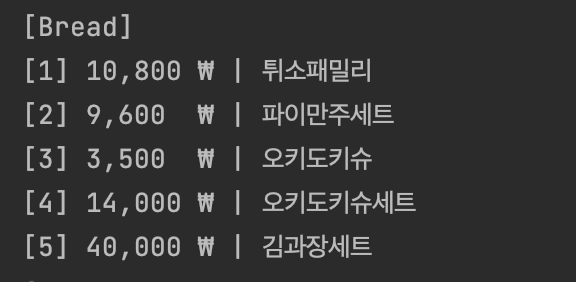
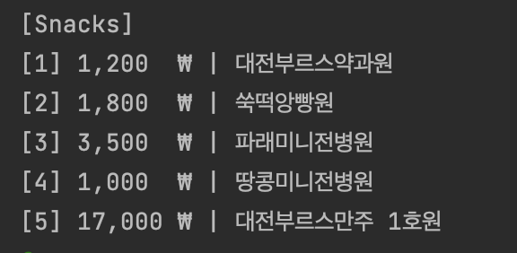
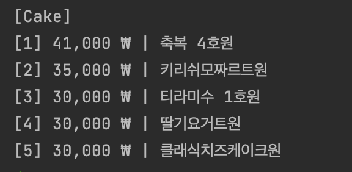
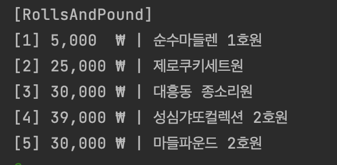
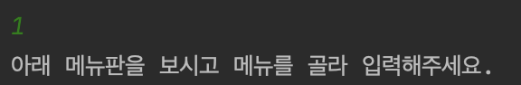
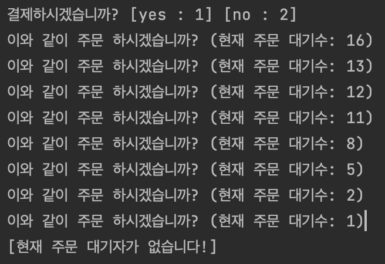
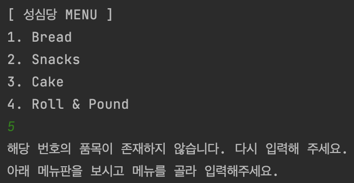
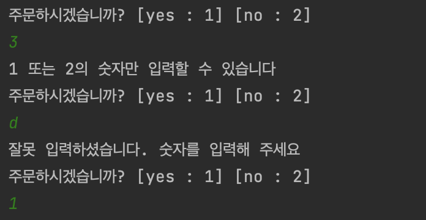

# [assignment] 키오스크 프로그램 최종

# 🙆🏻‍♂️ Team Members

- 팀명 :  **꿈을 '일구'조**
- 팀 소개 : **19조 인거랑 땅을 일궈내듯이 꿈을 일궈내자는 뜻!**

| 이름   | 역할 | MBTI        | BLOG                                        |
| ------ | ---- | ----------- | ------------------------------------------- |
| 추민수 | 팀장 | ENFJ        | [바로가기!](softychoo.github.io)            |
| 김민준 | 팀원 | ENTP        | [바로가기!](https://velog.io/@thundevistan) |
| 신민지 | 팀원 | ISFP        | [바로가기!](minjii (개발 블로그) - velog)   |
| 손현준 | 팀원 | INTP        | [바로가기!](https://velog.io/@hyunjun6133)  |
| 이혜명 | 팀원 | INFP & ENTP | [바로가기!](https://velog.io/@playerkr)     |

# 📽️ Project

- 주제 : 키오스크 프로그래밍

- 프로젝트명 : 🥐 대전의 자랑 🥐
- 프로젝트 소개 : 대전의 자랑 **‘성심당’**의 키오스크 구현하기

# 💡IDEA

- **WireFrame**

- **initial framework** [[초기 틀 바로가기!]](https://softychoo.github.io/devlog/kotlin/2023-07-25-%ED%82%A4%EC%98%A4%EC%8A%A4%ED%81%AC%EC%B4%88%EA%B8%B0/)

# ☑️ Implementation Function

- `Main.kt` 실행 시 `Balance`, `Datetime` Class를 불러와 현재시간 및 현재 잔액 표시
- `Datetime` : 현재 실시간 정보를 받아와 은행점검 이외의 시간에만 결제가 가능하도록 구현한 클래스
- `Balance` : 랜덤함수를 통해 처음 실행 시 20 ~ 30 만원 사이의 값을 랜덤으로 받아와 저장하도록 구현한 클래스
- 우상단의 메뉴판을 보고 클릭 시 각자의 클래스를 호출해와 화면에 출력

- 선택한 번호에 따라 각각의 메뉴들에 대한 항목들이 출력되도록 구현

- 항목 선택 시 추가되었다는 메시지와 함께 구현 해놓은 `orderList` 에 항목 추가됨
- ① 클릭 시 다시 상단의 [성심당 MENU] 로 돌아가 추가주문 구현
- ② 클릭 시 현재의 List의 정보를 가지고 결제를 담당하는 `Order` 클래스 호출

- 결제 클릭 시`Order` class 내부에서 장바구니(`orderList`) 를 불러와 항목 출력 후 총 가격 표시
- 결제하시겠습니까 메시지가 뜨면서 `WaitCount` 클래스르 호출해 현재 대기자 수를 랜덤으로 불러오고 5초마다  한번씩 랜덤으로 대기자가 줄어들게 구현

- 최종적으로 결제하기를 누르게 되면 Datetime클래스를 거쳐 현재 점검시간이 아니라면 결제가 가능하다는 메시지와 함께 현재 잔액또한 표시됨

### 예외처리

