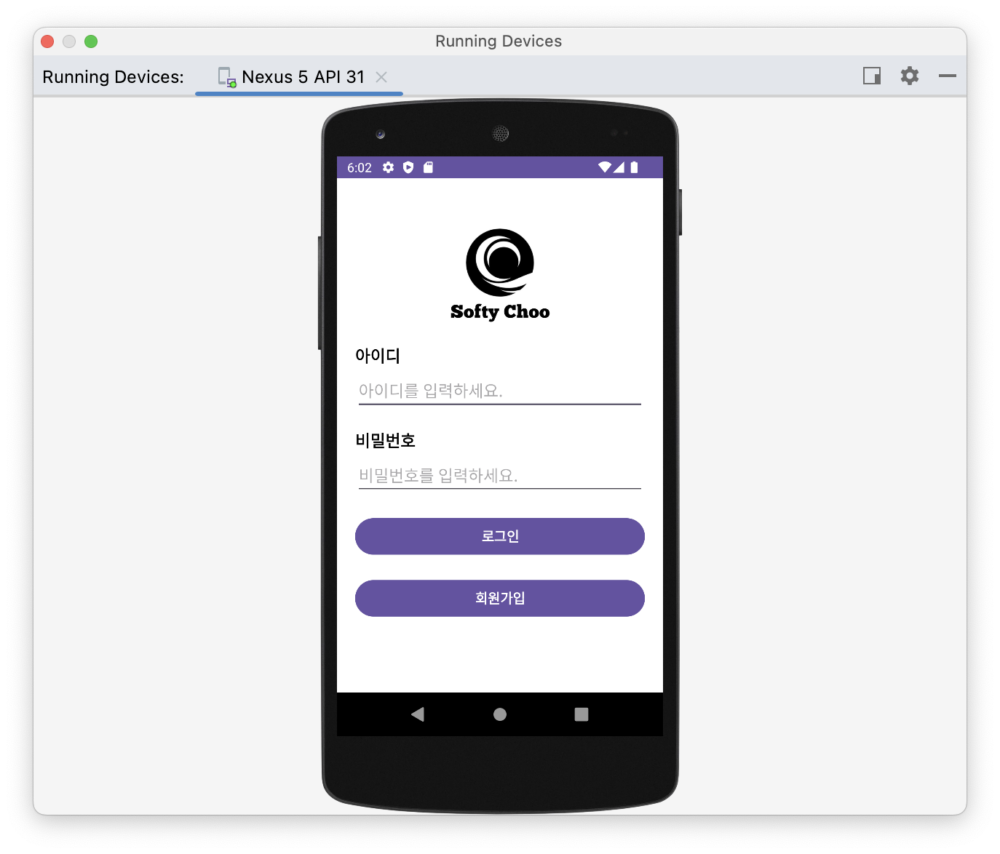
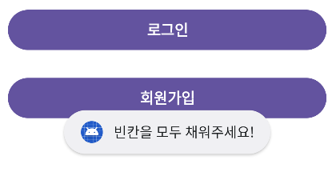
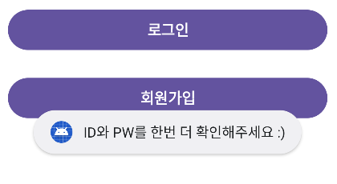
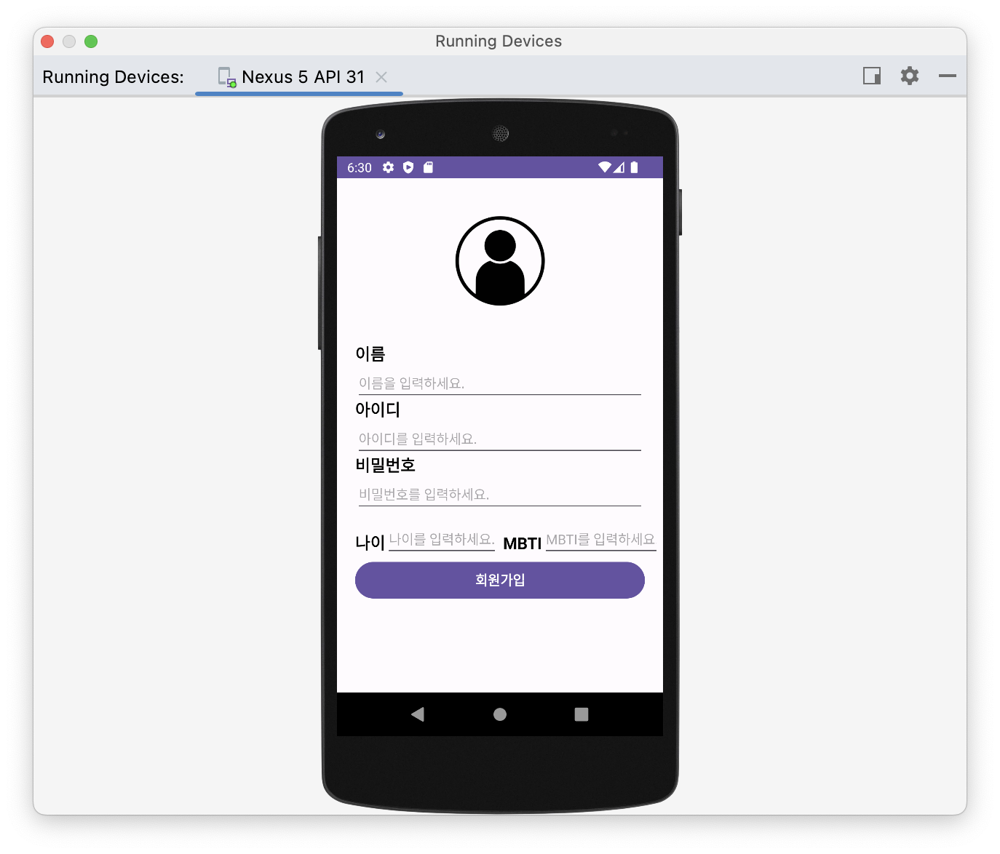
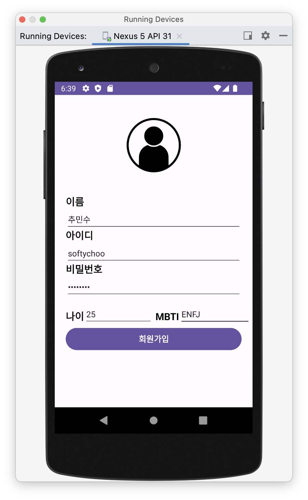
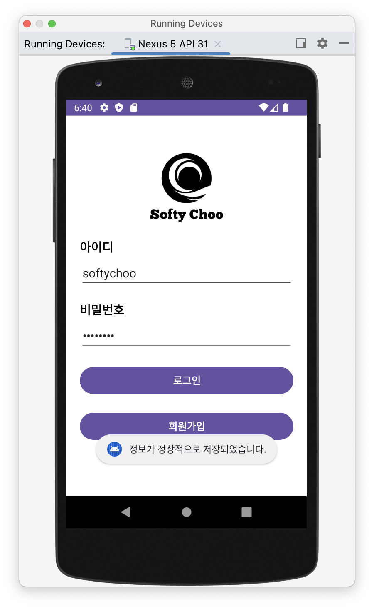
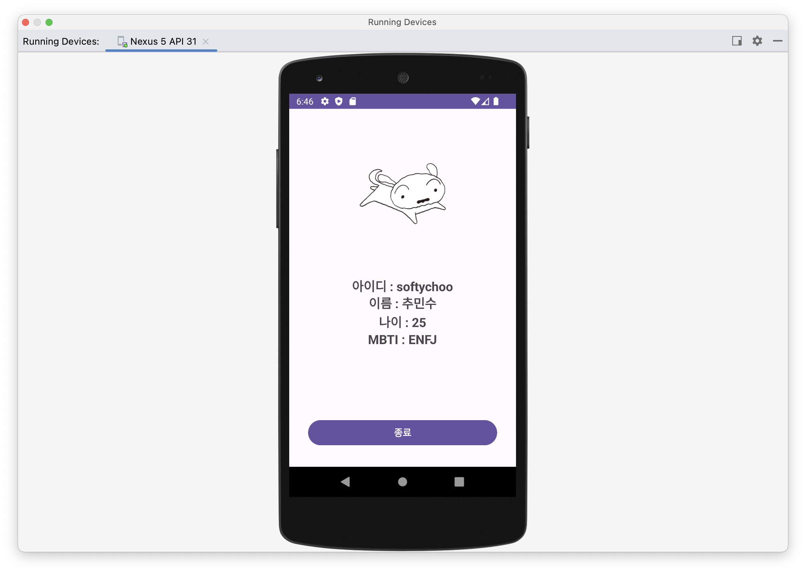
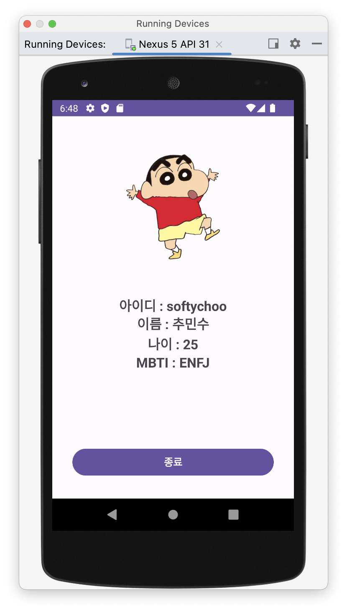
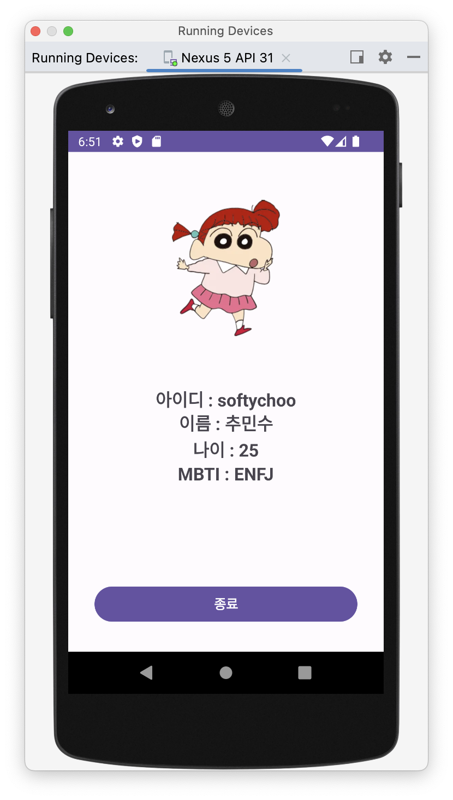

# [WIL] [Kotlin] 로그인 페이지 필수기능 구현


* toc
{:toc}


## 1. [Sign In Page] 로그인 페이지

- 앱을 실행하면 가장 먼저 실행되는 페이지로 `id`와 `pw`를 입력받아 로그인을 할 수 있다.



#### Users Object와 값을 저장하는 방식이 궁금하다면?

-  ➡  [[참조 Link!!]](https://softychoo.github.io/devlog/fix-it/2023-08-03-Object%EC%99%80%EA%B0%9D%EC%B2%B4/)

- **로그인 버튼** : 클릭 시 현재 입력된 EditText의 값과 저장된 사용자의 정보를 비교해 값을 반환하는 **`Users` Object의 `readUser`함수로 값을 넘겨 반환**
  - 유저 정보가 일치하지 않는 경우 : Toast 메시지를 띄워 재로그인 유도
  - 일치하는 경우 : 그 일치하는 유저의 정보를 HomeActivity로 전달

- **회원가입 버튼** : 클릭 시 회원가입(SignUpActivity)페이지로 이동

```kotlin
signInBtn.setOnClickListener {
            if (signInId.text.isEmpty() || signInPw.text.isEmpty()) {
                Toast.makeText(this, "빈칸을 모두 채워주세요!", Toast.LENGTH_SHORT).show()
            }
            else {
                val user = Users.readUser(signInId.text.toString(), signInPw.text.toString())
                if(user == null) //id와 pw가 일치하지 않아 null값을 반환했을 때
                {
                    Toast.makeText(this, "ID와 PW를 한번 더 확인해주세요 :)", Toast.LENGTH_SHORT).show()
                }
                else { //id와 pw가 일치하는 유저를 받아와 HomeActivity로 값을 전달
                    val intentToHome = Intent(this, HomeActivity::class.java)
                    intentToHome.putExtra("user_name",user.name)
                    intentToHome.putExtra("user_id",user.id)
                    intentToHome.putExtra("user_age",user.age)
                    intentToHome.putExtra("user_mbti",user.mbti)
                    startActivity(intentToHome)
                }
            }
        }
        signUpBtn.setOnClickListener {
            val intentToSignUp = Intent(this, SignUpActivity::class.java)
            startActivity(intentToSignUp)
        }
```




#### Toast 알림

- 채워지지 않은 빈칸이 있을 경우 
- ID, PW가 User에 저장된 데이터와 일치하지 않는 경우


## 2. [Sign Up Page] 회원가입 페이지



- 회원가입 버튼 클릭 시 각각의 EditText에 입력된 값들을 **`Users` Object의 `addUser()`함수로 값을 넘겨 미리 선언해준 객체 내에 저장**

- 현재 입력된 ID, PW값을 로그인 페이지로 넘겨주기 위해 **`putExtra()`**함수를 사용해 넘겨줌

```kotlin
로로 editBtn.setOnClickListener {
            if (name.text.isEmpty() || id.text.isEmpty() || pw.text.isEmpty()) {
                Toast.makeText(this, "빈칸을 모두 채워주세요!", Toast.LENGTH_SHORT).show()
            } else {
                Toast.makeText(this, "정보가 정상적으로 저장되었습니다.", Toast.LENGTH_SHORT).show()
                Users.addUser(name.text.toString(), id.text.toString(),pw.text.toString(),age.text.toString(),mbti.text.toString())

                val intentToSignIn = Intent(this,SignInActivity::class.java)
                intentToSignIn.putExtra("input_id",id.text.toString())
                intentToSignIn.putExtra("input_pw",pw.text.toString())
                startActivity(intentToSignIn)
                finish()
            }
        }
```

- 넘겨준 값을 **로그인(Sign in Activity)** 페이지에서 `getExtra()`함수를 사용하여 받은 후 입력창의 ID,PW값에 넣어줌

```kotlin
val inputId = intent.getStringExtra("input_id")
        val inputPw = intent.getStringExtra("input_pw")
        signInId.setText(inputId)
        signInPw.setText(inputPw)
```

### 동작확인



- 정보 입력 후 회원가입 버튼을 누르면 데이터가 정상적으로 저장되었다는 메시지와 함께 자동으로 EditText(ID, PW)에 값이 저장됨

## 3. [HomeActivity] 회원정보 페이지

- SignInActivity에서 넘겨준 값을 **`getExtra()`**함수로 받아준 뒤 화면에 출력함
- 프로필 느낌을 주기 위해 **`random()`** 함수를 만들어 매번 들어갈 때 마다 새로운 이미지가 나오도록 구현함

```kotlin
val user_name = intent.getStringExtra("user_name")
        val user_id = intent.getStringExtra("user_id")
        val user_age = intent.getStringExtra("user_age")
        val user_mbti = intent.getStringExtra("user_mbti")

        name.setText(user_name)
        id.setText(user_id)
        age.setText(user_age)
        mbti.setText(user_mbti)


        val changeImg = findViewById<ImageView>(R.id.iv_change)
        val num = rand(1, 6)
        when (num) {
            1 -> changeImg.setImageResource(R.drawable.jjang9)
            2 -> changeImg.setImageResource(R.drawable.jjanga)
            3 -> changeImg.setImageResource(R.drawable.mang9)
            4 -> changeImg.setImageResource(R.drawable.whitedog)
            5 -> changeImg.setImageResource(R.drawable.yuri)
        }

        finishBtn.setOnClickListener {
            finish()

        }

=====================================================================
val random = Random()
    fun rand(from: Int, to: Int): Int {
        return random.nextInt(to - from) + from
    }
=====================================================================
```

### 동작확인





## 추가 예정 기능

#### 1. 상황별 Toast메시지의 UI다르게 구현 예정

#### 2. UI 깔끔하게 변경 예정

