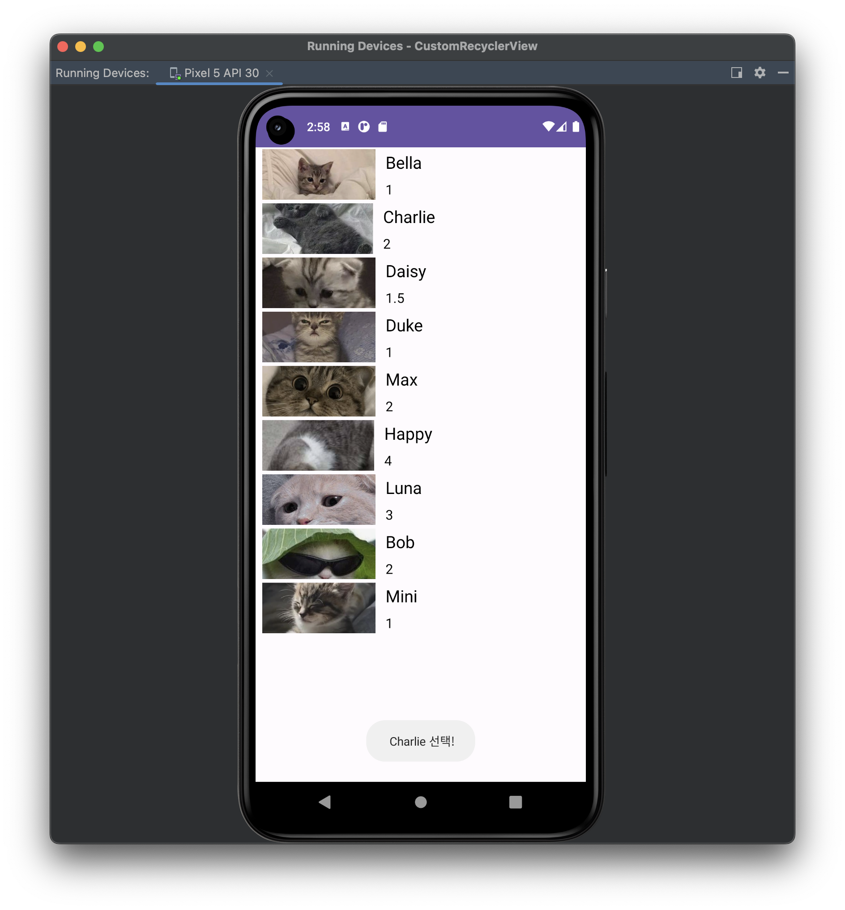

# [Kotlin] 커스텀 뷰(Custom View)란?


* toc
{:toc}


## 📌  커스텀 뷰(Custom View)란?

- 어댑터 뷰의 항목 하나는 단순한 문자열이나 이미지뿐만 아니라,다수의 문자열이나 이미지를 포함하는 임의의 뷰가 될 수 있다.


## 📌 커스텀 항목뷰 설정 절차

#### 1. 커스텀 항목을 위한 **XML 레이아웃 정의**

- res/layout의 경로에 새로운 **item.xml** 파일 생성

##### item.xml

```kotlin
<?xml version="1.0" encoding="utf-8"?>
<LinearLayout xmlns:android="http://schemas.android.com/apk/res/android"
    android:layout_width="match_parent"
    android:layout_height="wrap_content"
    android:orientation="horizontal"
    >
    <ImageView
        android:id="@+id/iconItem"
        android:layout_width="@dimen/icon_size"
        android:layout_height="@dimen/icon_size"
        android:scaleType="centerCrop"
        android:padding="@dimen/icon_padding"
        android:layout_gravity="center_vertical"
        android:layout_weight="1"
        android:src="@drawable/cat1"
        />
    <LinearLayout
        android:orientation="vertical"
        android:layout_width="wrap_content"
        android:layout_height="wrap_content"
        android:layout_weight="2">
        <TextView
            android:id="@+id/textItem1"
            android:layout_width="wrap_content"
            android:layout_height="wrap_content"
            android:textColor="@color/black"
            android:textSize="@dimen/list_item_text_size1"
            android:padding="@dimen/list_item_padding"
            android:hint="Name"
            />
        <TextView
            android:id="@+id/textItem2"
            android:layout_width="wrap_content"
            android:layout_height="wrap_content"
            android:textColor="@color/black"
            android:textSize="@dimen/list_item_text_size2"
            android:padding="@dimen/list_item_padding"
            android:hint="Age"
            />
    </LinearLayout>
</LinearLayout>
```

- Item.xml의 코드에서 ImageView,TextView의 크기 및 padding등의 속성은 따로 res/values경로에 **dimension 리소스**를 만들어 정의해주었다.

##### dimens.xml

```kotlin
<resources>
<!-- Default screen margins, per the Android Design guidelines. -->
<dimen name="activity_horizontal_margin">16dp</dimen>
<dimen name="activity_vertical_margin">16dp</dimen>
<dimen name="list_item_text_size1">20dp</dimen>
<dimen name="list_item_text_size2">16dp</dimen>
<dimen name="list_item_padding">4dp</dimen>
<dimen name="icon_size">60dp</dimen>
<dimen name="icon_padding">8dp</dimen>
</resources>
```


#### 2. 항목 관련 **데이터 클래스 정의**

- 커스텀뷰에 표시할 데이터를 MyItem DataClass로 정의해주었다.

##### MyItem.kt

```kotlin
data class MyItem(val aIcon:Int, val aName:String, val aAge:String) {}
```

#### [데이터클래스(Data Class)란?](https://softychoo.github.io/devlog/kotlin/2023-08-10-dataClass/) ⬅ 클릭하여 알아보기!!


#### 3. **어댑터 클래스 정의**

- **앞서 정의한 MyItem 타입의 객체들을 ArrayList로 관리하는 MyAdapter 클래스 BaseAdapter를 파생하여 정의한다.**
- **MyAdapter 클래스는 앞서 예시한 그리드 뷰의 예제에서 처럼, getCount(), getItem(), getItemID(), getView() method를 재 정의해야 한다.**

##### MyAdaptor.kt

```kotlin
class CustomViewAdapter(val mContext: Context, val mItems: MutableList<MyItem>) : BaseAdapter() {

    // MyAdapter 클래스가 관리하는 항목의 총 개수를 반환
    override fun getCount(): Int {
        return mItems.size
    }

    // MyAdapter 클래스가 관리하는 항목의 중에서 position 위치의 항목을 반환
    override fun getItem(position: Int): Any {
        return mItems[position]
    }

    // 항목 id를 항목의 위치로 간주함
    override fun getItemId(position: Int): Long {
        return position.toLong()
    }

    // position 위치의 항목에 해당되는 항목뷰를 반환하는 것이 목적임
    override fun getView(position: Int, convertView: View?, parent: ViewGroup?): View {

        var convertView = convertView
        if (convertView == null) convertView = LayoutInflater.from(parent?.context).inflate(R.layout.item, parent, false)

        val item : MyItem = mItems[position]

        // convertView 변수로 참조되는 항목 뷰 객체내에 포함된 객체를 id를 통해 얻어옴
        val iconImageView = convertView?.findViewById<View>(R.id.iconItem) as ImageView
        val tv_name = convertView.findViewById<View>(R.id.textItem1) as TextView
        val tv_age = convertView.findViewById<View>(R.id.textItem2) as TextView

        // 어댑터가 관리하는 항목 데이터 중에서 position 위치의 항목의 객체를 헤딩 힝목에 설정
        iconImageView.setImageResource(item.aIcon)
        tv_name.text = item.aName
        tv_age.text = item.aAge

        return convertView
    }
}
```


#### 4.화면 레이아웃에 **ListView 위젯 정의**

- **화면 레이아웃에 ListView위젯을 추가한다.**
- **XML레이아웃 파일에 정의된 ListView위젯을 Kotlin코드에서 참조하기 위하여 id속성을정의한다.**

##### Activity_custom_view.xml

```kotlin
...
<androidx.recyclerview.widget.RecyclerView
		 android:id="@+id/listView"
     android:layout_width="match_parent"
     android:layout_height="match_parent"
...
```


#### 5. 어댑터를 생성하고 **어댑터뷰 객체에 연결**

CustomViewActivity.kt 파일에서 다음 역할의 코드를 추가한다.

1. 어댑터 객체에서 관리할 항목 데이터의 ArrayList 객체를 준비한다.
2. MyAdapter 객체를 생성하고 초기화 한다.
3. 생성된 MyAdapter 객체를 어댑터뷰인 리스트뷰에 연결한다.

##### CustomViewActivity.kt

```kotlin
class CustomViewActivity : AppCompatActivity() {

    private lateinit var binding : ActivityCustomViewBinding

    override fun onCreate(savedInstanceState: Bundle?) {
        super.onCreate(savedInstanceState)
        binding = ActivityCustomViewBinding.inflate(layoutInflater)
        setContentView(binding.root)

        // 데이터 원본 준비
        val dataList = mutableListOf<MyItem>()
        dataList.add(MyItem(R.drawable.cat1, "Bella", "1"))
        dataList.add(MyItem(R.drawable.cat2, "Charlie", "2"))
        dataList.add(MyItem(R.drawable.cat3, "Daisy", "1.5"))
        dataList.add(MyItem(R.drawable.cat4, "Duke", "1"))
        dataList.add(MyItem(R.drawable.cat5, "Max", "2"))
        dataList.add(MyItem(R.drawable.cat6, "Happy", "4"))
        dataList.add(MyItem(R.drawable.cat7, "Luna", "3"))
        dataList.add(MyItem(R.drawable.cat8, "Bob", "2"))
        dataList.add(MyItem(R.drawable.cat9, "Mini", "1"))

        // 어댑터 생성 및 연결
        binding.listView.adapter = CustomViewAdapter(this, dataList)

        // 항목 클릭 이벤트 처리
        binding.listView.setOnItemClickListener{ parent, view, position, id ->
            val name: String = (binding.listView.adapter.getItem(position) as MyItem).aName
            Toast.makeText(this," $name 선택!", Toast.LENGTH_SHORT).show()
        }
    }
}
```


## 🎉 완성본(ListView, IMG GridView)

