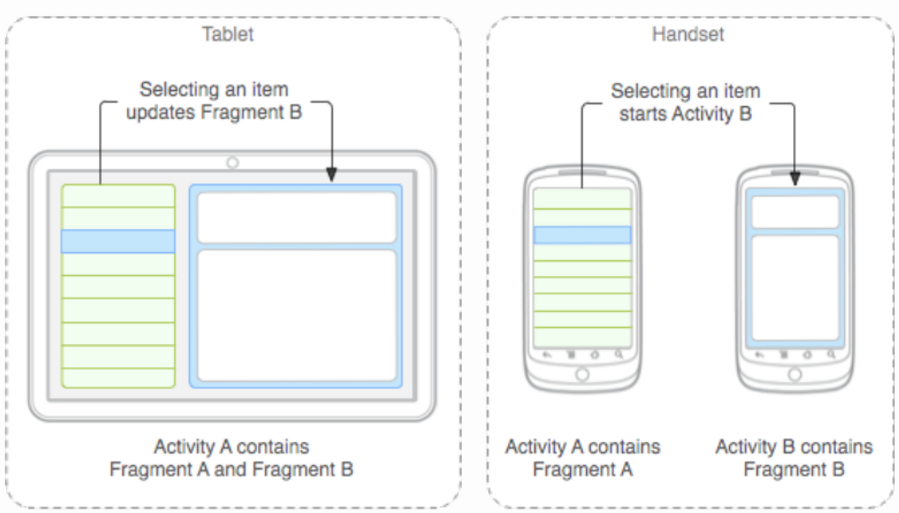
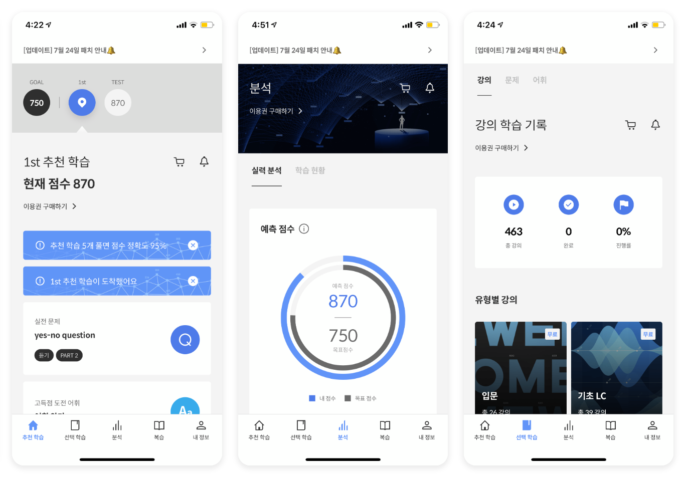
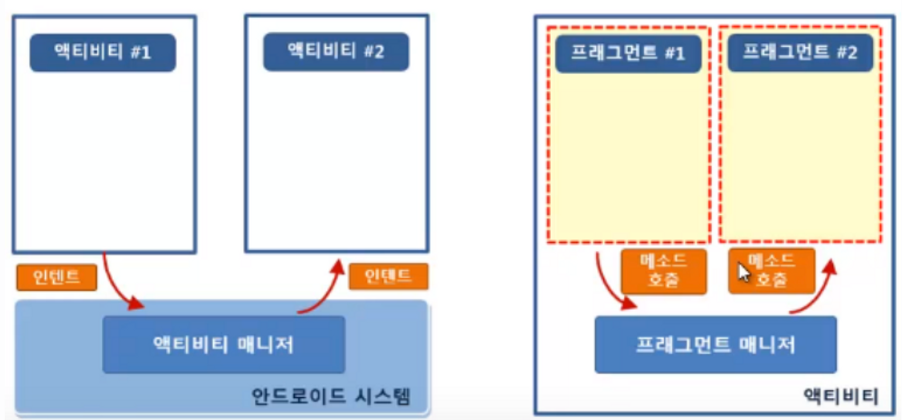
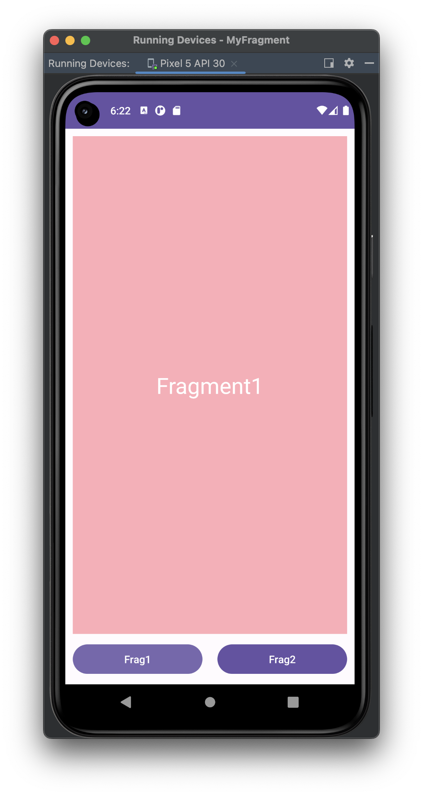
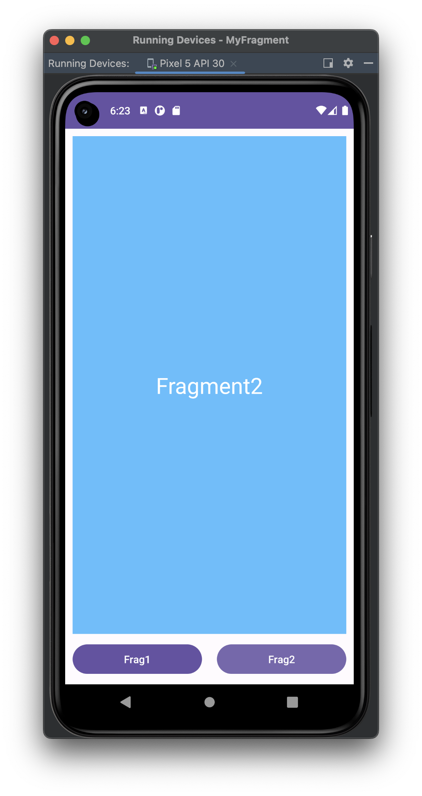

# [Kotlin] 프래그먼트(Fragment)란?


* toc
{:toc}


## 📌 프래그먼트(Fragment)란?

- **액티비티 위에서 동작**하는 모듈화된 사용자 인터페이스이다.
- **액티비티와 분리되어 독립적으로 동작할 수 없다.**
- **여러 개의 프래그먼트를 하나의 액티비티에 조합**하여 창이 여러 개인UI를 구축할 수 있으며, 하**나의 프래그먼트를 여러 액티비티에서 재사용할 수 있다.**



## 🤔 프래그먼트(Fragment)의 예시




## 🤔 액티비티(Activity)와 프래그먼트(Fragment) 비교

#### 1) Activity

- **시스템의 액티비티 매니저에서 인텐드를 해석해 액티비티간 데이터를 전달**

#### **2) Fragment**

- **액티비티의 프래그먼트 매니저에서 메소드로 프래그먼트간 데이터를 전달**




## 🤔 프래그먼트(Fragment)를 사용하는 이유

- Activity로 화면을 계속 넘기는 것보다는 Fragment로 일부만 바꾸는 것이 **자원 이용량이 적어 속도가 빠르기 때문이다.**

##### 다양한 장점

> **Fragment를 사용하면 Activity를 적게 만들 수 있다.**
>
> **Activity의 복잡도를 줄일 수 있다.**
>
> **Fragment를 사용하면 재사용 할 수 있는 레이아웃을 분리해서 관리가 가능하다.**
>
> **Fragment를 사용하면 최고 1개의 Activity안에서 Fragment 공간에 View만 집어넣으면 여러 Activity를 만들지 않아도 여러 화면을 보여줄 수 있다.**


## 👨🏻‍💻 프래그먼트(Fragment)사용절차

#### 1. 프래그먼트 정의하기

- **안드로이드스튜디오에서 File > New > Fragment > Fragment(Blank)를 이용하여 두 개의 프래그먼트를 생성한다.**
- 예시를 두개의 Fragment로 하기위해서 Fragment의 이름을 **FirstFragment,SecondFragment** 로 지정해주었다.

#### 2. Fragment.xml 파일수정

- 변화를 바로 보기 위하여 다음과 같이 xml을 조정해주었다.

##### Fragment_first.xml

```kotlin
<?xml version="1.0" encoding="utf-8"?>
<androidx.constraintlayout.widget.ConstraintLayout xmlns:android="http://schemas.android.com/apk/res/android"
    xmlns:app="http://schemas.android.com/apk/res-auto"
    xmlns:tools="http://schemas.android.com/tools"
    android:layout_width="match_parent"
    android:layout_height="match_parent"
    android:background="#FFACB7"
    tools:context=".FirstFragment">
    <TextView
        android:layout_width="wrap_content"
        android:layout_height="wrap_content"
        android:text="Fragment1"
        android:textColor="@color/white"
        android:textSize="30dp"
        app:layout_constraintBottom_toBottomOf="parent"
        app:layout_constraintLeft_toLeftOf="parent"
        app:layout_constraintRight_toRightOf="parent"
        app:layout_constraintTop_toTopOf="parent" />
</androidx.constraintlayout.widget.ConstraintLayout>
```

##### Fragment_second.xml

```kotlin
<?xml version="1.0" encoding="utf-8"?>
<androidx.constraintlayout.widget.ConstraintLayout xmlns:android="http://schemas.android.com/apk/res/android"
    xmlns:app="http://schemas.android.com/apk/res-auto"
    xmlns:tools="http://schemas.android.com/tools"
    android:layout_width="match_parent"
    android:layout_height="match_parent"
    android:background="#5ABEFF"
    tools:context=".SecondFragment">
    <TextView
        android:layout_width="wrap_content"
        android:layout_height="wrap_content"
        android:text="Fragment2"
        android:textColor="@color/white"
        android:textSize="30dp"
        app:layout_constraintBottom_toBottomOf="parent"
        app:layout_constraintEnd_toEndOf="parent"
        app:layout_constraintStart_toStartOf="parent"
        app:layout_constraintTop_toTopOf="parent" />
</androidx.constraintlayout.widget.ConstraintLayout>
```


#### 3. 프래그먼트를 액티비티의 레이아웃 파일에 정적 추가하기

- **main.xml에 FrameLayout과 button 추가**

```kotlin
<?xml version="1.0" encoding="utf-8"?>
<androidx.constraintlayout.widget.ConstraintLayout
    xmlns:android="http://schemas.android.com/apk/res/android"
    xmlns:app="http://schemas.android.com/apk/res-auto"
    xmlns:tools="http://schemas.android.com/tools"
    android:layout_width="match_parent"
    android:layout_height="match_parent"
    tools:context=".MainActivity">

    <FrameLayout
        android:id="@+id/frameLayout"
        android:layout_width="0dp"
        android:layout_height="0dp"
        android:layout_marginStart="10dp"
        android:layout_marginEnd="10dp"
        android:layout_marginTop="10dp"
        app:layout_constraintBottom_toTopOf="@+id/fragment1_btn"
        app:layout_constraintEnd_toEndOf="parent"
        app:layout_constraintStart_toStartOf="parent"
        app:layout_constraintTop_toTopOf="parent">
    </FrameLayout>

    <Button
        android:id="@+id/fragment1_btn"
        android:layout_width="0dp"
        android:layout_height="wrap_content"
        android:layout_margin="10dp"
        android:text="Frag1"
        android:textAllCaps="false"
        app:layout_constraintBottom_toBottomOf="parent"
        app:layout_constraintEnd_toStartOf="@+id/fragment2_btn"
        app:layout_constraintStart_toStartOf="parent"
        app:layout_constraintTop_toBottomOf="@+id/frameLayout" />

    <Button
        android:id="@+id/fragment2_btn"
        android:layout_width="0dp"
        android:layout_height="wrap_content"
        android:layout_margin="10dp"
        android:text="Frag2"
        android:textAllCaps="false"
        app:layout_constraintBottom_toBottomOf="parent"
        app:layout_constraintEnd_toEndOf="parent"
        app:layout_constraintStart_toEndOf="@+id/fragment1_btn"
        app:layout_constraintTop_toBottomOf="@+id/frameLayout" />

</androidx.constraintlayout.widget.ConstraintLayout>
```

- **MainActivity의 OnCreat안에 Fragment 추가하기**

```kotlin
binding.apply {
            fragment1Btn.setOnClickListener{ // 첫 번째 버튼이 눌렸을 때
                setFragment(FirstFragment()) // 첫 번째 프래그먼트로 설정
            }
            fragment2Btn.setOnClickListener {// 두 번째 버튼이 눌렸을 때
                setFragment(SecondFragment()) // 두 번째 프래그먼트로 설정
            }
        }
        setFragment(FirstFragment()) // 앱 실행 시 기본 프래그먼트를 띄워줌
    }

    private fun setFragment(frag : Fragment) { // 프래그먼트를 받아옴
        supportFragmentManager.commit {
            replace(R.id.frameLayout, frag) // 반아온 프래그먼트로 전환시켜줌 [Framelayout]에 frag 변수에 들어온 프래그먼트를 띄워줌
            setReorderingAllowed(true)
            addToBackStack("")
        }
```


## 🎉 완성본

