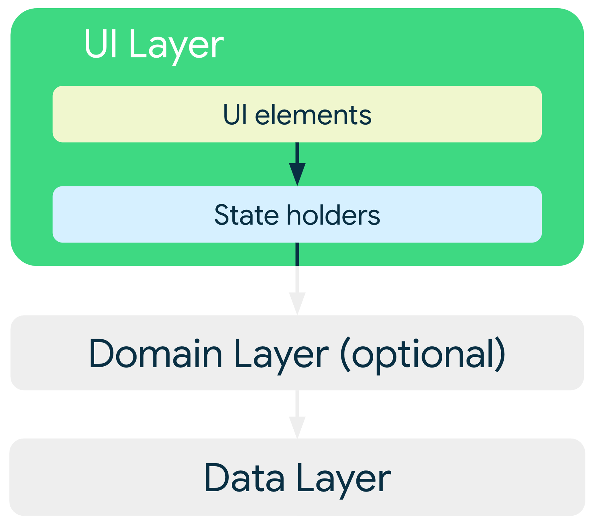

# [Android JetPack] ViewModel

* toc
{:toc}
## 📌 ViewModel

- ViewModel은 비즈니스 로직을 캡슐화하고 UI에 상태를 나타낸다.

- 주요 이점은 **상태**를 저장하여 구성이 변경되어도 이를 **유지**하는 것이라고 한다. 즉 구성변경(화면 회전) 시 UI가 데이터를 다시 가져올 필요가 없다는 것을 의미한다. 또한 비즈니스 로직에 대한 **엑세스 권한을 제공**한다.

#### UI Layer

- UI의 역할은 **화면에 애플리케이션 데이터를 표시**하고 **사용자와 상호작용**하는 것이다.

>  상호작용이란 버튼 클릭, 네트워크 처리, 데이터의 변경 등을 의미

- UI는 **데이터 레이어**에서 가져온 애플리케이션 상태를 **시각적**으로 나타냄

- ViewModel에서 **Data Layer에 있는 데이터를 가져옴**
- ViewModel UI에 사용될 **상태를 처리**하고 UI Layer에 **이벤트를 알리거나 상태를 업데이트**함
- UI Layer는  ViewModel에 이벤트를 전송함

[ViewModel(Developer)](https://developer.android.com/topic/libraries/architecture/viewmodel?hl=ko)

### UI State

- LiveData
- Flow

ViewModel은 **MVVM ViewModel**과 **ACC ViewModel**로 나뉜다.

## MVVM ViewModel 이란?

#### 	MVVM패턴

- Design 패턴인 **MVVM** 패턴은 MVP 패턴에서 파생된 패턴으로 비즈니스 로직과 프레젠테이션 로직을 UI로 부터 **분리**시켜 **테스트, 유지보수, 재사용등을 용이**하게 하는것이 주 목적이다.
- **MVVM** 패턴에는 **모델, 뷰 및 뷰 모델**의 세 가지 핵심 구성 요소가 있다. 각 구성 요소는 다른 용도로 사용된다.

- 세 구성 요소 간의 관계를 보여 주는 다이어그램

#### 	View Model

- MVVM 패턴의 구성요소 중 ViewModel은 공통 속성 및 명령을 표시하는 뷰의 추상화 이다. 다르게 말하면 View와 Data Binder 사이의 통신을 조정한다.

## AAC ViewModel 이란?

- 공식 문서에 적혀있길 AAC ViewModel 클래스는 수명 주기를 고려하여 UI 관련 데이터를 저장하고 관리하도록 설계되었다고 한다. 
- AAC ViewModel 클래스를 사용하면 화면 회전과 같이 구성을 변경하는 경우에도 데이터를 유지할 수 있다.

- 결론적으로 APP 의 LifeCycle을 고려하여 UI관련 데이터를 저장하고 관리하는 역할을 한다.

- AAC ViewModel 객체의 범위는 ViewModel을 가져오는 경우 ViewModel Provider에 전달되는 생명주기로 지정된다. 
- 그러므로 ViewModel은 생명주기가 영구적으로 종료되는 시점까지 메모리에 남아있게 된다.