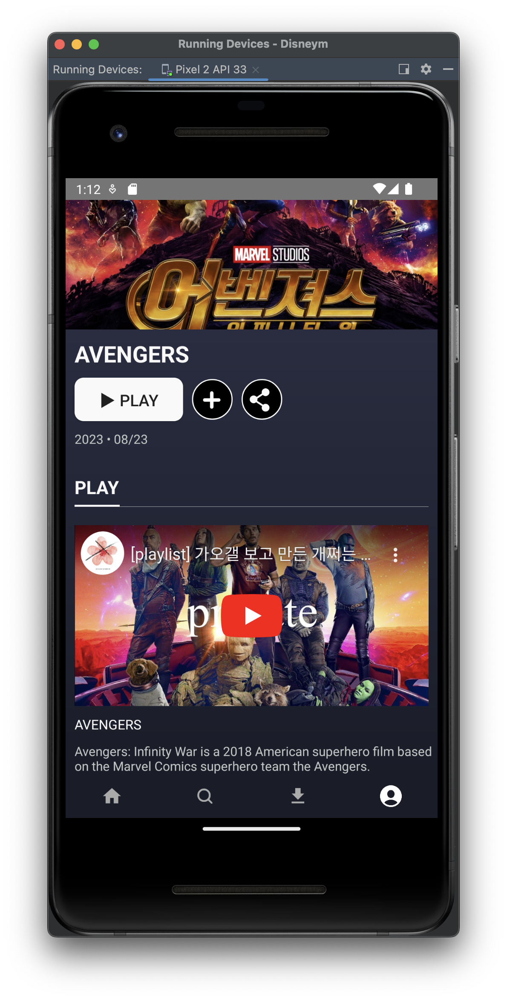

# [Android/Kotlin] 다른 앱으로 간단한 데이터 보내기 + 오류(작업을 수행할 수 있는 앱이 없습니다)

{:toc}

## 다른 앱으로 간단한 데이터 보내기

[[Developer 다른 앱으로 간단한 데이터 보내기 ⬅︎ 클릭!!]](https://developer.android.com/training/sharing/send?hl=ko) 

- 미리보기


- 참조한 코드

```kotlin
     val share = Intent.createChooser(Intent().apply {
          action = Intent.ACTION_SEND
          putExtra(Intent.EXTRA_TEXT, "https://developer.android.com/training/sharing/")

          // (Optional) Here we're setting the title of the content
          putExtra(Intent.EXTRA_TITLE, "Introducing content previews")

          // (Optional) Here we're passing a content URI to an image to be displayed
          data = contentUri
          flags = Intent.FLAG_GRANT_READ_URI_PERMISSION
      }, null)
      startActivity(share)
    
```

- **Developer에 있는 코드 중 다음의 코드를 참고하였고 내 프로젝트 앱의 형식에 맞게 재구현 해주었다.**
- 위의 코드를 그대로 실행하였을 때  **"작업을 수행할 수 있는 앱이 없습니다"** 라는 오류가 떴는데 이는 **type을 지정해주지 않아서 발생한 오류**였다.
- 따라서 `type = "text/plain"`이 코드를 추가해주니까 정상적으로 작동하였다 :)

```kotlin
fun shareUrl(context: Context, url : String){
    val share = Intent.createChooser(Intent().apply {
        action = Intent.ACTION_SEND
        putExtra(Intent.EXTRA_TEXT, url)
        // (Optional) Here we're setting the title of the content
        putExtra(Intent.EXTRA_TITLE, "YOUTUBE URL")
        // (Optional) Here we're passing a content URI to an image to be displayed
        data = Uri.parse(url)
        type = "text/plain"
        flags = Intent.FLAG_GRANT_READ_URI_PERMISSION
    }, null)
    context.startActivity(share)
}
```

- 또한 Util 함수로 따로 빼주고 싶어 Context와 Url을 넘겨서 작업해주었다.


#### 종속성 추가

- 코드를 작성하기 전 gradle 파일에 종속성을 추가한다.

```kotlin
implementation("com.pierfrancescosoffritti.androidyoutubeplayer:core:11.0.1")
```


#### Xml 구성

- 종속성을 추가해주면 `YouTubePlayerView`를 사용할 수 있게 된다.

```kotlin
<com.pierfrancescosoffritti.androidyoutubeplayer.core.player.views.YouTubePlayerView
    android:id="@+id/detail_player"
    android:layout_width="match_parent"
    android:layout_height="200dp" />
```


#### 코드 추가

- 플레이어가 준비되면 호출되는 코드를 작성해주고
- ID값은 다음 링크에서 `=`와 `&` 사이의 값이 아이디로 설정된다. 
- **42fmMP81EvA** : https://www.youtube.com/watch?v=42fmMP81EvA&t=2296s

```kotlin
private fun initPlayer() = with(binding) {
    detailPlayer.addYouTubePlayerListener(object :
        AbstractYouTubePlayerListener() {
        override fun onReady(youTubePlayer: YouTubePlayer) {
            super.onReady(youTubePlayer)
            val videoId = "42fmMP81EvA"
            youTubePlayer.cueVideo(videoId, 0f) // loadVideo로 변경 시 바로 재생
        }
    })
}
```


## 동작



