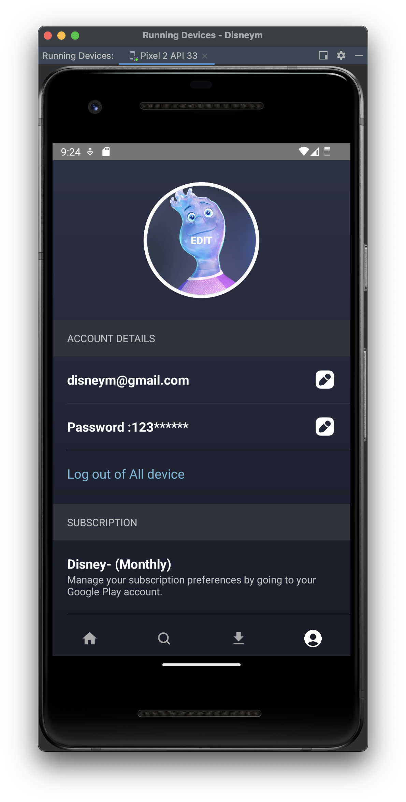
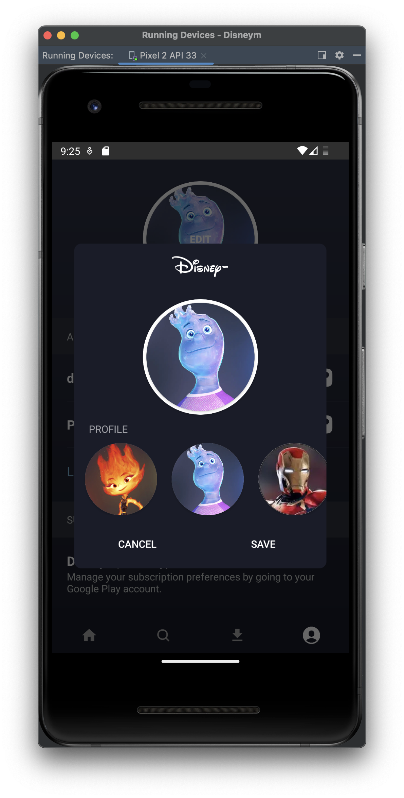
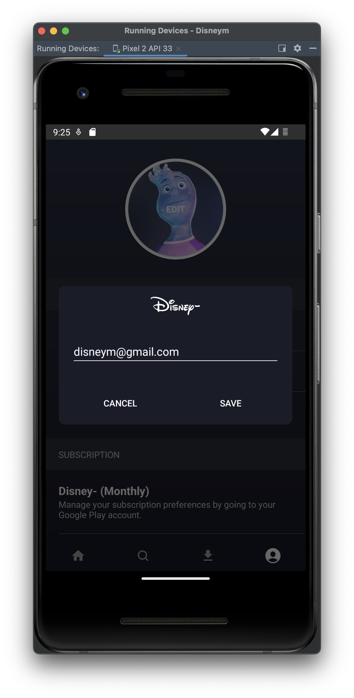
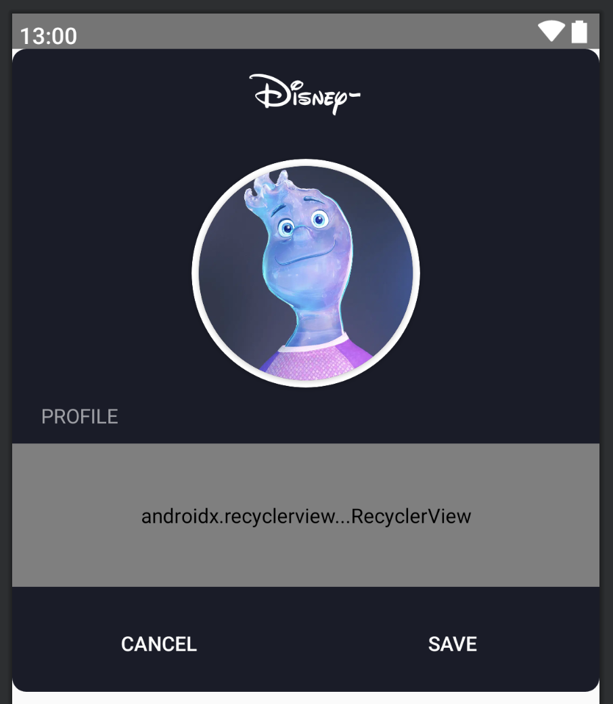

# [Android/Kotlin] Custom Dialog + Dialog Fragment로 변경

{:toc}

## Custom Dialog

Disney- 팀 프로젝트를 진행하던 중 **User의 정보를 수정하는 Dialog**를 만들 때 밋밋한 Dialog보다 앱의 퀄리티에 맞는 Dialog를 만들고 싶어 Custom으로 제작하기로 하였다.


#### 동작 결과!!




## Step 1 : 배경 설정

- 먼저 배경에 Round Corner을 적용해주기 위해서 `dialog_background_round.xml`을 작성해주었다.

```kotlin
<?xml version="1.0" encoding="utf-8"?>
<shape xmlns:android="http://schemas.android.com/apk/res/android"
    android:shape="rectangle">
    <corners android:radius="10dp" />
    <solid android:color="@color/common_background_navy" />
</shape>
```


## Step 2 : Dialog UI Design

- 이제 예쁜 Dialog를 띄워주기 위해 dialog.xml을 디자인해주었다.
- 이때 가장 바깥의 layout(ConstraintLayout등)의 background값을 위에서 지정해준 `dialog_background_round.xml`로 설정해준다.

```kotlin
android:background="@drawable/dialog_radius_background"
```

- Design은 다음과 같이 해주었다.

 


## Step 3 : Dalog Class 작성

- 사진과 ID or Pw를 수정하는 Dialog를 만들었는데 동일한 형식으로 만들었으므로 Text만 미리 봐보겠다.
- Dialog클래스를 상속받는 `MyPageTextDialog`를 만들었다.
- 자세한 설명은 주석으로 추가하였다.
- 추가적으로 프로필 이미지를 수정하기 위한 `MyPageProfileDialog`에서는  ImageURI를 넘겨서 작업해주었고 Item SideScroll은 RecyclerView와 

```kotlin
class MyPageTextDialog(
    context: Context,
    private val userInfo: String,
    private val type: Int,
    private val okCallback: (String) -> Unit,
) : Dialog(context) { // 뷰를 띄워야하므로 Dialog 클래스는 context를 인자로 받는다.

    private lateinit var binding: MypageTextDialogBinding

    override fun onCreate(savedInstanceState: Bundle?) {
        super.onCreate(savedInstanceState)
        // 만들어놓은 dialog_profile.xml 뷰를 띄운다.
        binding = MypageTextDialogBinding.inflate(layoutInflater)
        setContentView(binding.root)
        binding.dialogText.setText(userInfo)
        initViews()
    }

    private fun initViews() = with(binding) {
        // inputType 결정
        when (type) {
          	// ID → Email
            EditDialogType.ID.ordinal -> dialogText.inputType =
                android.text.InputType.TYPE_TEXT_VARIATION_EMAIL_ADDRESS
						// PW → Number
            EditDialogType.PW.ordinal -> dialogText.inputType =
                android.text.InputType.TYPE_CLASS_NUMBER
        }

        // 뒤로가기, 빈 화면 터치를 통해 dialog가 종료되지 않게하는 코드
        setCancelable(false)

        // Dialog는 내부적으로 흰 배경이 존재하므로 Corner Radius를 적용하기 위해 background 투명하게 설정
        window?.setBackgroundDrawable(ColorDrawable(Color.TRANSPARENT))

        // 종료
        dialogCancelBtn.setOnClickListener {
            dismiss()
        }

        // Button 클릭에 대한 Callback 처리
        dialogSaveBtn.setOnClickListener {
            if (dialogText.text.isNullOrBlank()) {
                Toast.makeText(context, "내용을 입력해주세요!", Toast.LENGTH_SHORT).show()
            } else {
                okCallback(dialogText.text.toString())
                dismiss()
            }
        }
    }
}
```


## Step 4 : 호출

- 호출해주는 부분은 MyPageFragment로 activity null처리를 해서 넘겨주었고 callback을 받는 부분에서의 데이터는 ViewModel상으로 넘겨 처리해주었다.

```kotlin
activity?.let {
    MyPageTextDialog(it, userId, EditDialogType.ID.ordinal) { callBackId ->
        viewModel.updateUserId(callBackId)
    }.show()
}
```


## Step 5 : Dialog Fragment로 변경

- MVVM 적용을 위해 Dialog Fragement로 변경하려고 한다 설명은 다음 링크를 참고하자!!

[[Dialog Fragement 링크 클릭!!]](https://softychoo.github.io/devlog/kotlin/2023-10-04-CustomDialogfragment)


