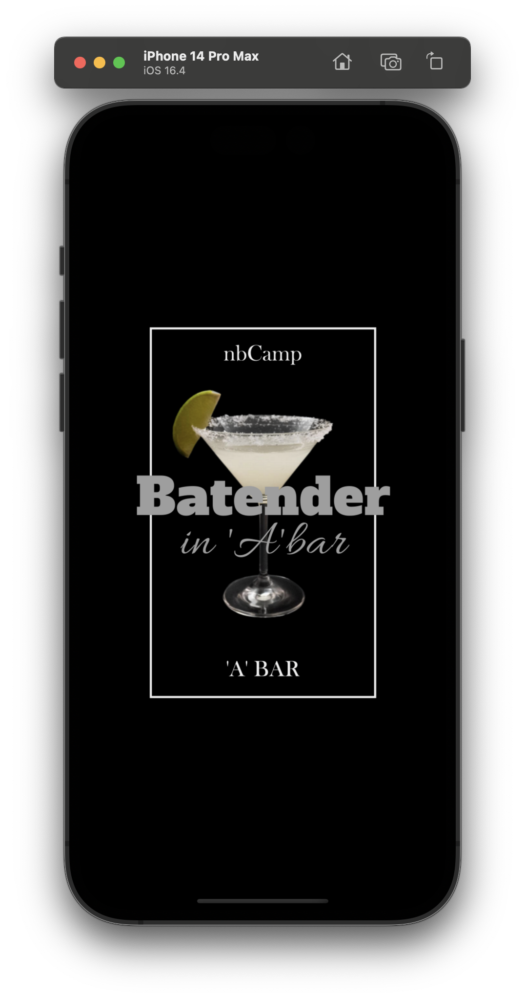
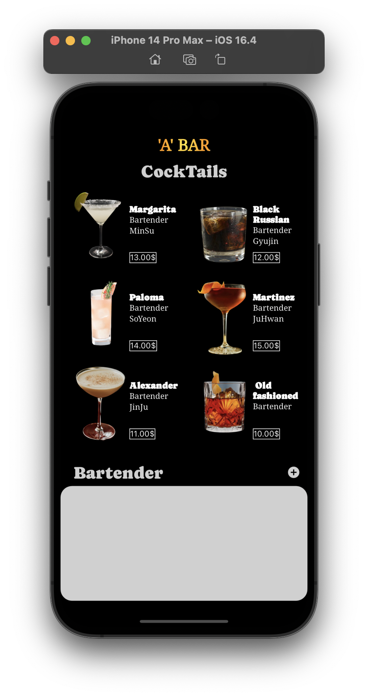
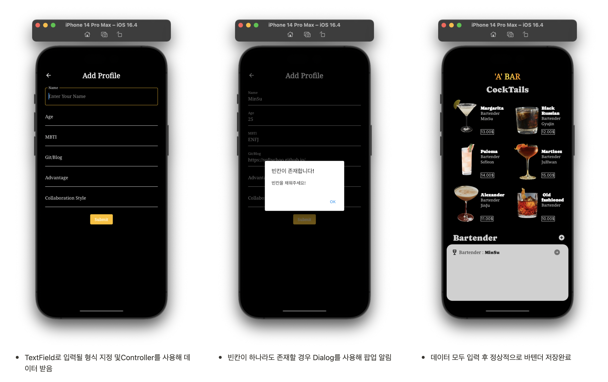
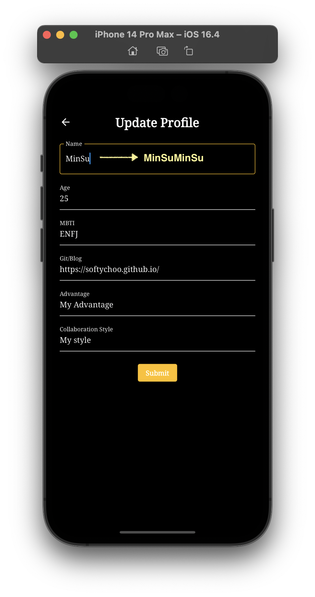
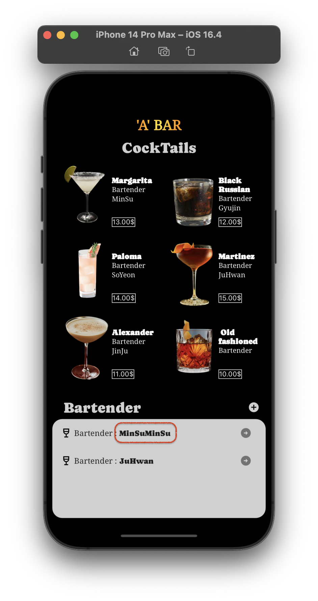
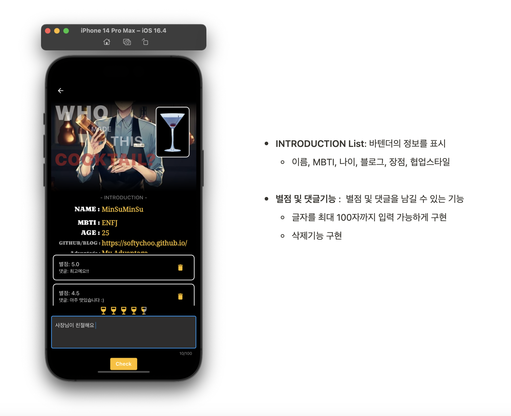

# [**‘A’ BAR]** 프로젝트 최종 시연 및 소개

- 컨셉 : 팀 이름인 **‘A BAR’**에 맞춰 5명의 바텐더를 소개하는 애플리케이션을 기획
- Provider 와 Shared Preference를 활용하여 데이터를 처리하였습니다.

* toc
{:toc}

****

## SplashScreen

- splashScreen을 구현해 앱 실행 시 스플래시 이미지를 보여준 후 MainPage로 이동

## MainPage

- Cocktail List와 Bartender목록을 보여주고 추가할 수 있는 페이지

## Add/Update Page

- Bartender의 상세정보를 추가 및 수정 할 수 있는 페이지

- 들어온 경로에 따라 상단 Text **‘Add Profile’** ‘**Update Profile’** 차별화 및 기능 차이를 둠

  ### Creat(생성 시) → ‘Add Profile’

### Update(수정 시) → ‘Update Profile’

- Data 수정 후 **Submit버튼** 클릭 시 정상적으로 반영

## BartenderPage

- Bartender의 상세정보를 확인할 수 있는 페이지
- 댓글 및 별점을 남길 수 있는 기능을 추가

