# [IXI] SNS 앱 프로젝트 (최종)

* toc
{:toc}

## [Main Ui]

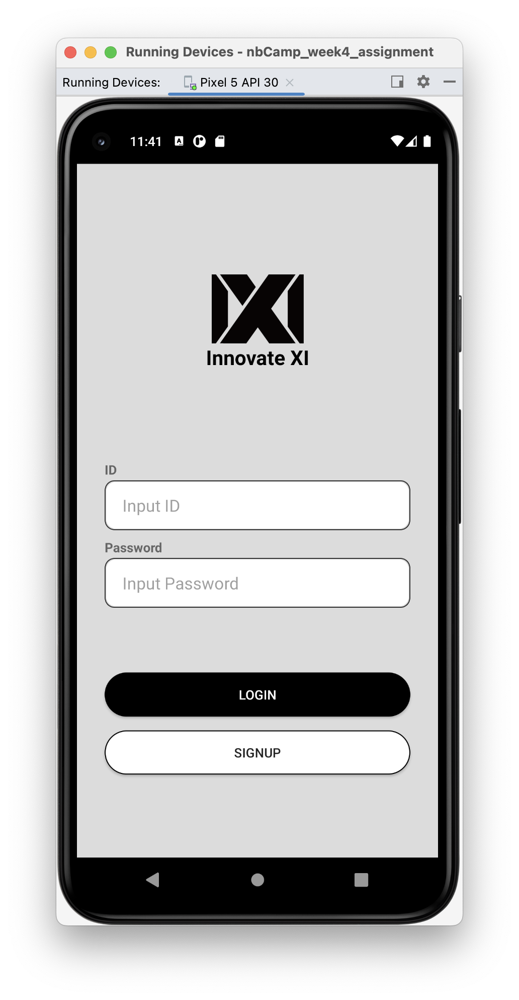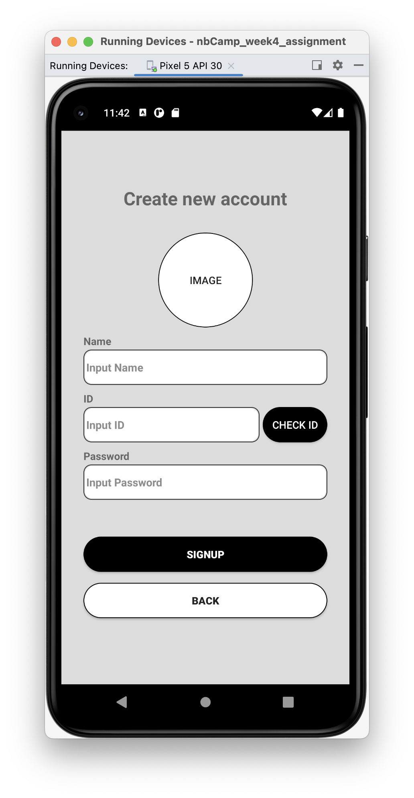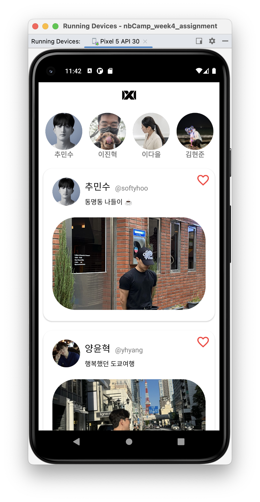

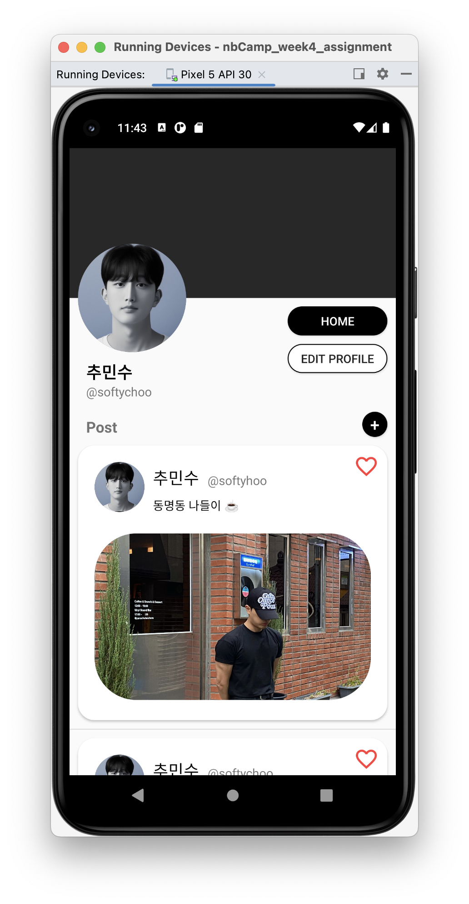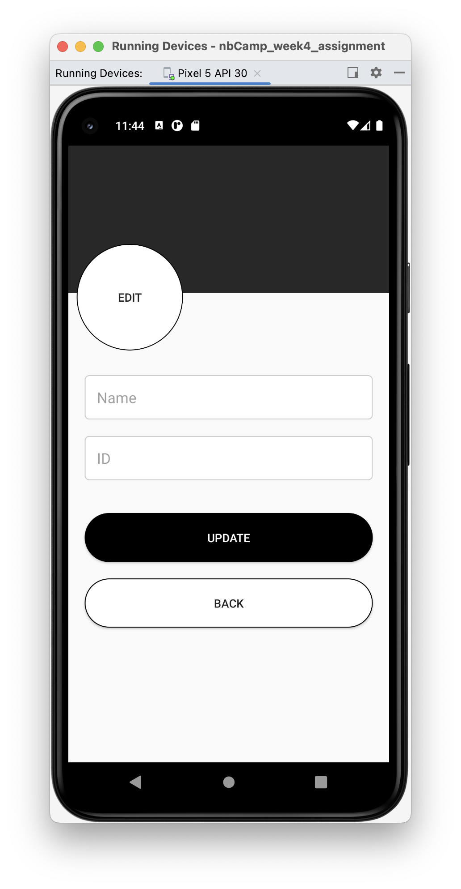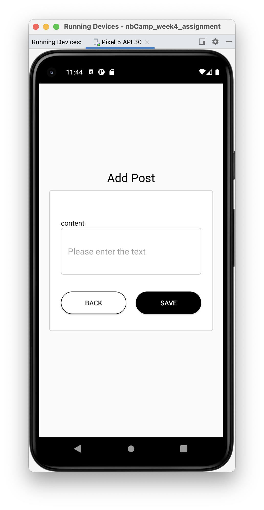

## 📑 데이터 저장 방식 📑

- 데이터를 저장하는 방식은 **DataClass**와 **Object**를 사용해 구현해주었다.

## 1. [SignInActivity] 로그인 페이지

- 앱을 실행하면 가장 먼저 실행되는 페이지로 `id`와 `pw`를 입력받아 로그인을 할 수 있다.

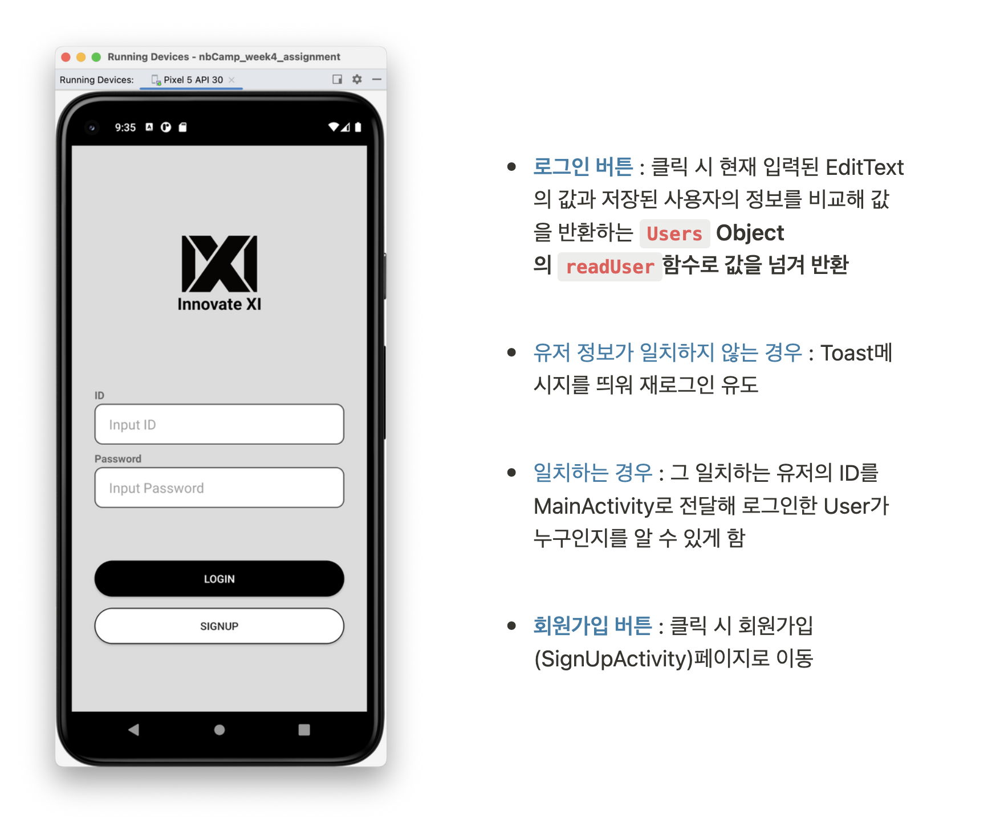

## 2. [SignUpActivity] 회원가입 페이지

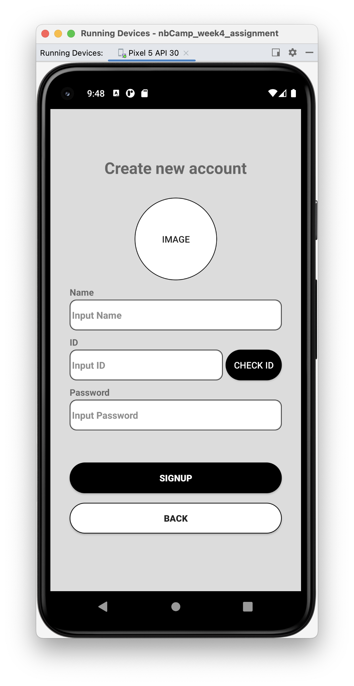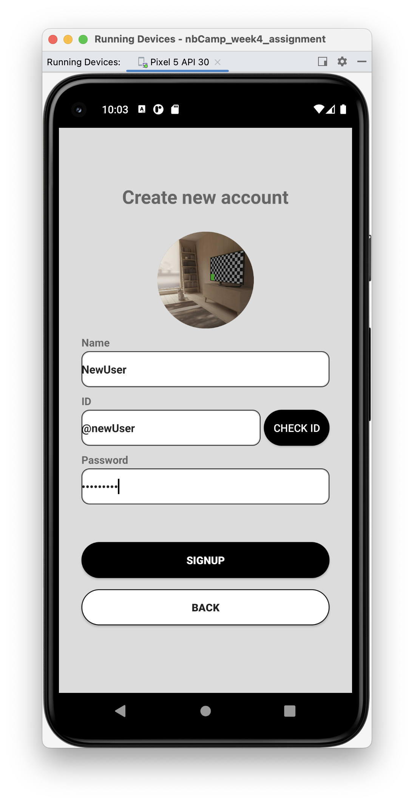

- **Add IMAGE** : 갤러리 연동까진 구현했으나 데이터베이스, 서버등을 연동하지 않아 임시로 화면상에만 구현해놓은 상태이다.

- **중복체크기능** : 현재 Object내에 저장된 ID를 비교해 중복을 체크하는 기능
- **회원가입 버튼** : 클릭 시 각각의 EditText에 입력된 값들을 **`Users` Object의 `addUser()`함수로 값을 넘겨 새로운 User 추가**

## 3. [MainActivity] 회원정보 페이지

- RecyclerView로 **UserList**를 구현해 모든 User를 가로 스크롤로 받아와 주었다.
- ListView로 모든 User의 **PostList**를 받아와 주었다.
- **좋아요버튼** : isSelected 속성을 둬서 좋아요버튼을 구현

## [ProfileAvtivity] 개인 프로필페이지

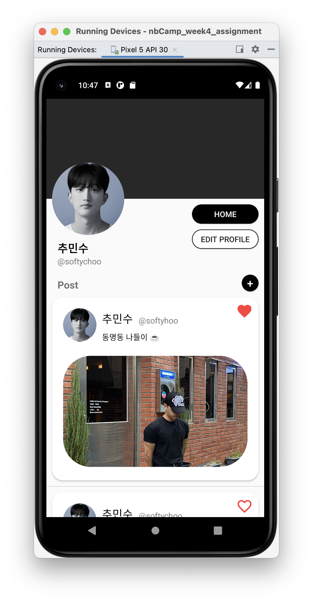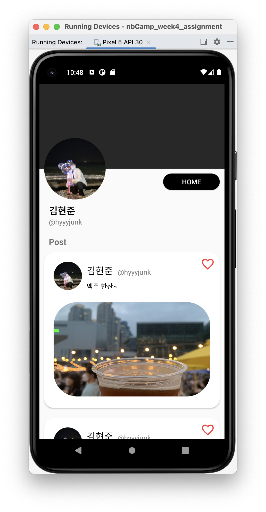

- 개인의 정보를 확인할 수 있는 프로필 페이지 구현
- 로그인한 **ID**를 기억해 본인의 프로필에 들어갈 때만 **EditProfile**, **AddPost** 버튼이 보이도록 구현 
- 프로필에 맞춰 본인의 Profile만 보이도록 구현

## [EditProfileActivity] 프로필 수정페이지

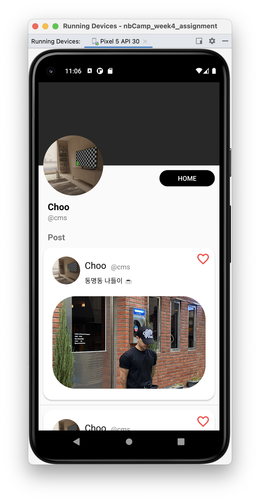

- 프로필을 수정할 수 있는 페이지로 **IMG, NAME, ID**값을 받아와 프로필과 포스트를 업데이트 시켜줌

## [AddPostActivity] 포스트 추가 페이지

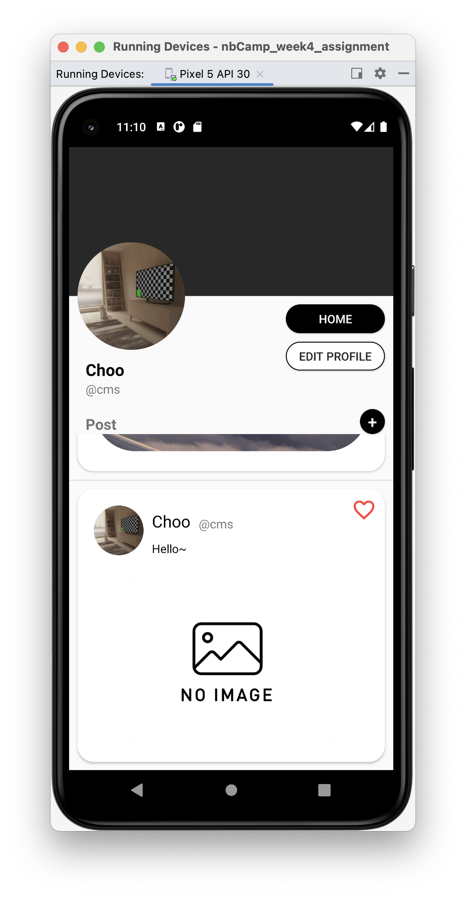

- Post를 추가하는 페이지로 text값을 받아와 새로운 포스트를 생성함

### + 신규 생성 유저

- 신규 유저는 Post 초기화 값이 없기 때문에 다음과 같이 표시됨

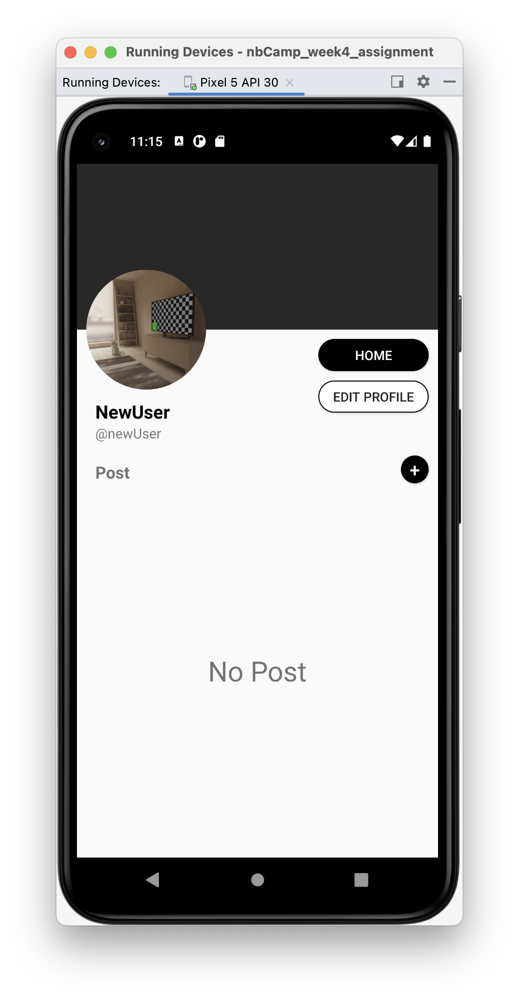

## [언어별 구현] Korean, English

- 위에서 보았던 UI는 기본언어가 English일 때의 UI이다.
- 다음은 기본언어를 **한국어**로 바꿨을 때의 구현된 UI이다.

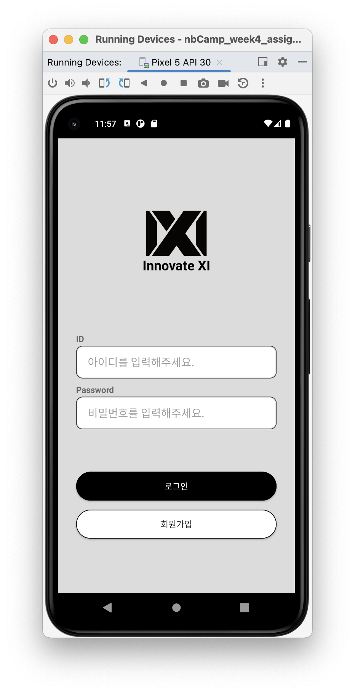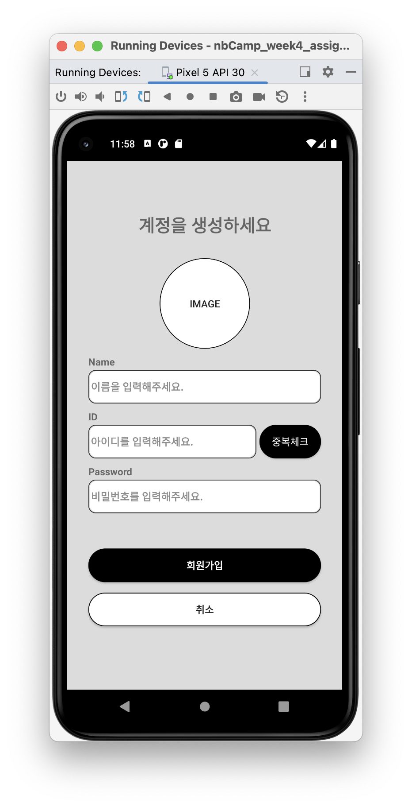

## [가로모드 구현]

## 최종 시연영상

