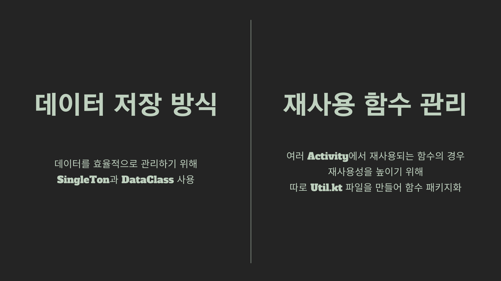
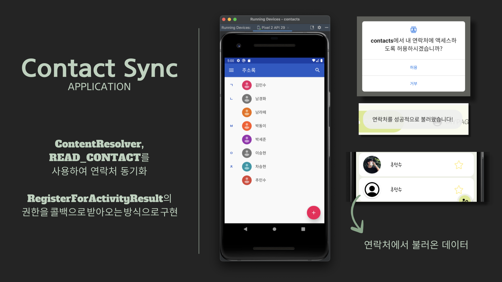
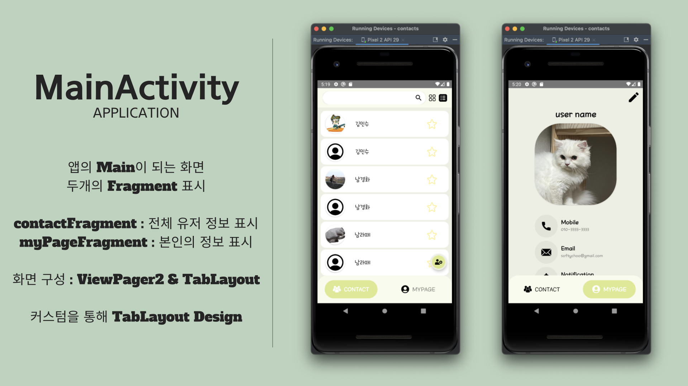
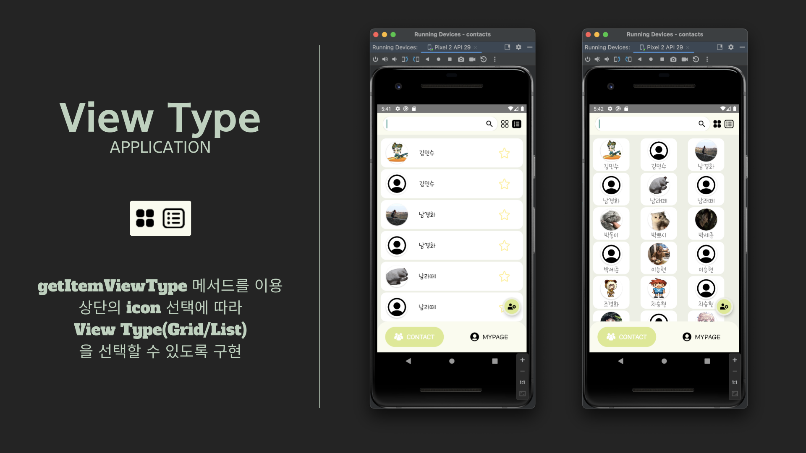
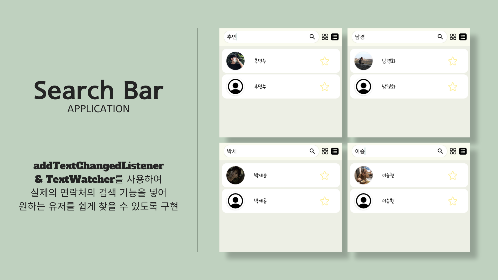
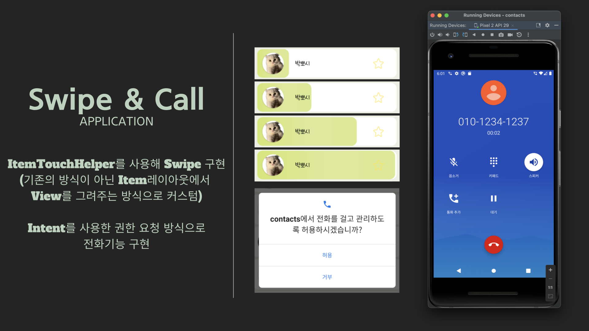
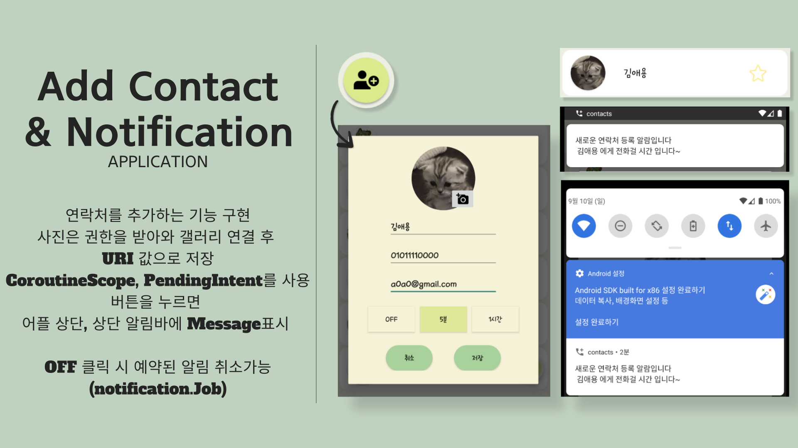
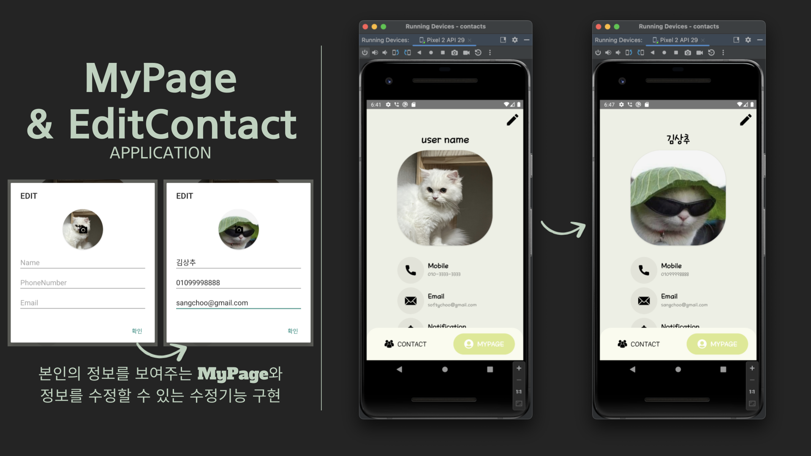
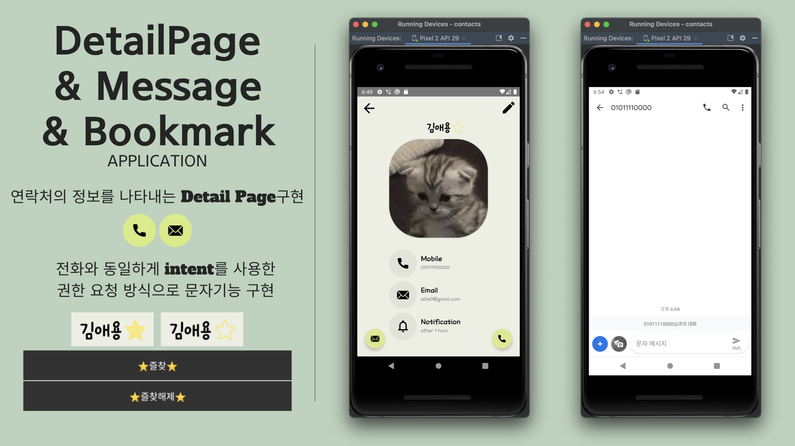

# [Contact] 연락처 앱 프로젝트 (최종)

* toc
{:toc}

## 데이터 저장 방식 및 재사용 함수관리

## SplashScreen

## 기기 연락처 연동

## MainActivity

## ViewType

## SearchBar

## Swipe & Call

## Add Contact & Notification

## MyPage & EditContact

## DetailPage & Message & BookMark

